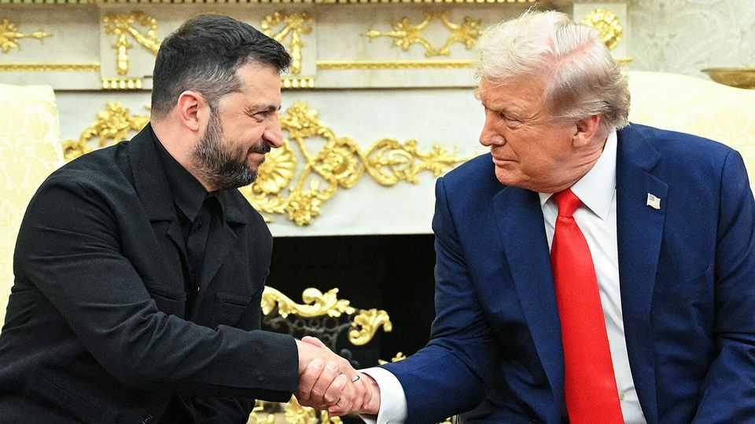
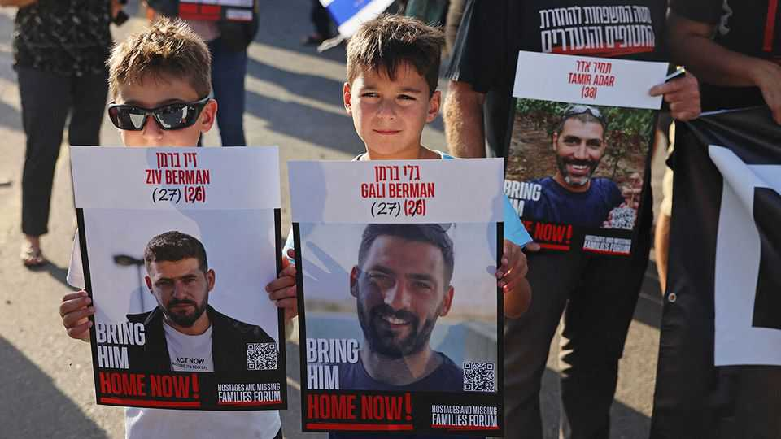

The world this week
Politics
August 21st 2025
  

  
Volodymr Zelensky travelled to Washington, DC, to meet Donald Trump for  
talks on ending the war in Ukraine. Mr Zelensky was backed by seven  
European leaders including the heads of NATO and the European  
Commission. The American president proposed a bilateral meeting between  
Mr Zelenksy and Vladimir Putin, Russia’s president, after which he would  
join them for three-way talks. Russia has yet to respond to the proposal.
 
Mr Trump was equivocal on the nature of any security guarantees that  
America might offer Ukraine. The Kremlin has said attempts to settle  
Ukraine’s security guarantees without Russian participation are a “road to  
nowhere”.

Spain sent around 2,000 soldiers to battle some of the country’s worst  
wildfires on record. At least four people were killed as fires ravaged
hundreds of thousands of acres of land. The area destroyed by fires is said to  
be twice the size of London. Pedro Sánchez, Spain’s prime minister,  
returned early from holiday to deal with the crisis.

Asylum-seekers will be removed from a hotel in Essex after an English court  
granted a temporary injunction to stop them being housed there. The  
decision follows weeks of protests outside the Bell Hotel in Epping after a  
man staying there was charged with sexual assault. He denies the charges.  
The ruling is a further blow for the Labour Party and a boon for the populist  
Reform UK, which supported the protests. Nigel Farage, Reform’s leader,  
welcomed the ruling and said he hopes it “provides inspiration to others  
across the country”.

In the first round of Bolivia’s presidential elections, voters turfed out the  
ruling socialist party, after nearly 20 years in power. Neither of the front-  
runners secured enough votes to win outright. Rodrigo Paz, a centrist  
senator, and Jorge Quiroga, a right-wing former president, will head to the  
polls in a run-off on October 19th.

America is beefing up its military presence in the southern Caribbean,  
sending air and naval forces and 4,000, marines and sailors. Officials told  
Reuters the aim is to combat drug threats in the region; in February America  
designated several gangs as foreign terrorist organisations. The build-up  
suggests an attempt to rattle Venezuela’s leader.

Canada’s Conservative leader Pierre Poilievre won a parliamentary seat after  
a by-election victory in rural Alberta. Mr Poilievre secured 80% of the vote  
in the safe Conservative riding. He had lost his seat in Ottawa, a  
constituency he had represented for more than 20 years, when the  
Conservatives suffered a general-election defeat in April of this year.
Hamas said it had accepted a ceasefire deal under which it would release ten  
living hostages and the bodies of 18 more in exchange for a 60-day halt in  
the fighting. Israeli officials say they will accept a deal only if it returns all  
of the 50 remaining hostages, around half of whom are thought to be alive.  
Hundreds of thousands of Israelis took to the streets to protest against the  
government’s decision to continue the war and its failure to secure the  
release of the hostages. Israel says it has begun the first steps of its planned  
offensive in Gaza City. The Israel Defence Forces called up 60,000  
reservists ahead of the plan, which has been met with widespread  
international condemnation.

Bezalel Smotrich, a far-right Israeli minister, said a controversial settlement  
plan has been approved. The E1 project would split the occupied West Bank  
in two and in effect cut it off from East Jerusalem. Mr Smotrich said “the  
Palestinian state is being erased from the table”.

A UN commission said it was likely that members of Syria’s interim  
government forces as well as fighters linked to the former regime had  
committed war crimes during an outbreak of sectarian violence in March.  
Around 1,400 people were killed, most of them were civilians, said the  
report.

M23, a rebel group backed by Rwanda, killed at least 140 people in eastern  
Democratic Republic of Congo in July, according to a new report by Human  
Rights Watch. The report is a reminder that violence in the region continued  
despite peace agreements brokered by America and Qatar.

Choguel Kokalla Maiga, the former civilian prime minister of Mali, was  
charged with embezzling public funds and jailed awaiting trial. Mr Maiga,  
who was appointed by the military junta following a coup in 2021, was  
dismissed in November last year.

In America the Justice Department is expected to begin providing  
documents to a congressional investigation related to the deceased child-  
molester Jeffrey Epstein by August 22nd. The scandal will probably  
continue to cause headaches—many congressmen who returned home  
during the summer recess have faced questions from constituents, and  
Democrats plan to force it onto the agenda when they return in September.

Six Republican governors promised to send National Guardsmen to  
Washington, DC, to aid President Donald Trump’s crackdown on crime and  
homelessness. As many as 1,900 troops have been mobilised to patrol the  
capital, including the 800 guardsmen that America’s president called up on  
August 11th.

J.D. Vance, America’s vice-president, was heckled by protesters while  
visiting troops in Washington, DC. The Justice Department is reportedly  
investigating the city’s official statistics, which suggest that violent crime  
spiked in 2023, but then fell dramatically.

Closing arguments began in Hong Kong in the trial of Jimmy Lai, a pro-  
democracy media tycoon. Mr Lai is accused of colluding with foreign forces  
and sedition; he denies the charges. The 77-year-old faces life imprisonment  
if found guilty.

More than 300 people were killed in floods that swept through north-west  
Pakistan.

Wang Yi, China’s foreign minister, met Narendra Modi, India’s prime  
minister, on a visit to Delhi amid warming relations. Mr Modi hailed “steady
progress” and said he “looked forward” to seeing Xi Jinping in China this  
month.

Kim Jong Un, North Korea’s dictator, said the country must rapidly boost its  
nuclear arsenal in the wake of “hostile” joint American-South Korean  
military drills. Mr Kim called the exercises an “obvious expression of their  
will to provoke war”, according to state media.

This article was downloaded by zlibrary from [https://www.economist.com//the-world-this-week/2025/08/21/politics](https://www.economist.com//the-world-this-week/2025/08/21/politics)