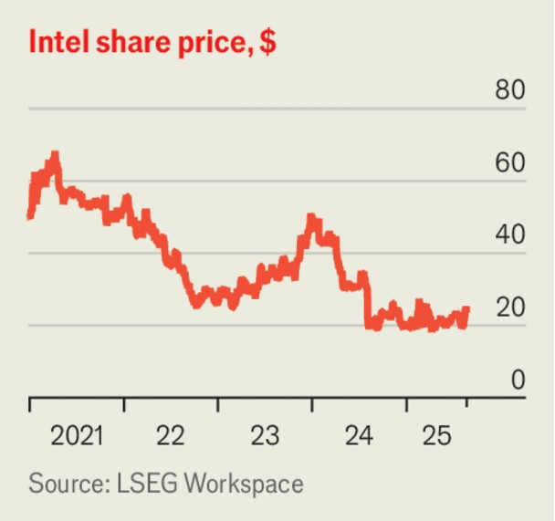

The world this week
Business
August 21st 2025

Howard Lutnick, America’s commerce secretary, confirmed that the Trump administration was considering taking a 10% stake in Intel. Mr Lutnick said the deal would convert the grants allotted to the firm under Joe Biden’s CHIPS Act into equity. Meanwhile SoftBank, a Japanese tech investor, announced it would invest $2bn in Intel. Shares in the floundering American chipmaker, which had risen on early reports of the government’s plan, climbed higher following SoftBank’s announcement.

Other American tech stocks slid amid worries about high valuations and low returns from artificial intelligence. The NASDAQ, a tech-heavy index, dropped by 2.5% in the week to August 20th. Shares in Nvidia, a maker of AI chips, fell by 2.8%. Those of Palantir, a software firm, fell by nearly 12%.

Mr Trump extended his campaign against the Federal Reserve. America’s president called for Lisa Cook, one of the governors on the Fed’s board, to resign after Bill Pulte, the head of the Federal Housing Finance Agency, accused her of falsifying bank documents and property records to obtain a mortgage. Ms Cook said she had “no intention of being bullied to step down”. Mr Trump has urged the Fed to cut interest rates and lambasted its chairman, Jerome Powell.

The bosses of Rio Tinto and BHP, two mining companies, met Mr Trump to discuss Resolution Copper, a long-delayed project in Arizona. Rio says the mine would provide 25% of America’s copper demand for 40 years. On August 18th, a day before the meeting, an appeals court temporarily blocked its development. Mr Trump slammed the ruling, writing: “our Country, quite simply, needs Copper—AND NOW!”

A Japanese startup, JPYC, said it had won regulatory approval to issue a stablecoin pegged to the yen this autumn. Like dollar stablecoins, which are usually backed by Treasuries, the tokens will be backed by assets such as Japanese government bonds. JPYC plans to issue tokens worth ¥1trn ($6.8bn) over the next three years.

Target posted a 22% drop in net profit, year on year, in the second quarter. The ailing American retailer said that Michael Fiddelke, a company insider,

would take over as its boss next year. That did not reassure investors. The company’s shares fell by nearly 10%.

Novo Nordisk halved the price of Ozempic, its weight-loss drug, for Americans who cannot obtain it through their health-insurance schemes. The Danish drugmaker reckons 98% of Ozempic’s American users get the drug through their insurers. But the firm is under pressure from cheap competitors. Shares in Novo, which have plunged over the past year, rose on the news.

Annual inflation in Britain rose to 3.8% in July, up from 3.6% in June. That is the highest figure since January 2024. Traders trimmed bets that the Bank of England, which lowered its key interest rate to 4% on August 6th, will cut rates next month.

Flight attendants ended a three-day strike after union leaders reached a deal with Air Canada, the country’s largest carrier. The action grounded hundreds of flights, affecting around 500,000 travellers. Air Canada will start paying attendants half their hourly rate for boarding passengers, which was previously unpaid.

BlackRock struck an $11bn deal to lease natural-gas facilities from Saudi Aramco. The American asset manager will lease them back to the state- owned energy giant for 20 years. In recent years BlackRock has poured cash into infrastructure deals in Saudi Arabia, which is eager to attract foreign capital.

Indonesia’s central bank lowered its main interest rate from 5.25% to 5%. It attributed the decision to low inflation and the need to boost growth. In the second quarter the economy grew at an annual rate of around 5.1%, the fastest in two years.

Xiaomi’s revenue rose by 31% year on year in the second quarter. The Chinese tech firm’s earnings from its smartphone business dropped slightly over the same period. Its electric-vehicle unit narrowed its losses to 300m yuan ($42m), down from 500m yuan in the previous quarter. Xiaomi expects its EV business to turn a monthly or quarterly profit by the end of the year.

Sales of Labubu dolls pushed Pop Mart’s net profit up by 400% year on year in the first half of 2025. Collectors outside the Chinese toymaker’s home market have gone crazy for the smiling, elvish trinkets. Some 40% of sales were abroad. The firm, whose shares have risen by nearly 250% since the start of the year, is worth more than three times as much as Mattel and Hasbro, America’s biggest toymakers, combined.

This article was downloaded by zlibrary from [https://www.economist.com//the-world-this-week/2025/08/21/business](https://www.economist.com//the-world-this-week/2025/08/21/business)