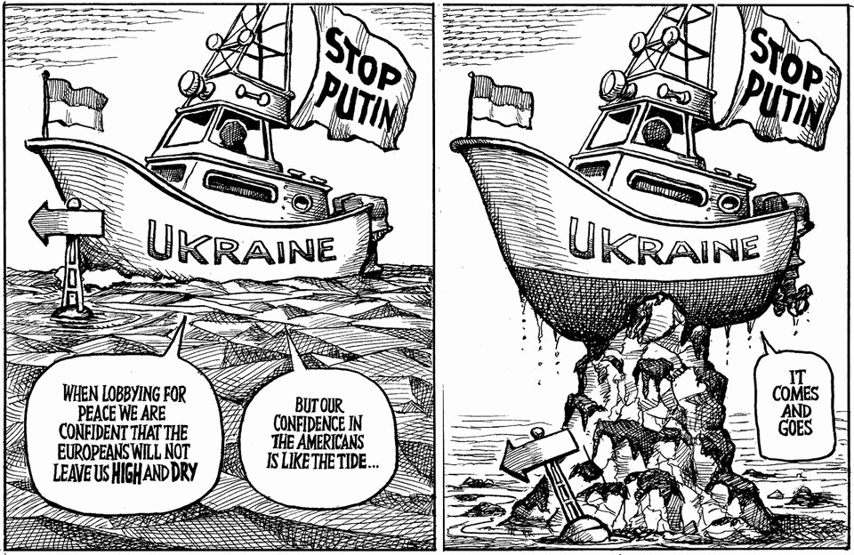

The world this week
The weekly cartoon
August 21st 2025

Dig deeper into the subject of this week’s cartoon: Who will America’s president listen to next on Ukraine? Security “guarantees” for Ukraine are dangerously hazy Trump wants a Nobel prize. Europe can exploit that to help Ukraine The editorial cartoon appears weekly in The Economist. You can see last week’s here. This article was downloaded by zlibrary from https://www.economist.com//the-world-this-week/2025/08/21/the-weekly-cartoon

Leaders

Donald Trump’s fantasy of home-grown chipmaking A new opposition could be a healthy sign for Syria Who will America’s president listen to next on Ukraine? Pregnant women need protecting from heatwaves Britain leads the world in a new global business—a criminal one