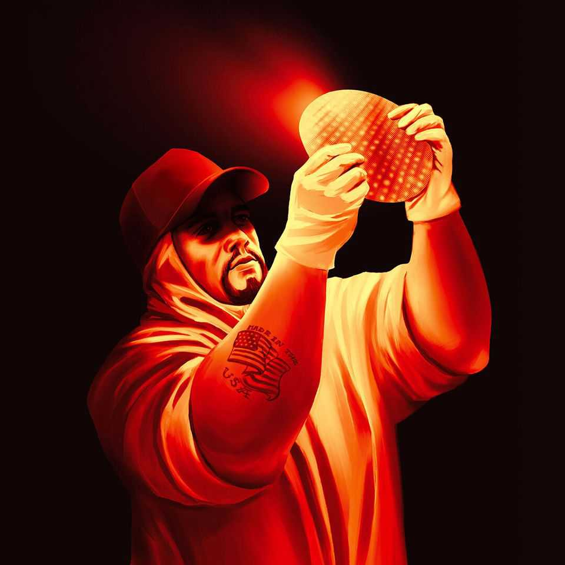

Leaders | All-American silicon
Donald
Trump’s   
fantasy   
of   
home-grown  
chipmaking

To remain the world’s foremost technological power, America needs its  
friends

August 21st 2025
  

  
How low mighty Intel has fallen. Half a century ago the American  
chipmaker was a byword for the cutting edge; it went on to dominate the  
market for personal-computer chips and in 2000 briefly became the world’s  
second-most-valuable company. Yet these days Intel, with a market  
capitalisation of $100bn, is not even the 15th-most-valuable chip firm, and  
supplies practically none of the advanced chips used for artificial  
intelligence (AI). Once an icon of America’s technological and commercial  
prowess, it has lately been a target for subsidies and protection. As we  
published this, President Donald Trump was even mulling quasi-  
nationalisation.
More than ever, semiconductors hold the key to the 21st century. They are  
increasingly critical for defence; in the ai race between America and China,  
they could spell the difference between victory and defeat. Even free-traders  
acknowledge their strategic importance, and worry about the world’s  
reliance for cutting-edge chips on tsmc and its home of Taiwan, which faces  
the threat of Chinese invasion. Yet chips also pose a fiendish test for  
proponents of industrial policy. Their manufacture is a marvel of  
specialisation, complexity and globalisation. Under those conditions,  
intervening in markets is prone to fail—as Intel so vividly illustrates.

To see how much can go wrong, consider its woes. Hubris caused the firm to  
miss both the smartphone and the ai waves, losing out to firms such as Arm,  
Nvidia and tsmc. Joe Biden’s CHIPS Act, which aimed to spur domestic  
chipmaking, promised Intel $8bn in grants and up to $12bn in loans. But the  
company is floundering. A fab in Ohio meant to open this year is now  
expected to begin operations in the early 2030s. Intel is heavily indebted and  
generates barely enough cash to keep itself afloat.

The sums needed to rescue it keep growing. By one estimate Intel will need  
to invest more than $50bn in the next few years if it is to succeed at making  
leading-edge chips. Even if the government were to sink that much into the  
firm, it would have no guarantee of success. The company is said to be

struggling with its latest manufacturing process. Its sales are falling and its  
plight risks becoming even more desperate.

The Biden administration failed with Intel, but Mr Trump could make things  
worse. He has threatened tariffs on chip imports, and may try to browbeat  
firms such as Nvidia into using Intel to make semiconductors for them.  
These measures might buy Intel time but they would be self-defeating for  
America. Chipmaking is not an end in itself but a critical input America’s  
tech sector requires to be world-beating. Forcing firms to settle for anything  
less than the best would blunt their edge.

What should America do? One lesson is not to pin the nation’s hopes on  
keeping Intel intact. It could sell its fab business to a deep-pocketed investor,  
such as SoftBank, which has reportedly expressed interest in buying it and  
this week announced a $2bn investment in Intel. Or it could sell its design  
arm and pour the proceeds into manufacturing. Intel may fail to catch up  
with TSMC even then. Either way, the federal government should not throw  
good money after bad. Taking a stake in Intel would only complicate  
matters.

That leads to a second lesson: to look beyond Intel and solve other  
chipmakers’ problems. tsmc is seeking to spread its wings. It is running out  
of land for giant fabs in Taiwan and its workforce is ageing. It has already  
pledged to invest $165bn to bring chipmaking to America. A first fab is  
producing four-nanometre (nm) chips and a second is scheduled to begin  
making more advanced chips by 2028. Samsung, a South Korean chipmaker  
that is having more success than Intel, is setting up a fab in Texas. But  
progress has been slow: Samsung and TSMC have both struggled with a  
lack of skilled workers and delays in receiving permits.

The last lesson is that, even if domestic chipmaking does make America  
more resilient, the country cannot shut itself off from the rest of the world.  
One reason is that the supply chain is highly specialised, with key inputs  
coming from across the globe, including extreme-ultraviolet lithography  
machines from the Netherlands and chipmaking tools from Japan. The other  
is that Taiwan and its security will remain critical. Even by the end of this  
decade, when tsmc’s third fab in America is due to begin producing 2nm  
chips, two-thirds of such semiconductors are likely to be made on the island.
TSMC’s model is based on innovating at home first, before spreading its  
advances around the world.

To keep America’s chip supply chains resilient, Mr Trump needs a coherent,  
thought-through strategy—a tall order for a man who governs by impulse.  
No wonder he is going in the wrong direction. On Taiwan he has been  
cavalier, confident that China will not invade on his watch, while failing to  
offer the island consistent support. His tariffs on all manner of inputs will  
raise the costs of manufacturing in America; promised duties on chip  
imports will hurt American customers. He thrives on uncertainty, but  
chipmakers require stability.

A sensible chip policy would make it attractive to build fabs in America by  
easing rules over permits and creating programmes to train engineers.  
Instead of using tariffs as leverage, the government should welcome the  
imports of machinery and people that support chipmaking. Given the  
bipartisan   
consensus   
on   
the   
importance   
of   
semiconductors,   
the  
administration should seek a policy that has Democratic support—with the  
promise of continuity from one president to the next.

Economic nationalists should also see the progress of chipmakers in allied  
countries as a contribution to America’s security. Samsung is aiming to start  
producing 2nm chips in South Korea later this year. Rapidus, a well-funded  
chipmaking startup in Japan, is making impressive progress. Both countries  
have a tradition of manufacturing excellence, and may have a better shot at  
emulating Taiwan.

The chipmaking industry took decades to evolve. It is built for an age of  
globalisation. When economic nationalists build their policies on autarky,  
they are setting themselves a needlessly hard task—if not an impossible one.  
■

For subscribers only: to see how we design each week’s cover, sign up to our  
weekly Cover Story newsletter.

This article was downloaded by zlibrary from [https://www.economist.com//leaders/2025/08/21/donald-trumps-fantasy-of-home-grown-](https://www.economist.com//leaders/2025/08/21/donald-trumps-fantasy-of-home-grown-)
chipmaking