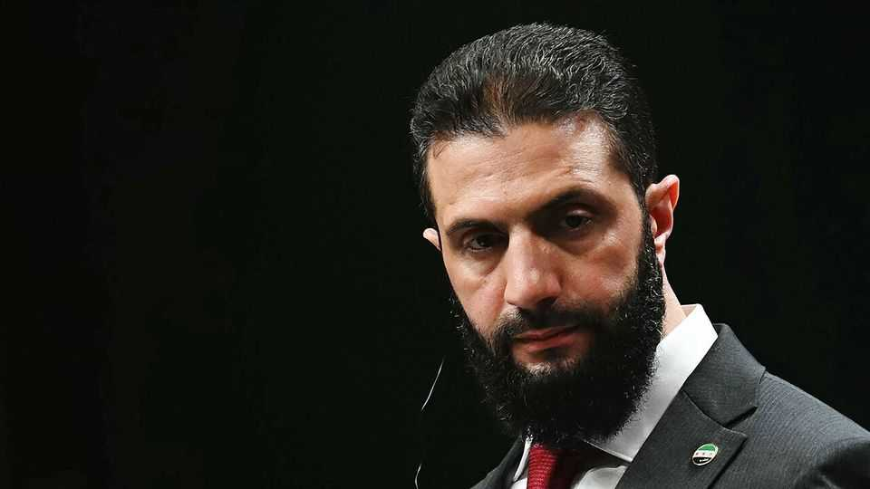

Leaders | Syrian politics
A new opposition could be a healthy sign for Syria
Ahmed al-Sharaa, the new president, needs to bring his critics closer

August 21st 2025
  

  
During much of the first half of this year, things were looking up for Ahmed  
al-Sharaa. Syria’s new president was basking in Donald Trump’s decision to  
lift sanctions on his country. After more than a decade of civil war,  
Damascus and other cities had begun to hum again. Investors from the Gulf  
and Turkey piled in. Our polling showed that the public mood was buoyant.  
After ousting Bashar al-Assad’s regime, Mr Sharaa, a former jihadist, had  
not imposed the Taliban-style rule that some had feared. The vast majority  
of Syrians said they were optimistic for the future.

Unfortunately, as the euphoria fades, Syrians are growing increasingly  
frustrated. Mr Sharaa has disappointed them by failing to ease the sectarian  
divisions that have long made their country a tinderbox. He exhibits
creeping authoritarianism. Now civil-society activists are building an  
organised opposition. How Mr Sharaa responds to this political challenge  
will define both his presidency and his country’s future.

The president has often acted pragmatically. But there have been terrible  
lapses. In March, when Sunni militias linked to Mr Sharaa’s forces  
slaughtered around 1,400 people in coastal Latakia, he was slow to respond.  
The region is the heartland of Syria’s Alawite minority, the sect from which  
Mr Assad and many of his loyalists came. Four months later clashes in  
Suwayda, a province dominated by the Druze, a mystical religious minority,  
ended with massacres, some by troops loyal to the government. Again Mr  
Sharaa was unable—or unwilling—to stop the violence. The atrocities there  
gave Israel, which has a Druze minority, an excuse to interfere. It launched  
strikes on the province and on Damascus.

Signs of authoritarianism are hard to miss. When Mr Sharaa ruled Idlib  
province during the final years of the Assad regime, he ran a competent  
government that oversaw a flourishing economy. But he also became  
increasingly brutal, imprisoning many of his critics. He has brought some  
aspects of that leadership to the presidency, centralising power among a  
small group of loyalists, leaning on Sunni tribes (he is Sunni) and sidelining  
minorities. His supporters sometimes argue that broad representation is a  
luxury in a country ravaged by war, and that narrow rule is the price of  
efficiency. Centralisation, however, has not brought good governance, let  
alone security.

A loose coalition of activists, some of them veterans of the anti-Assad era,  
has now begun pressing for urgent political reform. They have called for Mr  
Sharaa’s hastily drafted constitutional declaration to be rewritten so as to  
allow the formation of political parties and to give more scope for civil  
society to operate. It is the first stirring of co-ordinated opposition to the  
regime.

Mr Sharaa has yet to lock up any of his new opponents. But he should do  
more than tolerate critics; he should welcome them and bring them into his  
government. Syria needs an open constitutional process, a deal with the  
Kurds, broader leadership in the security forces and an electoral
framework to ensure that the committees choosing members of an interim  
parliament in September do not opt overwhelmingly for hardline Sunnis.

Towards the end of Mr Sharaa’s rule in Idlib, protesters chanted for his  
downfall. His critics have not yet gone that far. He has no replacement, and a  
power vacuum in a country hollowed out by civil war would be dangerous.  
Yet, in a functioning polity, the opposition can be a stabilising force rather  
than a threat. For fragile, divided Syria, that is the best chance of avoiding  
another descent into civil war. ■

Subscribers to The Economist can sign up to our Opinion newsletter, which  
brings together the best of our leaders, columns, guest essays and reader  
correspondence.

This article was downloaded by zlibrary from [https://www.economist.com//leaders/2025/08/20/a-new-opposition-could-be-a-healthy-](https://www.economist.com//leaders/2025/08/20/a-new-opposition-could-be-a-healthy-)
sign-for-syria