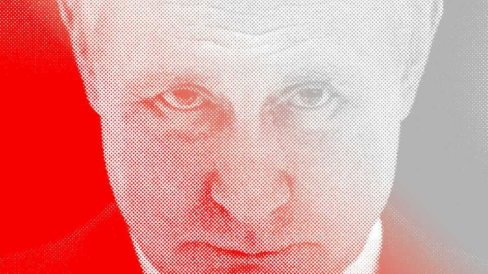
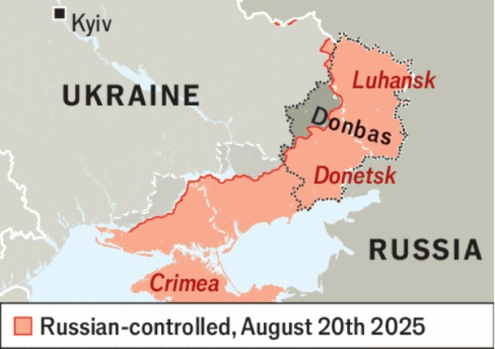

Leaders | The war for Donald’s ear
Who will America’s president listen to next on Ukraine?
The problem with Donald Trump’s fast-moving, unpredictable diplomacy
August 21st 2025

In February VOLODYMYR ZELENSKY lasted less than an hour inside the Oval Office before he was ordered to leave the building. When he returned to the scene on August 18th, many feared something even worse. Donald Trump had, three days earlier, rolled out the red carpet for Vladimir Putin in Alaska. On his way back he announced that he was no longer pressing for a ceasefire, but now favoured a comprehensive “peace” deal that could see Ukraine hand over a big chunk of fortified territory in return for a promise from Mr Putin that—cross his heart—he would not invade Ukraine for a third time.

In the sense that Mr Trump can cause Ukraine harm that it cannot protect itself against, America’s president is even more dangerous to Mr Zelensky than Mr Putin. Many feared that at Monday’s meeting he would force a terrible one-sided deal on America’s supposed allies. Thankfully, that did not happen. Amid profuse thanks and ego-stroking, Mr Trump did not talk about territory. He even said that America would consider backing new security guarantees for Ukraine.

By contrast with the diplomacy, the battlefield is leaden. The war in the south and east of the country grinds on. Russian drones and missiles pummel Ukraine’s cities nightly, demoralising its citizens, crippling its economy and poisoning its politics. Russia is losing men at several times the rate that Ukraine is, though it has a great many more men to lose. Although Ukraine is slowly ceding ground, without a collapse of its lines Russia will not take the land Mr Putin wants to gain through a peace deal—at least not without sacrificing tens of thousands of troops a month over many months or years.

That is why Mr Trump’s diplomacy, much faster-moving and less predictable, remains so threatening. During the meetings on Monday, the president broke off to call his Russian counterpart, and all the indications are that he still dreams of a deal that might win him a Nobel prize. He wants Mr Zelensky to sit down with Mr Putin in the next week or two. If land swaps

are Mr Putin’s price, the likelihood is that Mr Zelensky will again come under huge pressure to give up ground.

That would put Ukraine and Europe in a quandary. If Mr Zelensky and Europe refuse, Mr Trump could cut off the supply of weapons and crucial military intelligence at any time; he has done it before. A furious American president could impose tariffs on Europe. He could threaten to withdraw American support for NATO.

However, more than 250,000 people live in the part of the Donbas that Russia seeks. Freezing a war along contact lines has happened many times in the past. But the lines are there for a reason: they mark where Ukraine has fallen back to defensible positions, and vast amounts of effort and treasure have been expended on securing them with trenches, “dragon’s teeth” and elaborate fortifications. If Russia is allowed to take them over, it will become far harder for Ukraine to resist another advance. That would be an incentive for Mr Putin to attack again.

The only territorial concession Ukraine can sensibly make would be some form of de facto recognition of Russia’s existing occupation of around 19% of its territory. That would mark a victory for Mr Putin; deeply unpalatable, but arguably worth conceding in the interests of stopping a war that has already cost hundreds of thousands of lives on both sides. But what should Ukraine get in return? Mr Trump’s answer, and indeed that of the Europeans, is “security guarantees”. The problem is that Mr Trump is evasive about what they mean.

The most solid form of security guarantee—a commitment to use a large army to resist a Russian attack—is not on offer. Europe’s leaders have been trying to assemble a “coalition of the willing” that would deploy inside Ukraine, so that Russia could not violate a peace deal without risking direct conflict with Western countries. Unfortunately, the numbers committed are too puny to put up a fight against Russia. Also, to establish true deterrence, any force would depend on the certainty of American support.

Mr Trump has suggested that the Europeans will have his backing, though no troops, for these guarantees, but can he be relied on? On the face of it, not really. He threatened Mr Putin with “crippling” sanctions if he would not

agree to a ceasefire, but when they met he meekly dropped all talk of them. He declines to say what sort of support he will provide to the reassurance force, or even whether the supply of defensive weapons to Ukraine will be guaranteed.

A better way to achieve a degree of deterrence would be ironclad pledges to equip and fund Ukraine’s own army, which is far larger and tougher than anything the Europeans can muster. By contrast, it is hard to imagine anything more destructive to European security than a peacekeeping force that is not backed up if it is attacked. That would be the victory Mr Putin most longs for. ■

Subscribers to The Economist can sign up to our Opinion newsletter, which brings together the best of our leaders, columns, guest essays and reader correspondence.

This article was downloaded by zlibrary from https://www.economist.com//leaders/2025/08/21/who-will-americas-president-listen- to-next-on-ukraine