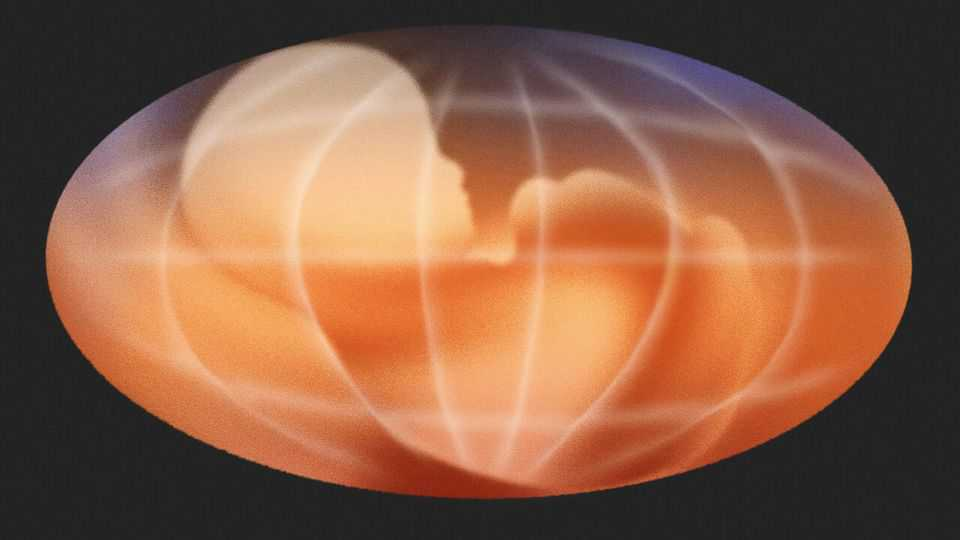

Leaders | In the oven
Pregnant women need protecting from heatwaves
As temperatures rise, so must understanding of the risks

August 21st 2025
  

  
CONSULT THE internet on what to avoid while pregnant, and the answer  
seems to be: everything. Worried women can find advice suggesting that  
they abstain from sex, spicy foods, swimming and sunscreen (in fact, all are  
fine; it might be wiser to avoid Google). Other things such as smoking,  
drinking alcohol and eating mercury-rich seafood, though, are rightly  
regarded as dangerous. Heat should be on that list, too.

Being too hot for too long is bad for anyone. But physiological changes in  
pregnancy—such as a faster metabolism, greater heat production, and  
heavier demands on the heart—make expectant women particularly  
vulnerable to higher temperatures, with worrying consequences for mother  
and child. Improvements in maternal and newborn health, once a key
concern for governments and humanitarian agencies, have stalled in recent  
years. That is due, in part, to attention shifting to other issues, including  
climate change. But it turns out the problems are related .

Studies from every part of the world now provide unassailable evidence that  
women are more likely to give birth before the 37th week of pregnancy as  
temperatures rise. A recent meta-analysis of 198 studies across 66 countries  
found that the odds of pre-term birth increase by 4% for every 1°C rise in  
temperature in the month before birth, and more over longer periods. Being  
in a locally defined heatwave—be it in Sweden or Senegal—increases the  
odds by more than a quarter, though the risks are predictably highest in the  
hottest, poorest places. Complications from pre-term birth cause 40% of all  
newborn deaths worldwide; survivors are far more likely to suffer from  
disabilities and disorders. Hotter weather has also been linked to stillbirths  
and certain congenital defects, and to gestational diabetes and pre-eclampsia,  
which can be fatal for the mother.

The problem is growing as global warming increases temperatures in  
general, and makes dramatic spikes more frequent and extreme. Already,  
climate change has at least doubled the annual number of hot days that can  
increase pregnancy risks in 222 out of 247 countries, according to Climate  
Central, a research group. It is deemed responsible for around a third of all  
heat-related newborn deaths in some countries, and more than a quarter of  
the pre-term births caused by heatwaves each year in China. Even if the  
world cuts emissions precipitously, modelling indicates that such impacts  
will continue to worsen.

But things can be done to help. The first is simply to make pregnant women  
aware of the risks, so they can take protective action. Though the link  
between heat exposure and negative outcomes is evident, the underlying  
mechanisms are unclear. So the advice is fairly broad: try to keep cool; stay  
hydrated; plan activities to avoid hot periods and heatwaves; and seek  
medical help at the first sign of heat stress. Yet such choices are constrained  
by circumstance, so efforts must be made to support those with the fewest  
resources. In America, for example, several states now let Medicaid, which  
provides health cover to poorer people, contribute to the cost of air-  
conditioning for the most vulnerable. Yet being poor and pregnant isn’t  
enough to qualify; it should be. In worse-off places, interventions such as
adding awnings to homes can reduce temperatures. Health workers  
everywhere should be taught about the dangers of heat exposure in  
pregnancy and ways to reduce it, as should officials in charge of responding  
to heatwaves.

Newly knowledgeable pregnant women will no doubt want more  
information. Good. That demand will drive funding for research to work out  
exactly how and why hot weather harms pregnancies, and what interventions  
work best. The first large-scale studies are now under way. Much is still  
unknown, including which biological systems are most implicated, or when  
in pregnancy the risk is greatest. Filling those gaps will help inform practical  
policies and allow treatments to be developed. Governments should start  
collecting the data needed to track progress. But recognising the problem is  
the first baby step. ■

Subscribers to The Economist can sign up to our Opinion newsletter, which  
brings together the best of our leaders, columns, guest essays and reader  
correspondence.

This article was downloaded by zlibrary from [https://www.economist.com//leaders/2025/08/21/pregnant-women-need-protecting-from-](https://www.economist.com//leaders/2025/08/21/pregnant-women-need-protecting-from-)
heatwaves