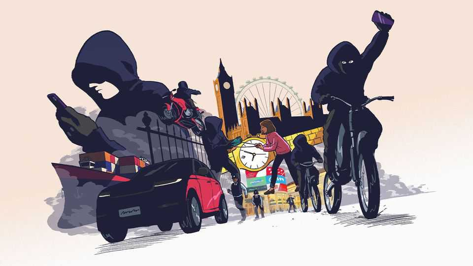

Leaders | Rogue Britannia
Britain leads the world in a new global business— a criminal one
What to do about its rampant steal-and-export industry
August 21st 2025

WALK DOWN the street in London and you might notice two things. First, although many pedestrians are glued to their phones, a few will periodically look over their shoulder, scanning for an assailant arriving at high speed. Second, some of the fancy cars, particularly SUVs, will have a steering lock. This does not mean that Britain is “lawless”, as the government’s critics complain. But both are signs of something worrying: a criminal enterprise that spans the world, but is flourishing most in Britain. We call it Grand Theft Global Inc. Expensive consumer goods are, increasingly, being stolen in the rich world and exported to distant markets. The idea is hardly new. In the 1990s

European cars and electronic goods headed east to former communist countries. “Visit Albania,” ran one joke. “Your car is already there.” What is novel is that the enterprise is globe-spanning, and underpinned by a sophisticated supply chain. London is the best place to see how it works, though other places should watch out. Grand Theft Global’s business model is spreading.

Roughly 70,000 phones were snatched in London last year—almost one for every 100 people. Britain accounts for 40% of phone thefts in Europe. (Phone-snatching is also growing elsewhere: 40,000 Parisians said adieu to their devices last year.) British thieves’ favoured method is to approach from behind on an electric bike, grab an unlocked phone and put it in a “Faraday bag” to prevent tracking; most of the nicked phones end up in China. Meanwhile, around 130,000 cars were stolen in Britain last year, a rise of 75% in a decade. SUVs are popular targets, for export to the Gulf and Africa, where they can handle poor roads.

Behind all this is a criminal enterprise that has all the trappings of a regular global business, including specialist service providers and seamless communications. Moving goods around the world adds cost, but distance is a feature, not a bug: Grand Theft Global depends on getting goods to places where they cannot easily be found. African countries have little capacity to check for stolen cars. China does not make it hard to sell stolen phones. The market is remarkably efficient. In April 2024 flooding in the UAE damaged many cars, and dealerships faced delays in replacing them. In the following months, Britain’s police saw a sharp uptick in SUV thefts.

Grand Theft Global seems destined to grow. As Africa and Asia become wealthier, demand for expensive goods will only increase—and the streets of rich-world cities offer a ready supply of nickable goods. In addition, many rich countries hardly monitor their exports at all. Moral hazard further complicates matters. The cost of Grand Theft Global is broadly spread among consumers via higher insurance premiums. That means no one has a really strong interest in tackling it.

But it needs to be tackled. Some suggest pressing countries where the stolen goods end up. That is unlikely to work: they have little reason to curb the trade, even if they could. A better idea is to stop Grand Theft Global at the

border. Hampering exports would have a cost, but freight companies could be asked to know their customers, as banks must to help fight fraud, money- laundering or sanctions-busting. Booking a container, for example, could require a face ID.

What about squeezing manufacturers? In the past, regulation has forced them to prioritise security, for example by adding immobilisers that make it harder to steal cars. But the rapid evolution of technology for breaking into vehicles suggests that a simple regulatory fix does not exist. The same is true for phones. Apple-bashing British MPs are wrong to think a quick tweak could end the blight of snatching.

That leaves policing, which has been left in the dust. Victims pull their hair out when they manage to track down their stolen car or phone and still the police do nothing. No Grand Theft Global kingpins have been caught. Authorities should clamp down on their latest tricks, for instance by making it illegal to possess break-in tools, and by seizing electric bikes that are not restricted to legal speed limits, which for now can serve as ideal getaway vehicles for urban wrongdoers.

Most of all, police need to understand what they are facing. Currently forces do not see these thefts as “high-harm”, yet the thieves’ impunity is corroding trust in law and order, and the same gangs are also involved in violence and drugs. Crimes are left to stretched local officers, with little to go on. To get to grips with Grand Theft Global, police must recognise it as the organised criminal enterprise it has become. ■

Subscribers to The Economist can sign up to our Opinion newsletter, which brings together the best of our leaders, columns, guest essays and reader correspondence.

This article was downloaded by zlibrary from https://www.economist.com//leaders/2025/08/21/britain-leads-the-world-in-a-new- global-business-a-criminal-one

Letters

How significant is the rise of fraudulent scientific papers?