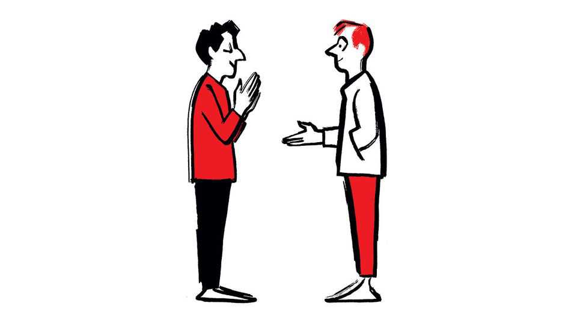

Letters | A selection of correspondence
How significant is the rise of fraudulent scientific
papers?

Also this week, higher education in Britain, AI security, greeting  
colleagues at work

August 21st 2025
  

  
Your article on the rise of fraudulent scientific papers drew on the work of a  
recent paper in PNAS that looked at the issue (“Inside job”, August 9th). We  
must indeed weed out fraudulent “paper mill” companies that produce this  
stuff.

However, both the original paper and your coverage rely on language and a  
figure that greatly overstates the scale of the problem. In 2020, the last year  
with actual data, paper-mill products were estimated at approximately 0.7%  
of all scientific articles. Tackling misconduct is vital, but misleading
representations and exaggerated projections risk undermining trust in  
science and lend weight to sceptics, rather than fostering effective reform.

Guillén   
FernándezScientific   
directorRadboud   
University   
Medical  
CentreNijmegen, Netherlands

As an editor of Neurology I oversaw the publication of an article (by Mark  
Bolland et al in 2016) that uncovered scientific misconduct on a large scale.  
Although this helped correct the literature, some of the papers that were  
retracted had been published years before, making it possible that their  
retraction may not have affected subsequent citations or inclusion of the data  
in guidelines or policy.

The study in PNAS is another strong effort to focus attention on unreliable  
scientific literature. Although this study could not distinguish between fraud  
(whether by authors, editors, or both) and poor adherence to scientific  
standards, it underlines that a reader cannot always believe all the findings.  
The identification of the networks at the core of this less reliable data is a  
service to science. It will take years of training programmes, at journals and  
at publishers, to bring rigorous standards to bear that will ensure the  
integrity of scientific literature.

Dr Robert GrossProfessor of neurology, emeritusUniversity of Rochester  
Medical CentreRochester, New York

You rightly observe in your article that Britain’s universities spend a lot on  
research and campuses (“Leaner learning”, July 19th). There certainly is an  
arms race on the latter—however, the financial problem for most universities  
is research. Britain does not need 157 research-active universities, most of  
which are not producing any significant volume of world-leading or  
internationally excellent research.

Academics derive little or no prestige from teaching, and are therefore  
driven into research. Huge amounts of money are wasted in the system that  
produces little or no new useful ideas. The government needs to concentrate  
research funds on the core research-active universities: the Russell Group  
and what used to be known as the red-bricks. The others should stop or only  
do applied research they can get the private sector to pay for. There are
many other problems within the sector related to the rankings, but getting it  
financially stable is the priority.

HENRIETTA   
ROYLEFormer   
chief   
operating   
officerCity   
St  
GeorgesUniversity of London

I noted the “bold” proposal to split Britain’s bankrupt universities into  
“national” and “local” institutions. National universities, such as Oxford and  
Cambridge, would focus on research and attracting the brightest minds.  
Local colleges “would offer the best possible training at the best possible  
cost”. Are the authors of this “radical” thinking aware that they have just  
reinvented the polytechnic? I agree with the prescription, but the thinking  
behind it is scarcely bold, more a reversion to a model of higher education  
that worked.

Sarah TraversLondon

Your briefing on the prospects for economic growth from the adoption of  
artificial intelligence (“Eureka all day long”, July 26th) explored a variety of  
AI-related risks and correctly highlighted the risk from biohazards as a  
particular concern. The actions you listed that labs could take to mitigate the  
risks omitted a critical component: security. Even if AI labs achieve  
overwhelming success in all the mitigations you mentioned, and even if they  
solve accidents and structural risks to boot, this would still be insufficient to  
prevent irreversible harms.

Models that are capable of causing a deadly man-made epidemic can be  
perfectly obedient (or “aligned”), closed-source and behind interfaces with  
aggressive guardrails, but if the model itself can be stolen by malicious  
actors and used outside a company’s data centre the epidemics will still  
happen. If we incorporate AI systems into critical infrastructure and  
national-security operations, as many governments are rushing to do, a  
single malicious modification of the behaviour of that system could  
endanger national safety. Good security is a prerequisite. Alignment of AI  
models is only helpful if they’re aligned to actually benefit society rather  
than harm it.
Many frontier AI companies seem to be on a worse trajectory for security  
than they are for safety. OpenAI recognises that its models could lead to a  
significantly increased likelihood and frequency of biological or chemical  
terror events, but it makes no commitments to any concrete security  
measures, benchmarks or processes.

In our report, “Securing AI Model Weights”, we outline 167 security  
measures that frontier AI labs can deploy to protect themselves. AI can’t be  
reliable and sustainable without being safe, but it also can’t be safe without  
being secure.

Sella NevoDirectorMeselson CentreRANDSanta Monica, California

Although no one knows exactly how this will pan out, it seems more likely  
that many top labs and countries could reach AGI capabilities  
simultaneously. Parallel efforts, leaks, shared research, or converging  
strategies may lead them to cross a blurred and ill-defined line together, each  
peering sideways at the others.

Each lab may claim its system truly crossed the threshold. In practice, we  
won’t get consensus, we’ll get a contested and chaotic landscape of rival  
use-case domains, where AGIs are aggressively marketed as smarter, safer  
and more aligned with your values. “Use ours” (any American Big Tech).  
“Don’t trust theirs” (any China Big Tech). The frontier will not be declared;  
it will be sold. If Silicon Valley’s forecasts are anywhere near accurate,  
expect unprecedented promotion and upheaval.

Dr Mark RobinsonOxford

It’s not surprising that critical thinking is inversely related to the use of  
memory aides. My wife says that I keep no appointments in my brain since I  
discovered Google Calendar. Now I drive an electric BMW that constantly  
downloads new software and has cameras with a 360-degree view of my  
surroundings. A question for your readers. Would you feel safer riding with  
a dumb person driving a smart car or a smart person driving a dumb car?

Dr William KochClinical professor emeritusUniversity of British Columbia  
MedicineWest Vancouver, Canada
Bartleby’s agony uncle, Max Flannel, tackled the question of how to greet  
people at work (August 9th). Just before the beginning of the pandemic,  
when social distancing was proposed but not yet enforced, we got to grips  
with that question down at the pub. Some of us thought that fist bumps,  
elbow bumps or ankle bumps might be acceptable. I disagreed. I thought the  
Imperial Chinese custom of shaking hands with oneself would be far better.  
But although I would have preferred the Imperial, I knew that namaskar, the  
Hindu tradition of pressing one’s hands together and bowing the head, would  
be more widely recognised, so I adopted it. I still use it as a greeting or  
farewell. I probably shall for the rest of my life. To date, no one has queried  
it.

Richard LarkinLondon

This article was downloaded by zlibrary from [https://www.economist.com//letters/2025/08/21/how-significant-is-the-rise-of-](https://www.economist.com//letters/2025/08/21/how-significant-is-the-rise-of-)
fraudulent-scientific-papers

By Invitation
 
Margaret MacMillan on the promise—and perils—of wartime summits