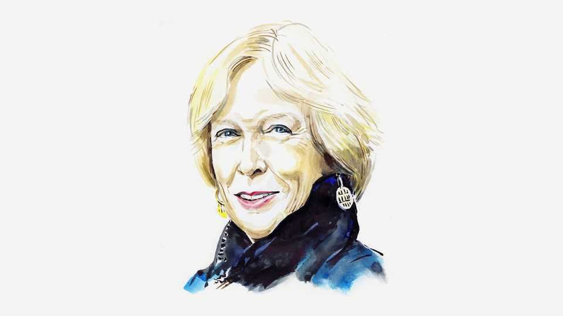

By Invitation | After Anchorage
Margaret MacMillan on the promise—and perils
—of wartime summits

Leaders’ set-pieces have become more common, but not always more  
productive

August 21st 2025
  

  
IF ONLY HE had thought of it in time. President Donald Trump could have  
used his favourite colour to turn the American base in Anchorage into a  
21st-century Field of the Cloth of Gold as Henry VIII of England and  
Francis I of France did near Calais in 1520. There were meetings, sumptuous  
banquets, jousts and a solemn mass. It was a marvellous spectacle and  
produced very little. Two years later Henry aligned with Francis’s great  
rival, the Holy Roman Emperor.

Summits so often promise more than they can deliver. The Russians have  
spun the Anchorage summit as a great victory, and perhaps it is for them, but
the Americans can make no such claim. There will, of course, be more jaw-  
jawing—Mr Trump met Ukraine’s President Volodymyr Zelensky and a host  
of other European leaders at the White House three days after Anchorage,  
and Mr Zelensky may yet get a bilateral summit with Vladimir Putin  
followed by a three-way one involving Mr Trump, too. But if this is a peace  
process, it has not had the most auspicious of starts.

Even the best-planned summits—and Anchorage was not—depend heavily  
on the personalities and chemistry of the leaders. With powerful leaders,  
feelings matter. An assumption of superiority, or conversely wounded pride  
and a desire for revenge, can lead to future trouble. Joseph Stalin treated  
Mao Zedong like a subordinate after the communist victory in the Chinese  
civil war and kept him hanging around in Moscow for months before  
offering some grudging aid to China. It left a lasting mark on the Chinese  
and contributed to the Sino-Soviet split. At their Vienna summit of 1961  
Nikita Khrushchev humiliated President John Kennedy. Khrushchev  
concluded that Kennedy was a weakling and later took the hideous gamble  
of stationing nuclear weapons in Cuba. Kennedy vowed he would never be  
pushed around again.

The staging of summits can signal contempt—Adolf Hitler summoning the  
hapless Austrian chancellor to Berchtesgaden to threaten his country, for  
example—or friendship, as with Mr Trump applauding the arrival of Mr  
Putin on the tarmac in Anchorage. But if a summit only papers over  
differences it can lead to war rather than peace. Napoleon and Alexander I of  
Russia met on a raft on the River Neman near Tilsit in 1807 to negotiate  
peace and an alliance. They also divided up Prussia, infuriating the  
Prussians, whose king, uninvited to the raft, wandered sadly along the river  
bank. Yet the two great powers never resolved their underlying differences.  
Five years after Tilsit Napoleon invaded Russia.

In their first meeting during the second world war, off Newfoundland in the  
summer of 1941, Winston Churchill and Franklin Delano Roosevelt made  
formal visits to each other’s warships and prayed and sang hymns together  
with their sailors to underline their countries’ friendship. They and their  
military top brass had serious conversations about the war in Europe, their  
new ally the Soviet Union, the worsening conflict with Japan and the shape
of the post-war world. The meeting was a milestone in a deepening  
relationship without which the war could not have been won.

Summits work when they are underpinned by shared goals, trust and a  
commitment to work together. It also helps to be well-prepared. At a critical  
meeting between Churchill and Roosevelt in Casablanca in January 1943 to  
decide on the overall strategy for the war in the following months, the  
British, who had brought detailed papers and a shipload of experts,  
persuaded the Americans to delay a landing in France until 1944. As an  
American general complained, “We came, we listened, and we were  
conquered.”

The same could be said of Anchorage. It was a Russian triumph and an  
American embarrassment. Mr Putin conceded nothing, not even a ceasefire  
—and for the Americans to claim getting the big deal is more important is  
wishful thinking, since Mr Putin will surely spin out the talks if he can keep  
fighting and grabbing more land. Mr Trump’s suggestion in subsequent  
meetings with European leaders that America could support security  
guarantees for Ukraine will have done little to ease concerns across the  
continent about the dependability of his administration.

Anchorage may yet produce something useful—by raising the question of  
whether summits are the best way to conduct international relations. So  
often, they are heavily choreographed and all the real work has been done  
already. Or, as has happened with Mr Trump, the leaders can ignore their  
advisers and briefing papers and pride themselves on getting through to their  
opposite numbers to make deals. Such freelancing, as Mr Trump has shown,  
can be unproductive or unpredictable.

Summits have increased in frequency since 1945 partly because leaders,  
whether of democracies or dictatorships, like them. They are a welcome  
distraction from domestic politics: Richard Nixon once mused about leaving  
all that to his cabinet while he dealt with the global issues that interested  
him. Leaders like to feel that they are making history.

Yet often the results are much less than advertised. Neville Chamberlain  
brought back a piece of paper from Munich signed by himself and Hitler that
symbolised, he said, the desire of their two peoples never to go to war again.  
A year later Britain and Germany were at war.

It remains to be seen what Anchorage and this week’s follow-on summits  
will produce, apart from yet more meetings and, probably, a continuing war.  
Pressure from America on Ukraine to give up even land Russia hasn’t taken?  
Resistance from Ukraine and the European powers? A Trump visit to  
Moscow? Perhaps not the Nobel peace prize for him just yet. ■

Margaret MacMillan is emeritus professor of history at the University of  
Toronto and Oxford University, and the author of “War: How Conflict  
Shaped Us (2020)”.

This article was downloaded by zlibrary from [https://www.economist.com//by-invitation/2025/08/18/margaret-macmillan-on-the-](https://www.economist.com//by-invitation/2025/08/18/margaret-macmillan-on-the-)
promise-and-perils-of-wartime-summits
Briefing
 
The world’s biggest chipmaker needs to move beyond Taiwan