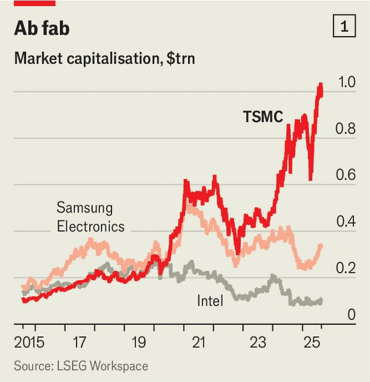
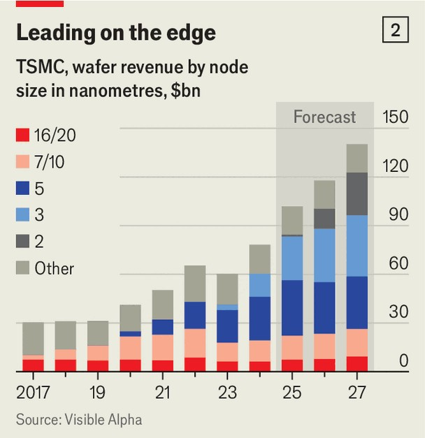

Briefing | TSMC
The world’s biggest chipmaker needs to move
beyond Taiwan

Easier said than done

August 21st 2025
  

  
Taipei, a city of over 2m people, stopped moving at 1.30pm on July 17th.  
Sirens rang out across the capital as residents rehearsed a civil-defence drill  
for a Chinese invasion. Half an hour later, as phones buzzed to mark the end  
of the drill, the top brass of tsmc, the world’s largest chipmaker, gathered in  
a hotel in the city centre for their quarterly earnings call. They brought good  
news: record profits, good progress on global expansion, a confident forecast  
of more.

The disjuncture was hard to miss. As an island contemplated war, its most  
important company carried on with business as usual. tsmc has fared  
exceptionally well in Taiwan, growing into a giant of the global technology
industry. But, for reasons both internal and external, it has embarked on a  
tricky expansion beyond its home.

In terms of revenue, tsmc produces two-thirds of all chips made by foundries  
—firms that manufacture semiconductors designed by others. In the most  
advanced segment, including processors for smartphones, laptops and data  
centres, the company’s share exceeds 90%. The artificial-intelligence boom  
is powered by the AI accelerator, a type of chip designed to train and run  
large language models. Almost all of them are made by tsmc. Nvidia, the  
world’s most valuable company, relies entirely on the Taiwanese firm. So  
does its closest rival, amd, another chip designer. Big tech firms like  
Alphabet, Amazon, Apple and Microsoft, each designing their own bespoke  
silicon, also turn to tsmc.

Swelling demand from tech firms has pushed tsmc to extraordinary heights.  
Between 2014 and 2024 its annual revenues rose from $24bn to $88bn.  
tsmc’s market value has reached $1trn, making it the eleventh-most valuable  
company in the world (see chart 1). Since the launch of Chatgpt in  
November 2022, tsmc’s share price has more than doubled. Unfortunately,  
the larger and more dominant the firm grows, the more it looks like a  
problem.

For most of its history, tsmc made all of its cutting-edge chips in Taiwan.  
Although the firm has long operated a few overseas plants making less  
sophisticated chips, it has only recently begun shifting some of its most  
advanced manufacturing abroad. Over the past five years it has embarked on  
a $190bn global expansion. Of that, $165bn is going to the American state  
of Arizona, where the firm plans to operate six leading-edge factories or  
“fabs”. Replicating tsmc’s precision on American soil will be difficult.  
Shielding its core operations from geopolitical risk may prove harder still.

Despite its size and importance, tsmc avoids the spotlight. In an interview  
with The Economist, Wendell Huang, the firm’s finance chief, admitted it  
prefers to “stay low profile” and is “still adjusting” to the more intense  
scrutiny it receives these days. That aversion to publicity is woven into its  
culture. tsmc was built to let customers shine while it stayed in the wings.

When Morris Chang founded the firm in 1987, chipmakers like Intel, amd  
and Texas Instruments designed and produced their own semiconductors. Mr  
Chang made a contrarian bet: that a firm focused on manufacturing could  
outperform vertically integrated rivals. By specialising, tsmc could create  
manufacturing processes that others could not equal. By serving many  
customers, the company could achieve economies of scale and cut costs.

Its bet paid off, and an industry was transformed. Evercore, an investment  
bank, estimates that in the first decade of this century more than 20 firms  
made leading-edge logic chips. By 2012 only three remained: tsmc, Intel and  
Samsung, a South Korean electronics firm. Today only tsmc is thriving.  
Samsung has struggled with manufacturing issues at its most advanced fabs.  
Intel, once the standard-bearer of the industry, has fallen behind in chip  
technology and is trying to build a foundry business as its sales dwindle.

The presence of foundries like tsmc made it easier for upstart “fabless”  
technology firms to focus on chip design and not worry about the  
manufacturing process. That shift unbundled the industry, triggering an  
explosion of chip startups. Jensen Huang, the boss of Nvidia, has said that  
his firm “would not be possible without tsmc”. Many rivals tried to copy  
tsmc’s pure-play foundry model, but none of them managed to survive at the  
technological frontier.
To understand why tsmc is so dominant, peer inside the fabs. Moore’s law,  
the idea that computing power doubles roughly every two years, relies on  
shrinking the transistor, a microscopic electrical switch. In 1971 a typical  
processor held 200 transistors per square millimetre. Nvidia’s b200 ai chip,  
released in 2024, squeezes in about 130m—making for smaller, more  
energy-efficient computing. Manufacturing such devices, with features  
measured in nanometres (nm, millionths of a millimetre), requires factories  
that cost $20bn apiece and are capable of producing around 25,000 silicon  
wafers, each containing many chips, per month.

tsmc’s fabs are enormous. In Taiwan, it operates four “gigafabs”, each with  
at least four times the capacity of a typical factory. Fab 18 in Tainan alone  
spans 950,000 square metres. Its cleanroom, the sterilised factory floor  
where chips are etched layer by layer, occupies one-sixth of that area and is  
cleaner than an operating theatre. Few other firms can match tsmc’s scale or  
precision. Its yields, the share of chips on a wafer that meet quality  
standards, are exceptionally high.

Its employees are even more formidable. Sassine Ghazi, chief executive of  
Synopsys, a maker of chip-design tools, says that tsmc’s manufacturing  
discipline is “unbelievable”. That discipline is shaped by how the firm sees  
itself: as a manufacturer first and a technology company second. Insiders  
describe a culture where employees are pushed to find efficiency gains even  
when systems are running smoothly. Any improvement in one fab is swiftly  
replicated across all others. Failures are hunted down obsessively.

The company’s finances reflect its rigour. In 2024 tsmc’s net profit margin  
was 40%, more than three times the average for rival foundries. Given its  
dominance, could it charge more? Mr Huang of tsmc says the firm is often  
asked that. His reply is that it succeeds only when its customers do. What he  
does not say, but is true, is that the firm is paranoid about losing ground to  
rivals. Pushing too hard risks driving clients away eventually.
Staying ahead is costly. tsmc outspends its rivals by a wide margin.  
TrendForce, a research group, estimates that in 2025 the company’s capital  
expenditure will amount to between $38bn and $42bn. Samsung plans to  
spend around $3.5bn on its foundry arm, Intel between $8bn and $11bn.  
tsmc directs spending where it matters most. In 2025, 52% of revenue is  
expected to come from chips produced on its most advanced nodes—  
typically “5nm” and below, although that is a marketing term rather than a  
precise measurement. By 2027 the share is expected to reach about 70% (see  
chart 2).

For years the firm’s growing dominance in chipmaking was hardly noted.  
Few outside the technology industry had even heard of tsmc. That began to  
change in 2019, when the first Trump administration sounded alarms over  
America’s reliance on Taiwanese chips. Then came the pandemic. Covid-19  
closed factories, causing a global chip shortage that halted production in  
industries from electronics to cars. As supply chains faltered, governments  
fretted. tsmc was no longer a mere manufacturer. It had become strategic  
infrastructure.

In 2022 President Joe Biden signed the chips Act, a $50bn package of  
subsidies and tax credits designed to boost chipmaking in America. tsmc,  
which announced it would spend $12bn on a factory in Arizona in 2020,

tripled that amount by late 2022. The ai boom made American politicians  
even keener to bring more fabs to their country. President Donald Trump,  
who derided the chips Act as wasteful, has pushed tsmc to make more chips  
on American soil by threatening tariffs. In response, the firm pledged to  
invest another $100bn in Arizona. C.C. Wei, tsmc’s boss, explained that a  
smaller sum “wouldn’t even make Trump open his eyes”.

Perhaps sensing that the firm can be swayed, some American officials have  
floated the idea of tsmc partnering with Intel to help jump-start the  
American firm’s foundry business. Mr Huang responds, frankly, that the  
company is not interested. He compares such a deal to pouring gasoline into  
a diesel engine. tsmc’s processes are not compatible with Intel’s fabs, nor  
could the firm help run them. The American government is now considering  
a stake in Intel.

Attempts to entice and bully tsmc to manufacture more chips outside Taiwan  
happen to align with the company’s thinking. Increasingly, the firm seems  
too large for its island home. s&p Global, a research firm, estimates that in  
2023 tsmc accounted for 8% of the island’s electricity use. By 2030 its share  
could rise to nearly a quarter.

Power is not the only limitation. Stephen Su of the Industrial Technology  
Research Institute, a tech incubator in Hsinchu, points out that competition  
for engineers will grow fiercer as the working-age population shrinks.  
Taiwan has few immigrants and a fertility rate of just 0.9, whereas a rate of  
2.1 is necessary to sustain the population. Land is another constraint. tsmc’s  
newest fab in Kaohsiung, which spans 79 hectares, was built on a former oil  
refinery and required a good deal of soil reclamation. Finding sites for future  
fabs is becoming harder.

Expansion abroad brings fresh challenges. The company is constructing new  
fabs in Japan and Germany, though its biggest bet is in Arizona. One fab has  
begun production; two more are under construction, with another three to  
follow. All told, Arizona could house as much as a third of tsmc’s most  
advanced capacity. The arid environment has taken some getting used to. Mr  
Huang admits the company was surprised by delays in the local permit  
process. In Taiwan, he says, managers know what permits are required and  
“how to handle it”. In Arizona, they assumed that, with Intel already
operating plants nearby, local authorities would be familiar with fab  
construction.

Things have since improved. The first Arizona fab is reportedly producing  
chips for Apple at yields comparable to those in Taiwan. They are not cheap,  
though. Lisa Su, the boss of amd, estimates that chips made in Arizona may  
cost up to 20% more than those from Taiwan. The hope is that customers  
will be willing to pay a premium for supply-chain resilience.

A bigger worry is the difficulty of importing an engineering culture. An  
executive at a chip-design firm likens TSMC’s operations in Taiwan to a  
machine with “its own heartbeat” and suggests that workers elsewhere do  
not possess the same rigour. Stories of an intense, self-sacrificing work  
culture abound. After a powerful earthquake hit Taiwan in 1999, employees  
quickly filled tsmc’s car park to assess the damage. In the mid-2010s the  
company created a “nightingale programme” with engineers working the  
night shift as it raced to close the gap with Samsung and win Apple’s phone  
business.

Mr Chang has long maintained that transplanting such a work ethic across  
borders would be difficult. The company is trying. Around 1,000 Arizona-  
based engineers were sent to its “mother fab” in Tainan for 12 to 18 months

of training. A similar number of Taiwanese engineers later joined them in  
Arizona. Over time, the number of transplants ought to fall. Growing  
automation may help, too. Jon Yu of Asianometry, a YouTube channel on  
business history, notes that tsmc still requires a pool of skilled technicians to  
operate its fabs. Given higher labour costs and different work norms abroad,  
the firm may be more willing to automate.

Geopolitics adds other pressures, which are harder to anticipate and respond  
to. In Taiwan, tsmc is more than just a company. Locals refer to it as “the  
sacred mountain that protects the country”, and in hard-to-measure ways it  
contributes to national security. As long as China relies on tsmc for its chips,  
goes the theory, it will hesitate to attack the island. That makes the firm’s  
global expansion politically delicate. Becca Wasser of the Centre for a New  
American Security, a think-tank in Washington, says that Taiwan faces a  
difficult balancing act. It needs to keep enough of TSMC’s operations at  
home to remain strategically indispensable, while accommodating allies who  
are eager to reduce their dependence on the island’s fabs.

The events of the past few years may have made the task harder. Since 2019  
asml, a Dutch firm that supplies technology to chipmakers, has been barred  
by that country’s government from exporting its most advanced tools to  
China. That has hobbled Chinese firms’ ability to produce semiconductors at  
the 7nm level and below. In November 2024 the American government  
tightened restrictions further, prohibiting tsmc from offering its most  
advanced services to Chinese customers. Some analysts warn that cutting  
China off from the technological frontier could increase the risk of military  
action.

The stakes of this balancing act are immense. In 2022 Mark Liu, then  
TSMC’s chairman, warned that a Chinese invasion would render the  
company’s fabs inoperable, since they depend on a “real-time connection  
with the outside world”. Elbridge Colby, the Pentagon’s current policy chief,  
has gone further—suggesting that the fabs should be destroyed if China  
invades. Either way, the result would be the same: a global supply chain in  
chaos.

tsmc sees little value in dwelling on hypotheticals. Mr Huang believes  
markets are more pragmatic now. Though he does not say it outright, the
message is that investors have already priced in geopolitical risk and are less  
anxious about it. He suggests that if war were to break out, it would not be  
confined to Taiwan but would engulf its neighbours too. In that case, there  
would be much more to worry about than chip production.

That view may be too sanguine. Even if the Arizona fabs function as well as  
expected, two-thirds of the world’s most advanced chips will still be made in  
Taiwan. The firm’s most advanced manufacturing technology will remain  
there, as will nearly all its research and development. Its overseas fabs, by  
design, will lag at least one generation behind.

Beyond geopolitics, other risks loom. As tsmc pushes the limits of process  
technology, it could stumble. The firm pulled ahead of Intel in 2015 when  
the American firm faltered on newer nodes. Its rivals, though bruised,  
remain formidable. Samsung recently signed a $16.5bn deal to supply  
advanced chips to Tesla, a lift to its foundry ambitions. The ai boom, which  
has fuelled much of tsmc’s recent growth, could slow down. Tariffs may sap  
demand for consumer electronics, which account for 40% of the firm’s  
revenue. And the semiconductor industry is notoriously cyclical. Firms tend  
to overbuild in good times, only to face a glut when demand slows. tsmc’s  
current expansion is bigger than anything in its history.

tsmc’s greatest challenge may be the least tangible. Mr Huang says outsiders  
often assume that chipmaking success is simply about money. Yet, he notes,  
there are examples where governments have “poured money into a certain  
company” and still failed. What they lack is tsmc’s edge, its resilience,  
discipline and relentless drive to improve. For the company to keep growing,  
it must succeed abroad. That will depend on whether it can export its  
exacting culture. For a firm that has weathered typhoons and earthquakes,  
and lives under the shadow of war, going global may prove the harder test.■

To stay on top of the biggest stories in business and technology, sign up  
to the Bottom Line, our weekly subscriber-only newsletter.

This article was downloaded by zlibrary from [https://www.economist.com//briefing/2025/08/21/the-worlds-biggest-chipmaker-needs-](https://www.economist.com//briefing/2025/08/21/the-worlds-biggest-chipmaker-needs-)
to-move-beyond-taiwan
United States
 
Does it make sense for America to keep subsidising a sinking city?  
Welcome to the YIMBYest neighbourhood in America  
The Democrats who find abundance liberalism threatening  
The young American female soldiers of TikTok  
Marjorie Taylor Greene wants to stop them from making it rain  
How Washington became Donald Trump’s chew toy