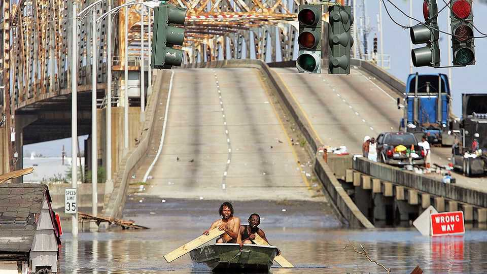
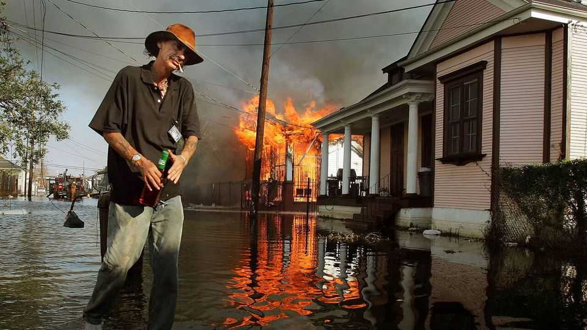
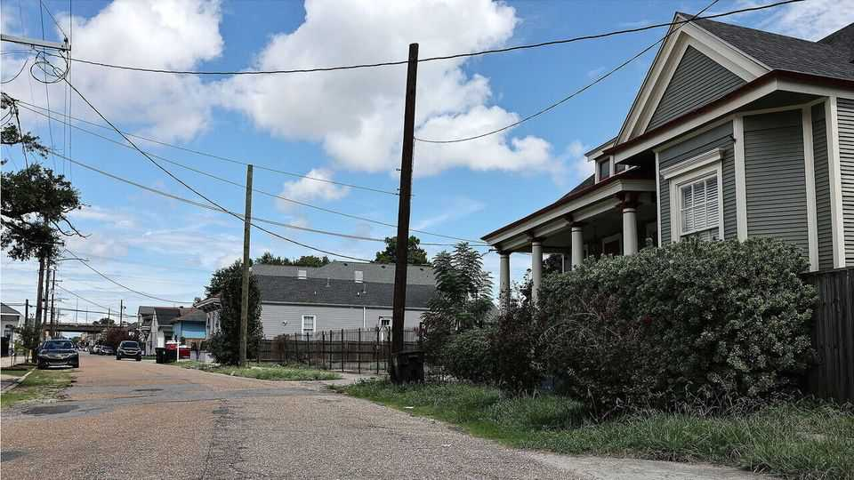
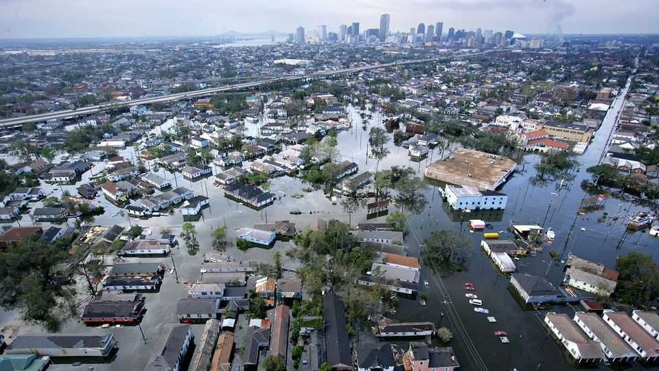
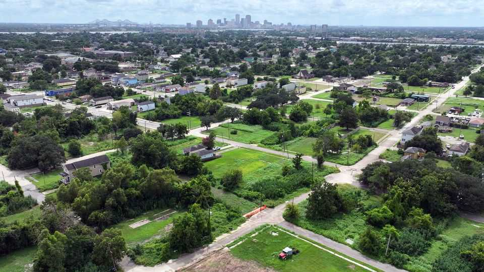
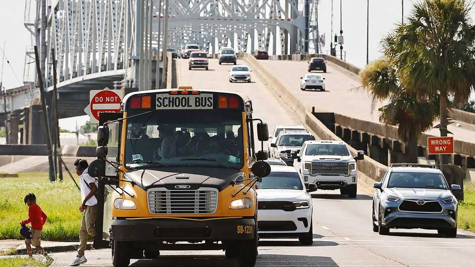

United States | Muskrat ramble
Does it make sense for America to keep subsidising a sinking city?
Twenty years after Hurricane Katrina, New Orleans faces a different kind of risk
August 21st 2025

STAND ON the rim of the grassy levees and you can see New Orleans’s dilemma: rising water on one side, a sinking city on the other. The people who call this place home have learned to live with water. Storms punctuate time as birthdays and holidays do in other parts of America. Twenty years after Hurricane Katrina tore through the Gulf coast and shattered New Orleans, the city remains as defiant—and precarious—as ever. In its aftermath the federal government spent $125bn, in today’s dollars, to rebuild a region that is home to just 1.4m people, making Katrina America’s costliest storm. Had the government not invested so much, the

city would have probably followed the path of Galveston, Texas, which ceded its place as the state’s ocean-side economic engine to Houston and fell off the national radar after a devastating hurricane in 1900.

New Orleans was spared that fate by federal money. But it could not be described as thriving. Its three biggest industries—tourism, shipping, and oil and gas—are losing jobs. It is bleeding residents faster than any other city of its size in America. Last week the mayor was indicted on corruption charges. Those could be dismissed as short-term problems. Rising water cannot. Even the levees, some of which doubled in height after Katrina, are slipping into the sea. The city is a project that begets more projects. To preserve it will cost much more. How long can this carry on?

Problems have been brewing since New Orleans was settled by French colonists. Jean-Baptiste Le Moyne de Bienville convinced his colleagues in Paris that the capital of French Louisiana should sit on the swampland where the Mississippi river met the Atlantic. The port gave the French an edge in commerce and defence. But, in 1719, a year after New Orleans was founded, it flooded. For the next century the city fought against water, as French rule gave way to Spanish and then American. By 1840 New Orleans had become the biggest city in the South and the fourth-busiest port in the world. The political heroes of the day were the “drainage kings” who engineered dry

land. In 1914 the mayor went on a national tour to advertise the extraordinary feat of reclaiming New Orleans.

Around that time an architect noticed cracks in St Louis Cathedral, the city’s grandest church. New Orleans was sinking below sea level. The levees that engineers had built to stop the flooding prevented the river depositing sediment to replenish the land as it always had. The city was also losing its natural defences against tropical storms. In the 20th century oil and gas companies carved 10,000 miles of canals through the marshes of coastal Louisiana. That killed the cypress groves that slowed the rush of water towards the city, and 2,000 square miles of land sank into the ocean. “The paradox is that the very devices that made New Orleans possible had sowed the seeds for its undermining,” says Richard Campanella of Tulane University.

Locals knew the city was vulnerable, but relished living in a place where food fused the cultures of three continents and deaths were honoured with jazz parades. When Katrina breached the levees on the morning of August 29th 2005, they paid a price. Flooding killed 1,800 people and caused $200bn worth of damage. Hundreds of thousands of people fled. Parts of the city filled up like a bathtub. Yvonne Blue sat in her attic in the Lower Ninth Ward with her grandchild in her arms and her feet in the water. When a boat

came to rescue her ten hours later she held her breath and swam under to unlock the door.

Katrina sparked a ferocious partisan argument about who was to blame for failing to prepare: the city (whose Democratic mayor botched the evacuation and stoked panic about violence in shelters) or the federal government (which was ultimately responsible for the levees). Democrats blamed President George W. Bush and won a thumping victory in the national mid- term elections of 2006.

The destruction also raised existential questions. Was draining the swamps a mistake? While first responders were picking bodies out of homes, Russel Honoré, the army general in charge of the recovery, briefed Washington politicians aboard a warship at the port. During his update Dennis Hastert, then the speaker of the House of Representatives, interrupted to ask whether New Orleans should be rebuilt. He was not alone in thinking: perhaps not. Religiously inspired pundits drew parallels to the biblical story of Sodom and Gomorrah; environmentalists were arguing for moving the city up the river. Nancy Pelosi, then the minority leader, stood up and struck the map before them in anger. “We’re going to rebuild this damn city,” Mr Honoré remembers her saying. President Bush agreed.

And so they did. The decision to rebuild went back to Bienville’s economic argument: most of the country’s agricultural exports flowed through the port and a robust military industry had built up around it. But there was also something about the culture of the city that people near and far wanted to protect. New Orleans was like a funny-shaped piece in the American puzzle —without it there would be a hole. Robert Carlisle, a construction worker who rebuilt 300 homes after the storm, remembers plastering over mouldy wood to get people back in quickly. “Some of those houses—we were just patching them up,” he says, but “it made sense because of the way the people felt about this city.”

Some found better, or easier, lives elsewhere and did not return. Franklin Avenue Baptist Church, the biggest in New Orleans, lost 3,000 congregants. Neighbourhoods like the Lower Ninth Ward started to resemble the teeth of a jack-o-lantern: houses interspersed with empty lots where the grass now grows waist-high. Despite the shrunken population, the federal government doubled down. In the decade that followed it spent $14bn to build a system of levees and floodwalls to withstand another storm as strong as Katrina. This time the government promised “risk reduction”, not “protection”. “It’s an American adage that we’re not going to abandon one of our great cities,” says Michael Hecht of Greater New Orleans, an economic-development

group, “but the humbling of Katrina made people understand that we are never going to defeat Mother Nature.”

On the 20th anniversary of Katrina, New Orleans is a city of even more paradoxes. Some good has come from its overhaul. After switching to a fully charter-school system, educational results in New Orleans dramatically improved. Its flood-control system is now the envy of other vulnerable places like Houston and New York. The West Closure Complex, its largest pumping station, could empty an Olympic swimming pool in five seconds. The system works remarkably well. Residents on the western bank pay around $150 a year for it to be maintained and their homes rarely flood. South of the city, where the fingers of the bayou stretch into the ocean, houses now sit on stilts. A group of volunteers there, who call themselves the “Cajun Navy”, travel to other parts of the country to help when it floods.

The place is nonetheless in peril. In the next 50 years Louisiana is expected to lose as much coastal land as it did in the past 100. The probability of huge storms will more than double. Since 2020 the feds have declared four times the number of weather disasters in all Louisiana parishes as in the average American city, and far longer blackouts. Kasey Sullivan, a shrimp seller, says she gets panic attacks whenever her phone buzzes with a weather alert: “you can’t breathe and you gasp for air, and you’re like, ‘What’s my next move?’”

Preparing the city to withstand future shocks will take more colossal investment, and New Orleans is a poor city in a poor state. Locals do not see retreat as an option. “If we stop investing in New Orleans, where would we ask people to move?” asks Allison Plyler of the Data Centre, a research firm. She is right that other American cities have become more vulnerable, too. Saltwater is threatening Miami’s drinking water, Los Angeles periodically goes up in flames and extreme heat in Phoenix is giving people asphalt burns. When Hurricane Helene destroyed North Carolina’s mountain towns last year, it became clear that places once seen as climate refuges are now susceptible to the deadliest storms. But because Congress appropriates funds, spending in one place comes at the expense of another. Louisiana already takes far more money from the government than it sends back in taxes.

Ms Blue, who swam to safety during Katrina, reckons that New Orleans will “go down” in the next 50 years, regardless of how much money is poured in. These days she spends hours watching storm clouds from her porch, just blocks from where her old house once stood. Because of how damp the soil is, the small patch of grass in her front yard grows so fast that she has to mow it twice a week. She considers that a sign of what will become of her city. “I may not be here to see it,” she says, “but it’s nothing but swamp and it will go back to being swampland.” ■

Stay on top of American politics with The US in brief, our daily newsletter with fast analysis of the most important political news, and Checks and Balance, a weekly note from our Lexington columnist that examines the state of American democracy and the issues that matter to voters.

This article was downloaded by zlibrary from https://www.economist.com//united-states/2025/08/21/does-it-make-sense-for-america- to-keep-subsidising-a-sinking-city