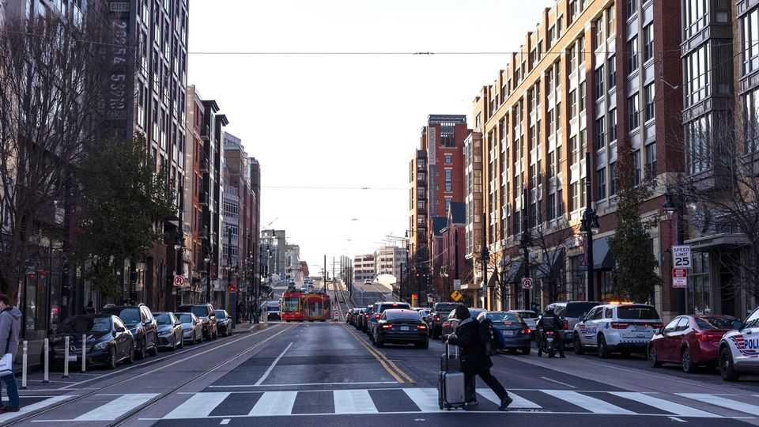
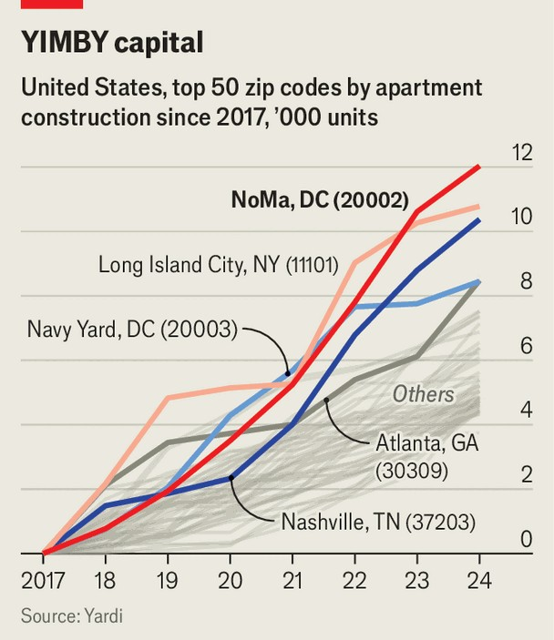

United States | Swampoodle, No More
Welcome to the YIMBYest neighbourhood in
America

Lessons for the country, from a few blocks north of the Capitol

August 21st 2025
  

  
Persuading yuppies to move to “Swampoodle” was always going to be an  
uphill battle. So when the ex-industrial zone next to Washington, DC’s main  
railway station was slated for redevelopment in the 1990s and 2000s, the  
authorities ditched the neighbourhood’s original 19th-century name, which  
had already fallen into disuse. Instead, they christened the wider area  
“NoMa” (“north of Massachusetts Avenue”), a syllable or two away from  
trendy locales like NoMad (in New York) and Soho (in each of New York,  
London and Hong Kong).
And come the yuppies have, in their thousands. The zipcode that  
encompasses NoMa has had more new apartment units added than anywhere  
else in the country since 2017, according to data from Yardi, a real-estate  
software company (see chart). Long Island City, just across the East River  
from Manhattan, is in second place. Not far behind is Navy Yard, a nearby  
Washington, DC, neighbourhood with a similar feel, though with a  
reputation for housing a slightly Trumpier crowd.

A visitor disgorged from the NoMa metro stop, which is now the sixth-  
busiest in the city, will almost immediately be barraged by “now leasing”  
signs, boasting rooftop pools, full-featured gyms and one-month-free rental  
offers. The buildings around were generally put up only five or, at most, ten  
years ago. Most have a blocky, plastic-clad look, that telltale feel of late-  
2010s and early-2020s American apartment developments. Café chains like  
Blue Bottle and Maman sell their residents $8 lattes and $5 chocolate-chip  
cookies.

NoMa is, in short, not far off the stuff of YIMBY dreams. “Yes in my  
backyard” activists—often 20- or 30-somethings radicalised by the high cost  
of rent in big cities—want to make it easier to build more, and denser,  
housing to raise the supply of homes and ultimately pull down property

prices. Many YIMBYs have flocked to NoMa; the Institute for Progress, an  
influential YIMBY think-tank, has its headquarters there.

Aesthetics aside, then, has the flood of new apartments in NoMa made a  
difference to housing affordability? Very possibly. Home prices in the  
Greater Washington area rose roughly in line with other big American cities  
in the 1990s and 2000s, but have lagged behind them over the past decade or  
so–just as the building boom in areas like NoMa and Navy Yard got going.  
That has hardly left the city cheap, but has made it at least less exorbitant  
than east coast peers like New York or Boston.

The political bargain that has allowed NoMa to deliver all those units  
quickly, and cheaply, was a relatively unusual one. For a start, very few  
people had lived in the area since the original residents of Swampoodle were  
turfed out in the early 20th century to make way for Union Station. That  
meant no local NIMBYs to complain about new construction ruining their  
surroundings. Serious residential development in the area became viable  
only after a new metro station for the neighbourhood was added in 2004,  
jointly funded by local government, the federal government (keen on new  
office space near Capitol Hill) and housing developers.

Washington’s government was also in dire financial straits in the 1990s,  
when NoMa’s redevelopment was conceived, making the extra tax revenue  
particularly appealing. Salim Furth, an economist at George Mason  
University, also points out that unlike many other big cities, Washington,  
DC, proper is dwarfed by its suburbs. That fosters a virtuous sort of  
competition: if Washington fails to house people who work there, they can  
move to Maryland or Virginia and take their tax dollars with them. Even  
then, zoning codes in much of Washington remain highly restrictive.  
Tall buildings are banned entirely, giving the city a squat skyline

The build-out of NoMa is now three-quarters complete, estimates Maura  
Brophy, who runs NoMa’s business-improvement district. The final leg of  
building should take another decade or so. America will need many more  
NoMas. After a century of mainly expanding outwards, cities across the  
country are nearing the limits of suburban sprawl. Next comes building  
upwards. NoMa was YIMBYism on easy mode. Cracking the politics of that  
shift elsewhere may well be a tougher task. ■
Stay on top of American politics with The US in brief, our daily newsletter  
with fast analysis of the most important political news, and Checks and  
Balance, a weekly note from our Lexington columnist that examines the  
state of American democracy and the issues that matter to voters.

This article was downloaded by zlibrary from [https://www.economist.com//united-states/2025/08/17/welcome-to-the-yimbyest-](https://www.economist.com//united-states/2025/08/17/welcome-to-the-yimbyest-)
neighbourhood-in-america