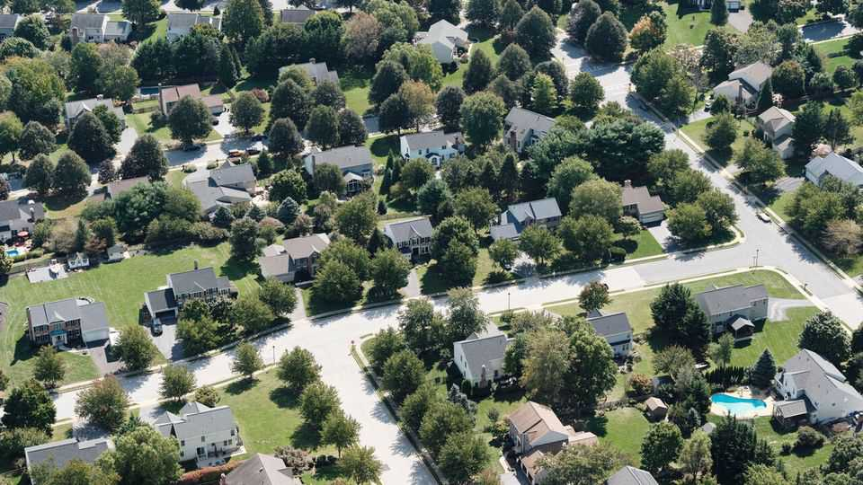

United States | When abundance meets resistance
The Democrats who find abundance liberalism
threatening

A call for more building runs into trouble in NIMBY-land

August 21st 2025
  

  
The Democratic Party needs a makeover. Donald Trump’s victory in  
November showed that the party can no longer rely on bashing him to win  
elections. The Republican president is trusted more than Democrats, whose  
approval rating is the lowest it has been in 35 years. Democrats are  
searching for a positive vision to inspire voters, and leading the pack, at least  
among party elites, is the brand of “abundance”. Popularised in a recent  
book by Ezra Klein and Derek Thompson, two journalists, abundance types  
advocate overhauling a decades-old liberalism of bureaucratic red tape with  
one that builds clean energy, infrastructure and, above all, affordable  
housing. Even Zohran Mamdani, the socialist Democratic nominee for New  
York City mayor who wants to freeze rents, has given the abundance wing of
the Democratic Party a few nods. But the high-powered Maryland suburbs  
outside Washington suggest the politics of abundance can be treacherous.

Montgomery County is one of the 30 richest counties in America. Nearly  
75% of its 1m residents voted for Kamala Harris in the 2024 election. When  
the Democrat-controlled county council entertained a plan last autumn to  
rezone large swathes of exclusively single-family-home neighbourhoods—  
allowing for multi-unit dwellings, townhouses and apartment buildings—  
liberal suburbanites rained hell. “This is a radical change that will be the  
death of single-family communities,” said one man, as hundreds gathered to  
mock and boo council members in a high-school auditorium. “There was  
massive resistance,” recalled Will Jawando, a council member. “People were  
apoplectic.” That backlash helped whittle down the proposed rezoning to  
little more than 1% of single-family homes along main thoroughfares, which  
the council passed this July, over more boos and groans.

Left-leaning suburbanites have many reasons to oppose rezoning, from  
concerns about overcrowding their high-performing schools to parking,  
wastewater management and traffic. But they boil down to one: they like the  
suburbs. “There is always a reason for why housing shouldn’t be built,” says  
Andrew Friedson, the council member behind the rezoning reform.

“When it comes to housing, expanding the supply of homes will reduce the  
rapid acceleration of housing values. That is what abundance is supposed to  
do,” says Richard Kahlenberg, author of the book “Excluded” and director  
of housing policy at the Progressive Policy Institute. When Mr Trump took  
the White House in 2016, yard signs began to pop up with sentiments like  
“Black Lives Matter”, “No Human is Illegal” and “Science is Real”. “None  
of that requires an ounce of sacrifice on the account of progressive elites,”  
says Mr Kahlenberg, a county resident.

Homeowners naturally reject the charge of elitism. They see so-called  
affordable housing as a Trojan horse—a means by which developers can lay  
claim to the suburbs. “No developer giveaways at our expense,” read yard  
signs outside quaint million-dollar homes on the drive into Washington. “It’s  
a total scam to benefit developers instead of representing the people that live  
here,” said Gerald Smith, an interior architect, who is among the dozens
protesting against the rezoning effort on Connecticut Avenue, a thoroughfare  
into Washington.

Such Democratic infighting has fuelled a competition for progressive virtue.  
Kim Persaud, a community activist from the heavily Hispanic town of  
Wheaton, called rezoning a “racist policy” and “blatant injustice” that would  
displace black and Hispanic renters so that wealthy white people can live in  
luxury condos. She said the majority of those for rezoning are “young white  
kids who come from privilege” and whose parents could give them a down-  
payment. During a county hearing, one self-described white, privileged  
young renter said that the rezoning proposal was needed to house “the  
thousands of queer people, people of colour and immigrants who live in  
dangerous, conservative states and need to move to our sanctuary county”.  
Among Democrats, this way of discussing zoning remains much too  
abundant. ■

Stay on top of American politics with The US in brief, our daily newsletter  
with fast analysis of the most important political news, and Checks and  
Balance, a weekly note from our Lexington columnist that examines the  
state of American democracy and the issues that matter to voters.

This article was downloaded by zlibrary from [https://www.economist.com//united-states/2025/08/19/the-democrats-who-find-](https://www.economist.com//united-states/2025/08/19/the-democrats-who-find-)
abundance-liberalism-threatening