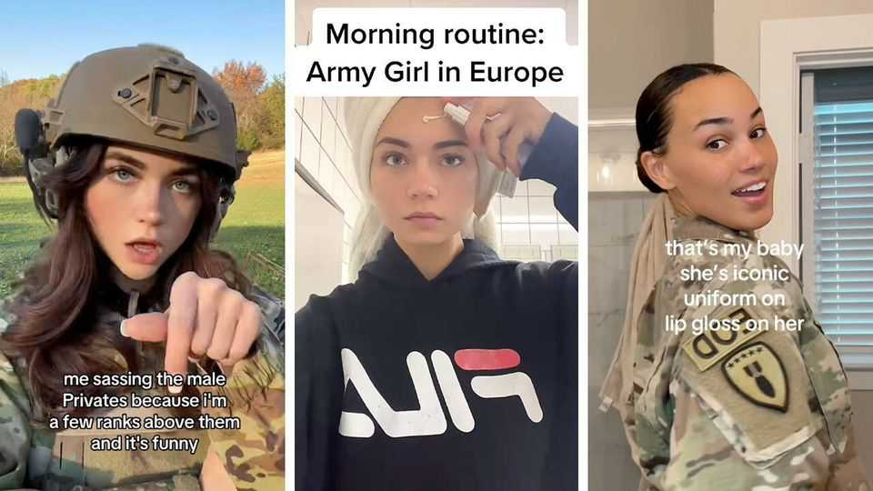

United States | No-man’s-land
The young American female soldiers of TikTok
An app that Congress considers to be a national-security risk helps to  
recruit soldiers

August 21st 2025
  

  
Before Pete Hegseth became defence secretary, it is fair to say that he did  
not always see the point of women in some parts of the army. “Our military  
runs on masculinity. It’s not toxic at all, it’s necessary,” he once wrote. To  
win confirmation by the Senate he moderated his views: all combat roles  
remain open to women. That is just as well. Finding enough recruits is hard.  
Strangely, one thing that helps the armed forces do so is an app that  
Congress has tried to ban on national-security grounds.

Enlist in “#MilTok”, TikTok’s niche for military content, and you may find a  
lieutenant doing her skincare routine, a navy officer on a nursery run, or an
air-force operator vlogging mid-flight. They command thousands of  
followers and millions of views, reflecting a broader shift within the ranks.

While the number of male active-duty members has fallen by 10% since  
2005, the number of their female counterparts has grown by 12% over the  
same period. Still, women have had a tough time assimilating. As recently as  
2023, 13% of active-duty women experienced gender discrimination  
compared with 1.4% of active-duty men, according to the Department of  
Defence.

Some of these women turned to TikTok—a platform which offered  
recognition when they were overlooked and support when they were  
isolated. It soon became a place for talking about issues that male  
counterparts rarely encountered, such as adapting the female uniform or  
navigating grooming regulations. “Women didn’t have other women to look  
up to or talk to about their struggles,” says Monica Smith, a first lieutenant  
in the army’s bomb-disposal unit (pictured above).

But not all attention has been welcome. The comments sections on #MilTok  
are often littered with lewd or disparaging remarks. Peers and superiors in  
the Pentagon are also wary, especially since the Chinese-owned app is  
deemed a security risk. “When my unit heard I had a TikTok, people were  
really sensitive about it,” says Lieutenant Smith. It doesn’t help that some  
servicewomen court controversy, like Hailey Lujan—an influencer known  
for pairing cutesy antics with graphic references. In one video, she dances in  
tactical gear to a Charli XCX song while joking about bleeding out in the  
trenches.

Such posts have fuelled online speculation that these women are “psy-ops”:  
psychological-operations specialists deployed to influence perceptions of the  
military. Most reject that label. They are not shouting about the institution—  
they just want to be heard within it. As Ms Lujan wrote (on Instagram), “It’s  
simply a new method of standing up for what I believe in, by all silly means  
necessary.” ■

Stay on top of American politics with The US in brief, our daily newsletter  
with fast analysis of the most important political news, and Checks and
Balance, a weekly note from our Lexington columnist that examines the  
state of American democracy and the issues that matter to voters.

This article was downloaded by zlibrary from [https://www.economist.com//united-states/2025/08/19/the-young-american-female-](https://www.economist.com//united-states/2025/08/19/the-young-american-female-)
soldiers-of-tiktok