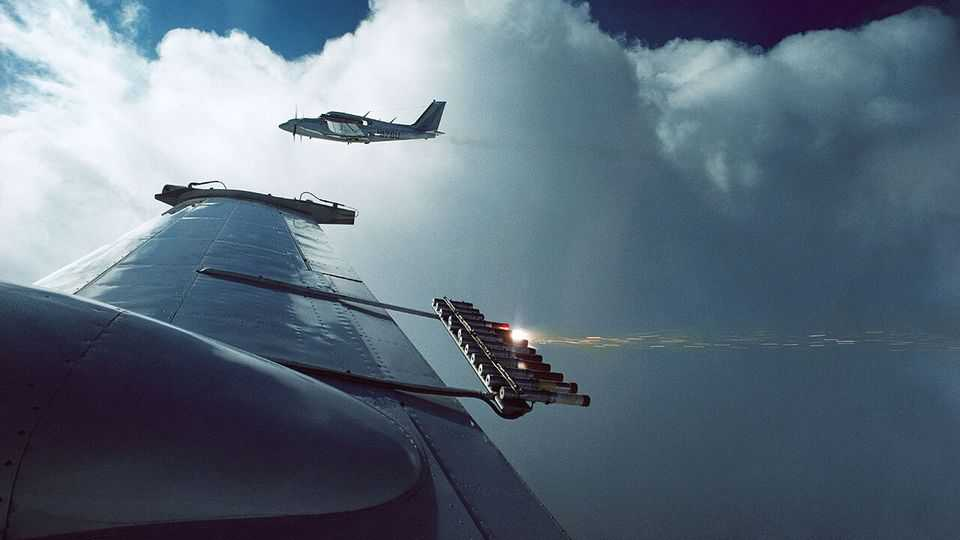
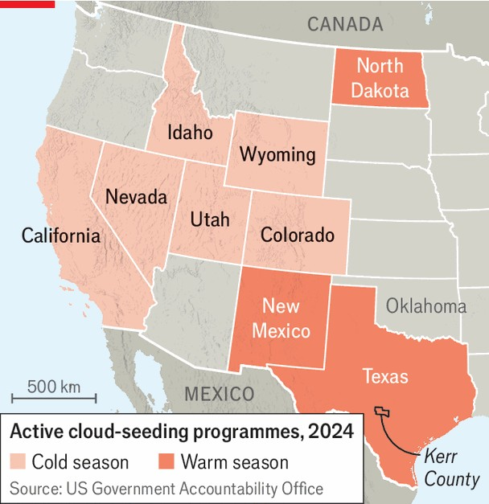

United States | Cloudbusting
Marjorie Taylor Greene wants to stop them from
making it rain

The opponents of cloud-seeding come for geoengineering

August 21st 2025
  

  
Rainmaker, A STARTUP backed by Peter Thiel, a prominent venture  
capitalist, among others, flew an aeroplane over south-central Texas in early  
July, depositing 70 grams of silver iodide within two clouds. The technique,  
known as cloud-seeding, aims to coax more water from the heavens than the  
clouds would yield on their own. This is done by aeroplanes; Rainmaker  
wants to do it more cheaply, and, therefore perhaps more frequently, using  
drones.

Two days later a deadly downpour hit Kerr County, in central Texas, and  
with it a deluge of theories on social media blaming Rainmaker’s  
technology. Augustus Doricko, the founder and CEO of Rainmaker, says
that he was physically threatened and has since hired a security detail.  
Rainmaker was not the only target. A member of Veterans on Patrol, a  
vigilante group, vandalised a weather radar system in Oklahoma, believing it  
to be weather-manipulation technology.

It is not possible for cloud-seeding to have caused the extreme rainfall and  
flooding seen in Texas, says Andrew Dessler, an atmospheric scientist at  
Texas A&M University. Meteorologists attributed the downpour to  
atmospheric water vapour from the remnants of Tropical Storm Barry. But as  
anyone who has found themselves in a conversation about chemtrails can  
attest, the combination of government plus aircraft plus altering weather  
patterns looks like evidence for something conspiracists have always known  
was true.

Among those who feared a sinister plot are several Republican politicians,  
including Marjorie Taylor Greene, a congresswoman from Georgia. In the  
aftermath of the floods Ms Greene published several social-media posts  
warning of the dangers of weather modification. The congresswoman has  
form on this. “Yes they control the weather,” she wrote on X after Hurricane  
Helene hit North Carolina particularly hard last September. On July 15th she  
proposed the Clear Skies Act, a federal ban on weather modification. If  
passed (which is unlikely), the legislation would make it a felony to release  
chemicals into the atmosphere with intent to modify the weather.
The bill fits into a broader trend. This year 22 states have introduced bills to  
ban or restrict weather modification. In Florida, which enacted its law in  
June, meddling with the weather carries a prison sentence of up to five  
years. In many states this is a cost-free way for state legislators to signal  
their hostility to the federal government and openness to conspiracy theories,  
since only a small number of states in the West actually do it (see map).

Cloud-seeding has been carried out in America since its invention in the  
1940s by scientists at General Electric Research Laboratories, New York.  
Commercial and government cloud-seeding operations spread and by the  
1950s about 300m acres (1.2m square kilometres) of land were targeted for  
cloud-seeding. While the efficacy of the technique remains contested, a  
study in the Journal of Applied Meteorology and Climatology in 2014 found  
it can increase rainfall by up to 15%. Jonathan Jennings, a meteorologist  
who directs the cloud-seeding programme in the Utah Division of Water  
Resources, one of the state’s main water agencies, says it is useful as part of  
a broad water-management strategy. The main use is to cause snow in  
winter, thickening the snowpack and thus increasing the flow of rivers in the  
spring and summer, rather than to cause rain when there is a drought.

The federal government does not carry out cloud-seeding, but nine states  
have active programmes. Rainmaker’s operation on July 2nd was contracted

by the South Texas Weather Modification Association, an organisation of  
local water agencies.  What had hitherto been practised quietly is becoming  
tangled up in bad faith and worse science. The Climate Science Legal  
Defence Fund has provided legal aid to scientists who have been the subject  
of doxxing (the practice of publishing private information without consent)  
and lawsuits from weather conspiracy theorists.

Wrapped up in the hostility towards cloud-seeding is a stronger animus  
towards geoengineering—the idea of deliberately cooling the Earth. The  
proposed federal ban on weather modification would outlaw research on  
solar geoengineering, which includes spraying sulphur dioxide into the  
stratosphere. Solar geoengineering is controversial, but more research is  
needed to understand its risks. The Florida law prohibits “geoengineering  
and weather modification”; Ms Taylor Greene’s bill includes solar  
geoengineering and solar-radiation modification as examples of things to  
ban. That this is how the future of mankind’s home planet is being  
determined is so odd that it might seem like, well, a conspiracy. ■

Stay on top of American politics with The US in brief, our daily newsletter  
with fast analysis of the most important political news, and Checks and  
Balance, a weekly note from our Lexington columnist that examines the  
state of American democracy and the issues that matter to voters.

This article was downloaded by zlibrary from [https://www.economist.com//united-states/2025/08/20/marjorie-taylor-greene-wants-](https://www.economist.com//united-states/2025/08/20/marjorie-taylor-greene-wants-)
to-stop-them-from-making-it-rain