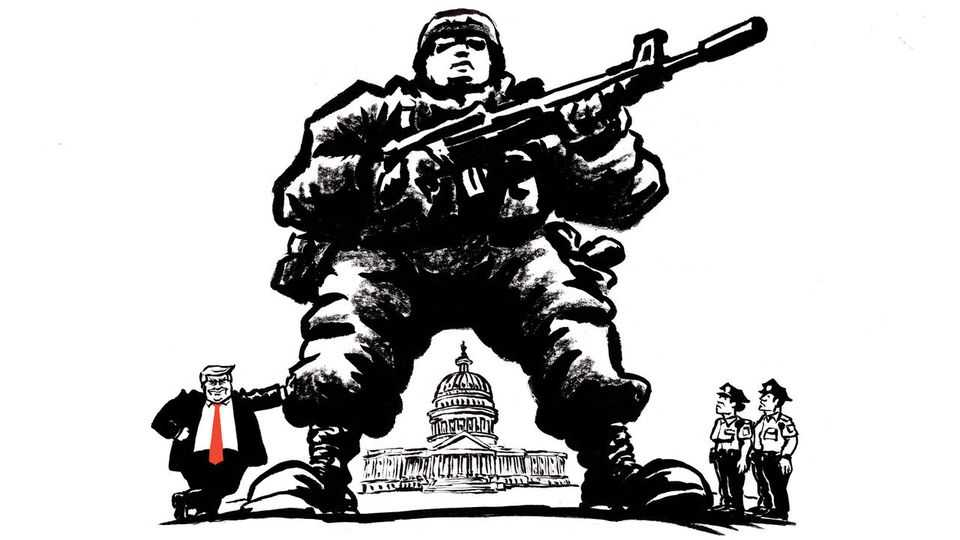

United States | Lexington
How Washington became Donald Trump’s chew toy
The politics are particularly potent today, but their origins are older than the republic itself
August 21st 2025

America’s capital city is particularly vulnerable to the dictates of President Donald Trump because of an insurrection against Congress—not the one on January 6th 2021 but a more successful one a couple of centuries earlier. On June 21st 1783 hundreds of mutinous soldiers surrounded Congress in what was effectively the capital, Philadelphia, to demand back-wages that the revolutionary government could not afford to pay. Unlike the insurrectionists of 2021, they did not attack the building or hurt anyone, but they chased Congress out of town.

They also turned the congressmen against not just Pennsylvania, which they concluded could not be trusted to protect them, but against the idea the capital should be part of any state. Without “complete authority at the seat of government”, warned James Madison, “the public authority might be insulted and its proceedings interrupted with impunity”. The host state might also exercise undue influence. Eventually, the “complete authority” of Congress over the capital was written into the constitution, and after some wandering and wrangling the capital itself fetched up in a swamp at a bend in the Potomac river.

Perhaps to avenge itself, Congress has been insulting the public authority of Washington, DC, and interrupting its proceedings with impunity ever since. Washington has more people than Wyoming or Vermont—about 700,000— and they pay far more federal taxes per head than the residents of any state. But they live a bitter paradox, inhabiting the capital of a great republic in which they have no voting representation. Until Mr Trump came along, notes Michael Fauntroy, a political scientist at George Mason University who has studied the limited home rule Congress granted Washington in 1973, “It’s always been the House that’s been more problematic for the city.” Congress, which kept authority over the district’s budget and its laws, has intervened to block domestic partnerships, abortion subsidies, needle- exchange programs and even late-evening hours for a pool (some Capitol Hill staffers lived nearby and objected to the noise, Mr Fauntroy says).

Washington does have a say in the choice of president. The 23rd Amendment, ratified in 1961, gives it the same number of electoral votes— three—as the least-populous state. If Washington cast those votes for Mr Trump, he would no doubt be championing its long-cherished dream of statehood.

Instead, Washington is on the receiving end of another Trumpian manoeuvre: he has correctly identified a problem and then hyperbolised it (Washington is no “shithouse”, as he once called it, but a pretty, staid city where crime is coming down but remains a scourge); he is using presidential power in a way no predecessor has (sending in the National Guard over the mayor’s objections, temporarily commandeering the police, dispatching masked agents in unmarked cars to arrest people); he is saturating the internet with his own reality (including by sending social-media teams on

FBI raids); and, by dispensing more drama than care, he seems likelier to compound tensions than to ameliorate woes. So far the new federal presence is more obvious in safe spaces frequented by tourists than in poor neighbourhoods most victimised by criminals. Restaurants report steep declines in business.

The mismatch of means and putative ends was captured by a slick video, shared by the White House on X, of heavily armed agents swooping in after dark to arrest a man at his home. The man had thrown a sandwich at another federal agent days before. He had previously been arrested in the incident and then released. (He had also been fired from his job in the criminal division of the Justice Department.) He should not have thrown the sandwich. Yet Washington would have to be paradise to be terrorised by such an act. Further: no federal-agent theatrics in the first place, no airborne sandwich—not to blame the victim, of course.

A city dominated by Democrats when the federal government is dominated by Republicans, Washington is experiencing an enhanced version of the predicament confronting Democratic cities in some Republican states. As political power is becoming more sharply distributed geographically and intensified by polarisation, Republican states are increasingly overruling, or “pre-empting”, policies in Democratic cities on matters such as environmental regulation and criminal justice. “For about a decade now, there’ve been much more targeted interventions, clear-cut efforts to prevent or undo local policies by the states,” says Richard Briffault, a professor at Columbia Law School.

Some cities helped bring the trouble on themselves through mismanagement, a record that blights the Democratic Party. But in Washington, at least, the overlords are part of that problem. The Senate has left vacant 13 of 62 judgeships on the court that handles local crime, while the House, apparently out of fecklessness, has blocked Washington from spending $1bn of its own tax revenue, forcing $400m in cuts even as the mayor, Muriel Bowser, is trying to hire 500 more police officers.

But the politics of beating up Washington are irresistible, and so Republican states are getting in on the act. Six Republican governors plan to deploy National Guard troops to the city. The troops lack authority to make arrests

and may not have much to do. Outside Washington’s Union railway station, an encampment festooned with anti-Trump signs (“rapist” “felon”) has stood since the spring. It now shares the plaza with National Guards, who on a recent afternoon posed for pictures and cheerfully exchanged greetings with passers-by. “The troops have been great,” one protester says. Yet their presence in the city, in flak jackets and desert camouflage, beside giant armoured vehicles, seemed as jarring as such displays after the attacks of 9/11. May it remain so. ■

Subscribers to The Economist can sign up to our Opinion newsletter, which brings together the best of our leaders, columns, guest essays and reader correspondence.

This article was downloaded by zlibrary from https://www.economist.com//united-states/2025/08/21/how-washington-became-donald- trumps-chew-toy

The Americas

Life after death for Canada’s crushed Conservatives Climate change threatens an Andean ski boom The new fears of Cubans in Florida After 20 years in power, Bolivia’s socialists crash out of it Why Mexicans love Japan and Korea