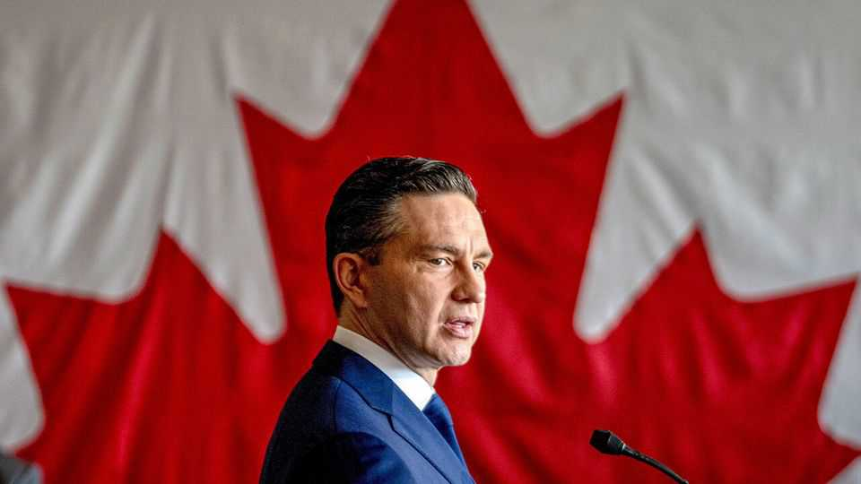

The Americas | Turning over a new leaf?
Life after death for Canada’s crushed Conservatives
Pierre Poilievre can now return to Parliament to take on Mark Carney, the prime minister
August 21st 2025

Voters of a conservative persuasion in the riding, or constituency, of Battle River-Crowfoot in rural Alberta clearly now have a good handle on the spelling of Pierre Poilievre’s name. In a by-election on August 18th they wrote it on more than 80% of the ballots cast. Mr Poilievre is not from the riding. The vote was called when a pliant fellow Conservative stepped down, providing Mr Poilievre with a shot at a parliamentary seat. He needs it. In April he led his party to a crushing general-election defeat by Mark Carney’s Liberals, one of whom took the

Ottawa riding Mr Poilievre had maintained a firm grip on for two decades. Without a seat, he could not continue as Canada’s formal opposition leader.

So, along with more than 200 other candidates (hence the write-in ballot), Mr Poilievre contested Canada’s second-safest Conservative district. It was, however, far more than a matter of parliamentary procedure. He needed a resounding victory to restore his reputation and consolidate his power over the party. The conditions that sent the Conservatives to their fourth election loss in a row remain in place.

At the end of 2024 the Liberal Party had sunk in opinion polls, with the Conservatives holding a seemingly insurmountable 25-point lead. Yet a mere four months later, the Conservatives were crushed once again by the Liberals, this time led by Mr Carney in place of Justin Trudeau.

What happened? The former central banker bristled against Donald Trump’s graceless claim that Canada should become America’s 51st state or face hobbling tariffs. No way, said Mr Carney: Canada would restructure its economy and diversify it away from its previous overwhelming dependence on trade with the United States. He has since been diligent in nudging his party back towards the centre on issues such as taxes and energy development. And he has dropped many of Mr Trudeau’s policies deemed to be excessively “woke”. When, on July 31st, Mr Trump carried out his threat to impose a 35% tariff on Canadian exports, it only added fuel to the nationalist outrage that drove the Liberal surge in April.

At the same time, a swan-dive in support for the socialist third party, the New Democrats (NDP), has for the time being turned Canadian politics into a two-party tussle. But this means that the split vote among progressives is no longer bound to help the Conservatives to victory, as it has in the past.

None of these developments bodes well for Mr Poilievre, who will face his party’s verdict on his leadership in January. But there are a few bright spots. His decision to stick to cost-of-living issues did attract support from younger and working-class Canadians. The Conservatives’ share of the vote rose to 8m, or 41% of the total—its highest in nearly four decades. Mr Poilievre believes that can be built upon next time round. When he hasn’t been campaigning in Battle River-Crowfoot, he has been asking the party faithful,

“How do we add another roughly a million votes to get us over the finish line?”

The line may be receding; polling data suggest that backing for Mr Poilievre and his Conservatives is softening. A recent survey by Nanos Research put Liberal support at 45% against 32% for the Conservatives. That may be thanks to a lingering post-election honeymoon. But the poll also asked respondents for their preference for prime minister: 52% opted for Mr Carney and only 24% for Mr Poilievre.

This suggests that quite a few Conservatives prefer the Liberal incumbent to their own standard-bearer, among them some powerful Conservative premiers of provincial governments. Perhaps that is because, like Tony Blair and Bill Clinton decades ago, Mr Carney has junked his party’s old leftist dogma to appeal to a broader swathe of centrist voters. He is spending more on national defence and has scrapped consumer taxes on carbon pollution. He is cutting bloated government departments by 15% and is preparing to enact tougher laws against crime. Much of this programme was pinched from Mr Poilievre’s platform. Voters do not seem to mind the theft.

Supporters of Mr Poilievre, especially among the 144 Conservative MPs elected in April, say he has earned the right to face down Mr Carney. Mr Poilievre, who is 46, is a good communicator. And under his leadership his party continues to rake in more money than its rivals.

Not good enough, says Regan Watts, a longtime Conservative whom Mr Poilievre has previously consulted: “Measured against Mr Carney’s immaculate credentials, Mr Poilievre’s résumé looks parochial.” And the Conservative leader’s insistence privately that he would be prime minister but for Mr Trump’s intervention and for the slump in the NDP’s vote share, says Mr Watts, evinces a man who refuses to accept responsibility for the election loss. Instead, Mr Watts believes, he should ease the sloganeering and put business luminaries on his front bench: “With no experience beyond the political arena, his best response is to surround himself with heavyweight advisers and candidates.”

Mr Poilievre’s defenders say Mr Carney’s honeymoon cannot last. It will take years for Canada to restructure its economy and diversify exports away

from the United States. If the Liberals fail to fulfil their promises of massive infrastructure projects at high speed, voters will soon be disenchanted, his backers say. But that might seem to put the Conservatives’ fate in the hands of the Liberals. “Hope”, says Mr Watts, “is not a strategy.” ■

This article was downloaded by zlibrary from https://www.economist.com//the-americas/2025/08/17/life-after-death-for-canadas- crushed-conservatives