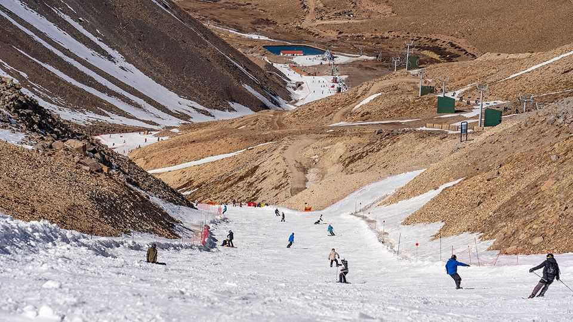
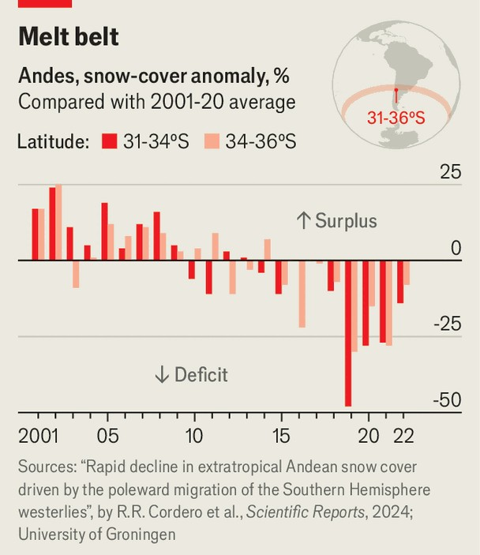

The Americas | Not snow sure
Climate change threatens an Andean ski boom
The industry is melting just as it was starting to take off again
August 21st 2025

Nick Cherney, a 43-year-old asset manager from the state of Colorado, stands before a bare slope at Las Leñas, a ski resort in Mendoza, Argentina. “Normally that would be great skiing, but now it’s just rock. If you go off that, you’re dead,” he says. Then he begins shuffling farther up the mountain, where slopes are whiter. This year, in the depth of winter in South America’s most famous ski resort, the only way to get space for some decent turns is to walk up. Mr Cherney travelled to Argentina with his children, all of whom are competitive “freeride” skiers (a variant involving steep terrain and eye- catching acrobatics). They are part of a small but fast-growing coterie of serious American and European skiers who cross the equator to continue

skiing through the northern hemisphere’s summer. This is the family’s sixth visit; never has Mr Cherney seen such poor snow.

Commercial skiing in South America goes back decades. The first resort to open was Portillo, in Chile, in 1949, and the industry boomed through the 1970s. But since then investment has flagged. Las Leñas, which opened in 1983, is among the most modern resorts, yet its ski lifts are small, lumbering two-person affairs.

In the past decade or so, however, interest has gone back up a slope. Last year Las Leñas hosted a qualifier for the Freeride World Tour, the highest- level competition for freeride skiers: a sign that its steep slopes are considered world-class. Since 2019 Valle Nevado, a bigger resort in Chile, has been included on the Ikon pass, an American season ticket that gives skiers access to dozens of resorts (the growth of these all-you-can-ski international passes has also sent Americans flocking to resorts in Europe and Japan).

Yet climate change is melting the regional industry perhaps faster than it can grow. Higher temperatures bug skiing fans the world over, but the Andes have been hit harder than most. A study published last year suggested that from 2001 to 2022 the average snow cover in the region declined by 19%

per decade. As so often with climate change, the temperature is not the only thing varying. Westerly winds that bring cold air to the mountains have begun to shift southwards, compounding the effects of temperature on the snowpack. And not only is it snowing less, snowfall varies more from one season to the next.

The resorts and the industry’s array of ancillary businesses will therefore see variation, too. Lucas Malaret, a Chilean ski instructor who works for Glove Travel, an operator that organises trips for European and American clients, looks at bookings just as much as at thermometers. Last year snow was relatively plentiful, resulting in a surge of early reservations. Bare slopes this year will reverse that. A hunger to keep business steady may have disappointing effects for ski bunnies: Mr Malaret notes disapprovingly that some outfits that deliver skiers to high ground by helicopter have been promoting this season with pictures from last year.

Is there a solution? In July the Malaysian firm that owns Las Leñas said it would expand into a snowier neighbouring valley. As in Europe and the United States, more South American resorts are investing in snowmaking equipment and the like. But beating a changing climate is, not unlike Mr Cherney’s, an uphill climb.■

Sign up to El Boletín, our subscriber-only newsletter on Latin America, to understand the forces shaping a fascinating and complex region.

This article was downloaded by zlibrary from https://www.economist.com//the-americas/2025/08/21/climate-change-threatens-an- andean-ski-boom