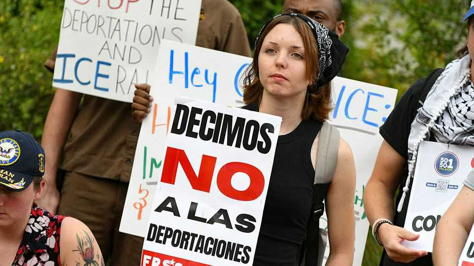

The Americas | Cubans sandwiched
The new fears of Cubans in Florida
The privileged status they have enjoyed since the cold war is slipping away

August 21st 2025
  

  
The Freedom Tower, a Miami museum overlooking Biscayne Bay that  
honours the history of Cuban exiles, will be unveiled next month after its  
$65m facelift. Between 1962 and 1974 it was the Cuban Refugee Centre,  
and through it passed around 400,000 people who fled after the 1959  
revolution led by Fidel Castro. They received food, money, medicine and a  
warm welcome. One of the museum’s exhibits notes loftily that “Freedom is  
not just a dream, but a shared responsibility.”

That message is hard to square with the feeling that south Florida’s Cubans  
have today. In the harsh immigration facility that officials insist on calling  
the Alligator Alcatraz, some 95% of detainees are citizens of Latin  
American countries. Most are from Mexico, Guatemala or Cuba, and most
entered the country in the past few years by avoiding official border  
crossings and airports.

Hundreds of thousands of Latin Americans fear that same fate after the  
Trump administration ended programmes that gave some of them hope for  
future residency. Yet it is Cubans who feel most hard done by, because they  
have in the past enjoyed exceptional immigration privileges.

Under the Cuban Adjustment Act (CAA), passed in 1966, they can apply for  
permanent residency after a year. Now Cuban arrivals who skirt border  
points, and increasingly those who do not, receive the same I-220A  
document—and a court date that could be years hence—that other  
nationalities do. The I-220A confers a nebulous status: released into the  
country, but subject to apprehension at the later whim of immigration  
officials. And it all but precludes Cubans from receiving permanent  
residency under the CAA.

Further, in June the United States Supreme Court lifted a stay on the Trump  
administration’s termination of the Biden-era Humanitarian Parole  
programme for Cubans, Haitians, Nicaraguans and Venezuelans. That  
permitted people of those nationalities to live in the United States for two  
years, if sponsored by a resident.

Even those Cubans who have had no run-ins with the law since arriving now  
wait in fear of a knock on the door. “It’s a constant worry,” says Ricardo,  
who asked not to reveal his surname for fear it might bring that knock. He is  
a skilled engineer in his 30s who fled arrest in Cuba during anti-government  
protests in 2021. Since his asylum claim was denied he has limited his  
movements between his job and home, barely daring to go to the  
supermarket. When his wife, a legal resident, gave birth this month to their  
first child, he sneaked into the hospital in the dead of night.

Miami’s downtown immigration court is swamped. Twenty-eight judges  
wade through a backlog of 312,000 pending cases; about one-third of them  
are those of Cubans. Merely attending the court is perilous. “People are  
terrified of going to court hearings,” said Wilfredo Allen junior, a lawyer.  
Two of his clients were detained at court in July and sent to the South  
Florida Detention Facility. “They both have strong asylum cases and no
criminal record,” Mr Allen says. His firm has had to hire extra legal staff to  
handle the 16,000 cases, almost all of them Cubans, on the books. “There’s  
no rhyme or reason as to how they handle these cases. It’s totally arbitrary,”  
he says.

Deportation was once impossible, because Cuba would not take returning  
citizens. It remains difficult, for the island’s government still chooses whom  
it will accept. So far in 2025, 833 Cubans have been sent back, according to  
Cuba’s interior ministry.

For the Trump administration the way around that narrow deportation path is  
removal to a third country. The list of candidate countries is growing, from  
elsewhere in the Americas to South Sudan. The Deportation Data Project run  
by the University of California at Berkeley found that at least 731 Cuban  
nationals had been deported to third countries between January and the end  
of June, 98% of them to Mexico. Moreover, many migrants from Cuba are  
skipping the uncertain step of the United States and are instead changing  
their destinations. In the first six months of 2025 20,900 Cubans sought  
asylum in Mexico and another 19,400 in Brazil.

For Cubans in south Florida, all this is arousing not only fear but also  
indignation, particularly as local leaders who had long defended Cuban  
migrants now stand idly by for fear of drawing Trumpian ire. Cubans were  
“the darlings of the cold war”, says Joe Garcia, a Cuban-American and a  
former Democratic congressman. Now, he says, “all of a sudden, we’re just  
like Mexicans.” For citizens of other Latin American countries who also find  
themselves in the crosshairs of immigration officials, that may seem right  
and just; Cubans’ special status has rankled for decades.

Now that fear of agents of the state is rattling the Cuban community, an  
uncomfortable parallel is becoming apparent, says Ana Sofia Pelaez of the  
Miami Freedom Project, a non-profit outreach-and-education outfit. “The  
crux of the problem is that people are essentially re-experiencing what they  
fled in Cuba.”■

Sign up to El Boletín, our subscriber-only newsletter on Latin America, to  
understand the forces shaping a fascinating and complex region.
This article was downloaded by zlibrary from [https://www.economist.com//the-americas/2025/08/21/the-new-fears-of-cubans-in-](https://www.economist.com//the-americas/2025/08/21/the-new-fears-of-cubans-in-)
florida