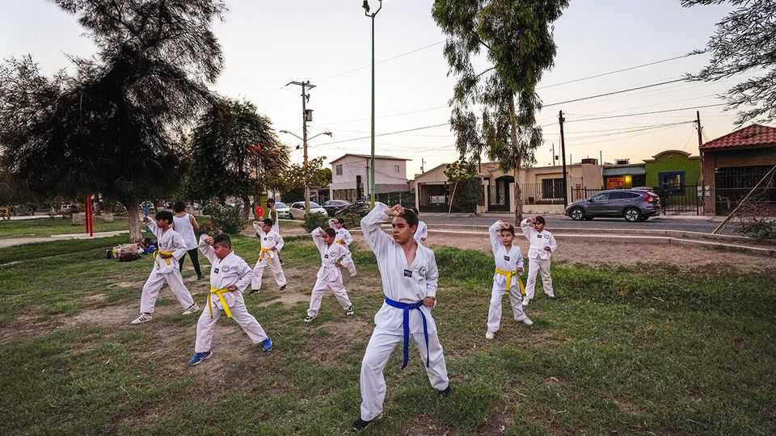

The Americas | More than manga and microwaves
Why Mexicans love Japan and Korea
Drama, language and music in one direction; rising numbers of Mexican  
tourists in the other

August 21st 2025
  

  
Over brightly coloured jelly sodas at Kai Bai Bo, a Korean-themed café in  
Mexico City, Alejandra Chávez and Adriana Guzmán discuss their shared  
passion: BTS, South Korea’s global pop phenomenon. “It was an instant  
click,” says Ms Chávez, a 23-year-old who discovered the band just before  
the pandemic. “They make me happy.” Ms Guzmán, 24, nods: “They’ve  
changed my life. When I stop listening to them, I feel negative.”

These two young women are part of the Mexican chapter of the BTS Army,  
a global fan collective that mobilises like a campaign machine. Together  
with other volunteers they organise streaming parties, raise funds for murals  
and explain voting rules to newcomers baffled by the mechanics of K-pop
fandom (it revolves around getting out the vote for the band in various polls  
and awards). Their group has even decorated boats with BTS-themed art.  
“Sometimes we pay out of our own pockets,” says Ms Chávez. “It’s how we  
show love.”

That love is in bloom. Millions of Mexicans have developed affection not  
just for Korean pop, but for Japanese anime (animated films, TV and  
videos), as well as the languages, food, fashion and values of both countries.  
There are fan clubs in the capital, Japanese-language schools in  
Aguascalientes and Korean-cooking classes in Querétaro. What was once a  
niche taste is becoming a national appetite.

Japan’s was the first East Asian culture to find fans in Mexico. That began  
when dubbed anime shows started airing on Mexican television in the late  
1970s, says Edgar Peláez, a Mexican academic at Lakeland University in  
Tokyo. Real growth began in the 1990s. Japan’s asset-price bubble piqued  
global interest and, later, its government pushed culture as a form of soft  
power. In Mexico, that coincided with the liberalisation of the economy, the  
privatisation of state broadcasters and the arrival of Japanese toy companies  
such as Bandai, leading to a flood of content and merchandise. Mexican  
dubbing studios became regional hubs in which anime was adapted for Latin  
American audiences.

Foreign investment also played a role in the boom. Nissan, a Japanese  
carmaker, opened its first assembly plant in Aguascalientes in 1992. The city  
is now home to a large Japanese community, part of which has put down  
roots, giving rise to second-generation nikkei families.

More recently, Japanese cuisine has become popular. Takeya Matsumoto,  
who runs several restaurants in Mexico City, says that when he arrived from  
Japan in 2007 there were very few. “Now all sorts of Japanese food is  
available,” he says.

These cultural imports seem to have spurred demand for travel to Japan; in  
2024 150,000 people flew there from Mexico, the highest tally on record.  
While small compared with the number of people visiting Japan from other  
countries, arrivals from Mexico were up by 60% from 2023, the fastest year-  
on-year growth of any country.
Korea’s culture has followed that of Japan to become, if anything, even more  
popular. In 2023 South Korea’s global cultural exports—including music,  
TV dramas, films, fashion and beauty products—were worth a record  
$12.4bn, according to the country’s culture ministry, exceeding even exports  
of home appliances. Mexico played its part. The Korean Cultural Centre in  
Mexico City says the number of Mexicans enamoured of hallyu, the wave of  
Korean culture which started sweeping the world starting in the late 1990s,  
is estimated to have jumped from 6.7m in 2023 to more than 11m in 2024.  
Korean-language courses are heavily oversubscribed. Korean skin-care  
products, once hard to find, are now sold in boutiques and supermarkets. K-  
dramas are likely to appear in social-media feeds alongside telenovelas.

Mexicans seem attracted to these cultures for different reasons. Many  
students of Japanese are learning because they want to work there; others  
want to read manga or prepare for a trip. Many emphasise the more  
traditional parts of the culture, such as origami or tea ceremonies. Soraya  
Aguirre of Cendics México, a language school in Aguascalientes, says  
demand for Japanese lessons has surged in the past five years. By contrast,  
students of Korean are often driven by pop culture. They skew younger and  
female. Many, like Ms Chávez and Ms Guzmán, teach themselves Korean  
by studying song lyrics and YouTube videos, rather than taking formal  
classes.

Booming cultural imports are likely to continue as Mexico’s relationship  
with both countries deepens. Japan and Mexico have had a free-trade  
agreement since 2005. Asian firms have been investing heavily in northern  
and central Mexico. South Korea and Mexico are exploring new trade ties.  
Diplomatic   
efforts—from   
scholarships   
to   
taekwondo   
parades—are  
becoming commonplace.

China is also making inroads, albeit of another sort. In cities like  
Aguascalientes, interest in Chinese is still limited but gradually rising—and  
driven more by economic pragmatism than popular appeal. Students cite job  
prospects and business ties rather than fandom and cultural allure. Confucius  
Institutes have opened at several Mexican universities. But, for now at least,  
China’s soft power in Mexico is more of the boardroom than the bedroom  
wall.
In the background, Mexican perceptions of Asian cultural fandom have  
shifted. Being a fan of BTS used to provoke bullying, says Ms Chávez.  
Now, she says, it is finally cool. ■

Sign up to El Boletín, our subscriber-only newsletter on Latin America, to  
understand the forces shaping a fascinating and complex region.

This article was downloaded by zlibrary from [https://www.economist.com//the-americas/2025/08/21/why-mexicans-love-japan-and-](https://www.economist.com//the-americas/2025/08/21/why-mexicans-love-japan-and-)
korea
Asia
 
Japan storms back into the chip wars  
TSMC could revolutionise rural Japan  
How fair are India’s elections?  
Pakistan is critical in the fight against Islamic State terrorism  
The world is learning to live with the Taliban