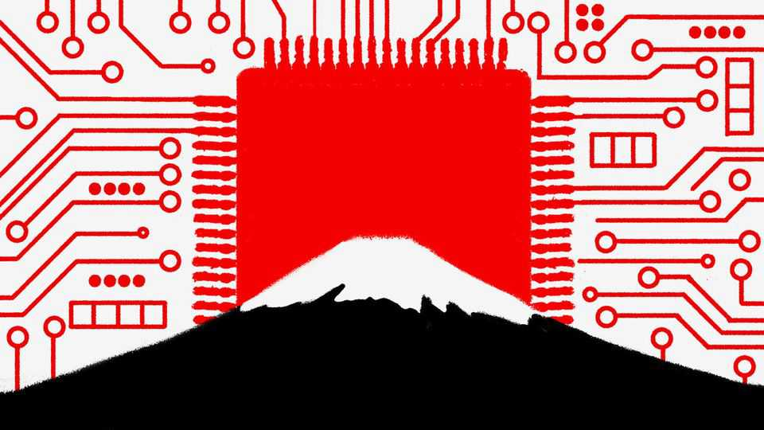

Asia | Roaring back?
Japan storms back into the chip wars
The country used to be a semiconductor powerhouse. Can it be one again?
August 21st 2025

KOIKE ATSUYOSHI likes to go fast. The 73-year-old semiconductor engineer is a motorcycle aficionado. He brings the same tempo to his latest company, Rapidus. Founded in 2022, the firm opened its massive semiconductor factory, or “fab”, last year in Chitose, a small city on Hokkaido, Japan’s northernmost main island. In December Rapidus became the first Japanese entity to acquire an extreme ultraviolet lithography (EUV) system from ASML, the Dutch company that makes the unique devices; Rapidus had the complex up and running within months. In mid-July, Mr Koike announced the successful pilot production of two-nanometre (2nm) transistors, the thinnest, most advanced chips yet. “A company that’s been around less than three years managed to do it,” he boasts. “It’s an incredible pace.”

Rapidus is the most ambitious element of a broader effort to revive the semiconductor industry in Japan. In the boldest industrial policy push in a generation, the Japanese government ploughed ¥3.9trn ($27bn) into support for semiconductors between early 2020 and early 2024. As a share of GDP, that amounts to a bigger commitment than America made to its semiconductor industry through the CHIPS Act. Japan wants both to revive its domestic champions and to attract foreign ones, such as TSMC, the Taiwanese semiconductor giant, which now makes chips in southern Japan. At the launch of its fab there last year, Morris Chang, the TSMC founder, spoke of a chip “renaissance”.

Japan once dominated the semiconductor industry. In the 1980s, Japanese firms accounted for more than half of the global market, and an even bigger share of the cutting-edge chips of the time. But trade friction with America led to limits on Japanese chip exports, creating an opportunity for rivals in Taiwan and South Korea. Japanese companies also struggled to shift to an era of increasing specialisation in semiconductor production. Whereas some Japanese firms retained strong positions in the materials and equipment necessary for making semiconductors, from coating chemicals to silicon wafers themselves, they fell behind in cutting-edge manufacturing. By 2019, Japan accounted for less than 10% of the world’s semiconductors.

The Japanese government came to see this state of affairs not only as a commercial disaster, but also as a national-security risk. Supply-chain disruptions during the pandemic helped raise public awareness of the crucial role chips play in modern life. The war in Ukraine fuelled fears of Chinese designs on Taiwan—and highlighted the risk of depending on a single firm there for most of the world’s high-end chips. The emergence of generative artificial intelligence (AI) has only heightened the strategic importance of semiconductors. Japan’s latest National Security Strategy, released in 2022, explicitly sets a goal of strengthening “next-generation semiconductor development and manufacturing bases”.

Japan’s semiconductor strategy consists of two main pillars. First is indispensability, which means, in effect, “being influential over others”, says Mireya Solís of the Brookings Institution, an American think-tank. The idea is that if Japan can control parts of a long supply chain it can leverage that

interdependence to keep others (ie, China) from weaponising their control over certain inputs.

The second pillar is autonomy, or having domestic production capacity. “The world will be divided into two groups: countries that can supply semiconductors and countries that buy them,” says Amari Akira, a former lawmaker with the ruling Liberal Democratic Party (LDP) who led semiconductor policy. “The countries that supply will be the winners, and the countries that buy will be the losers.”

The government has refreshed its industrial-policy toolkit to meet the challenge. The LDP passed a series of new laws in recent years enabling broader and longer-lasting government support for chip firms like Rapidus. While such measures involve taking sizable bets with taxpayer money, they have broad political support. “Of course there are risks involved—but there are also risks of doing nothing,” says one LDP bigwig involved in the policies.

The measures have begun to bear fruit. Big subsidies helped entice TSMC to set up shop in Kyushu. Its first fab there produces chips of 12-28nm—the most advanced type of semiconductor to be produced in Japan so far, but still well behind its state-of-the-art models. The firm has already announced plans to build a second facility for even higher-end logic chips there; talks about a potential third fab are reportedly under way. TSMC’s arrival has enticed suppliers and partners to expand on Kyushu, which has positioned itself as “Silicon Island”.

Micron, an American memory chipmaker, has also received more than $1bn in subsidies to expand its chipmaking facilities in Hiroshima. Meanwhile Samsung, a South Korean electronics giant, is building a cutting-edge research facility in Yokohama, south of Tokyo.

Another nascent ecosystem is emerging around Rapidus. The firm is the highest-risk and highest-reward bet of the bunch. Born of a partnership with IBM, which developed a new method for making next-generation transistors, a type of electrical component, Rapidus hopes to leapfrog across a generation of semiconductor engineering and catch up with global pace- setters. It has attracted investment from a consortium of eight blue-chip

Japanese firms, including Sony, Toyota and SoftBank. The government has also bankrolled much of the initial cost, to the tune of ¥1.72trn ($12bn) through early 2025.

The success of Rapidus hinges on meeting three big challenges, says Ota Yasuhiko of Hokkaido University. First is cultivating enough talented cadres. Universities across Japan are launching programmes to train a new generation of semiconductor engineers. But in the meantime, Rapidus has had to rely largely on older specialists who came of age during Japan’s first chip boom; the average age of its recruits was initially over 50. Roughly 150 top engineers were sent to train at IBM’s research facility in New York.

Another challenge is developing a sustainable business model. Samsung and TSMC are advancing towards 2nm chips of their own, and have established relationships with the buyers of high-end semiconductors. Rapidus is positioning itself as a boutique option, able to make smaller lots of specialised chips, rather than large batches of one-size-fits-all offerings. “We have no intention of directly competing with TSMC—the markets are different,” Mr Koike says. He is counting on generative AI becoming a tailwind, boosting overall demand for chips and increasing interest in offerings that can improve efficiency and reduce power consumption.

But first Rapidus must make the leap to mass production, which the firm aims to begin in 2027. While the successful pilot wafer is an encouraging sign, the true test will be whether Rapidus can make lots of them of the quality necessary to be commercially viable. The production process for such semiconductors is closer to handmade crafts than to assembly-line widgets: engineers must constantly adjust equipment to maintain correct parameters. For Mr Koike, motorcycles offer another lesson here. A lifetime of riding, he says, has taught him “about how a machine and a human being can work together closely”. Japan’s chip renaissance depends on it. ■

This article was downloaded by zlibrary from [https://www.economist.com//asia/2025/08/21/japan-storms-back-into-the-chip-wars](https://www.economist.com//asia/2025/08/21/japan-storms-back-into-the-chip-wars)