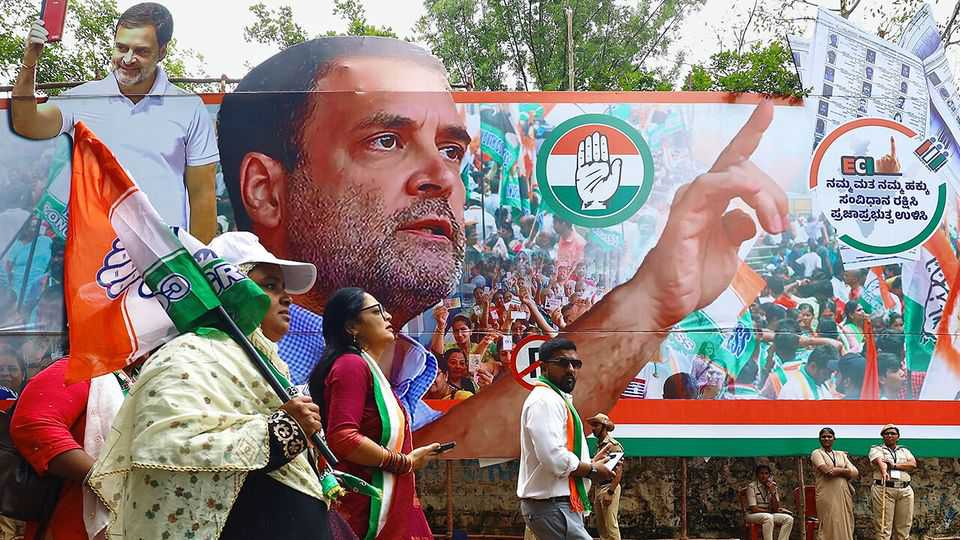

Asia | Poll politics
How fair are India’s elections?
Rahul Gandhi, an opposition leader, raises some uncomfortable questions

August 21st 2025
  

  
An address with a house numbered zero; a household with 80 people; a  
person named “dfojgaidf”. Bureaucratic snafus are common in India. But  
according to Rahul Gandhi, these irregularities in Mahadevapura, a suburb  
in the city of Bangalore, were part of a grander “vote chori” (vote theft)  
scheme that helped the Bharatiya Janata Party (BJP) win last year’s general  
election. In a detailed presentation this month Mr Gandhi, the leader of  
Congress, India’s main opposition, said there were thousands of such  
examples and accused the Election Commission of India (ECI), the  
constitutional body that organises the country’s polls, of colluding with the  
BJP.
Mr Gandhi’s allegations have rocked the ECI, which was already under  
pressure. On June 24th it began a “Special Intensive Revision” of the  
electoral rolls in Bihar, ahead of polls due there by November. The exercise  
has been controversial for both its timing and execution. Such electoral  
revisions are rare—the last one in Bihar was in 2003—and are usually  
planned in great detail. This revision was announced abruptly and will be  
completed for a state with 130m people in a matter of weeks. Questions also  
hover over the review’s result, in which 6.5m voters were struck from the  
list (approximately 8.3% of the total voter count).

The ECI has dismissed such concerns. It says that its deletions were due to  
deaths, duplicate entries and migration. The commission has been even more  
defiant in the face of Mr Gandhi’s allegations. On August 17th Gyanesh  
Kumar, the ECI’s boss, issued an ultimatum to the Congress leader, ordering  
him to file an affidavit to the courts under oath outlining his charges or to  
apologise to the country. “There is no third option,” he said.

The controversies add to growing concerns about the integrity of India’s  
polls. For years, the ECI has been seen as the bedrock of Indian democracy,  
earning plaudits for organising the world’s biggest elections. On indices  
compiled by the V-Dem Institute, a Swedish think-tank, India’s electoral  
process has long outperformed its peers in the region. But its score has been  
sliding over the past decade, dragged down by declines on several measures,  
including those tracking voter irregularities and freedom for parties to  
operate.

One explanation lies in the nature of Indian politics. Since 2014 the BJP has  
been the country’s dominant political power. In the era of coalition politics  
that preceded its rise, it was in everyone’s interests for the ECI to ensure a  
level playing-field. But today, in an era of single-party hegemony, that  
neutralising force has lost its power. The head of the ECI, for instance, is  
nominated by a panel, which includes the prime minister, leader of the  
opposition and another minister—and is hence skewed towards the  
executive. (The Supreme Court had recommended that the third member  
should be the Chief Justice of India, but that was ignored by the  
government.)
Similarly, critics argue that the model code of conduct, which the ECI uses  
to monitor election campaigns, is unfairly applied. They say clear violations,  
such as inflammatory language, by BJP leaders, including the prime  
minister, Narendra Modi, have been ignored. In a new study examining the  
integrity of the general election in 2024, Milan Vaishnav, a political scientist,  
writes that there are signs that elections in India “are free but not necessarily  
always fair”.

For now, the opposition has been galvanised by the issue and is pressing for  
reforms. On August 17th Mr Gandhi embarked on a “Voter Adhikar Yatra”  
(Voter Rights March) in Bihar to educate people about their electoral rights.  
Opposition parties have even mooted impeaching Mr Kumar, the election  
commissioner. But such changes require legislation passed by parliament,  
where the BJP and its allies enjoy a comfortable majority.

The BJP itself has dismissed allegations of collusion and shown little  
appetite   
for   
change—despite   
seemingly   
acknowledging   
electoral  
irregularities. A week after Mr Gandhi’s presentation, Anurag Thakur, a BJP  
parliamentarian, accused the Congress of conducting its own vote chori,  
pointing to alleged “doubtful voters”.■

Stay on top of our India coverage by signing up to Essential India, our free  
weekly newsletter.

This article was downloaded by zlibrary from [https://www.economist.com//asia/2025/08/21/how-fair-are-indias-elections](https://www.economist.com//asia/2025/08/21/how-fair-are-indias-elections)