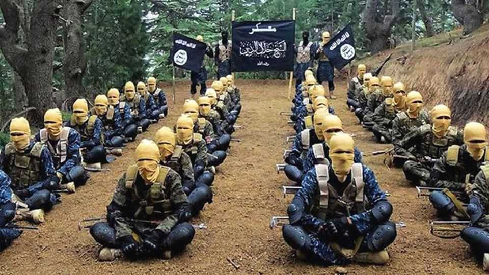

Asia | Terror trade
Pakistan is critical in the fight against Islamic
State terrorism

It is helping the West but wants arms and intelligence in return

August 21st 2025
  

  
For most of the past 25 years, “phenomenal” was not a word many  
Americans used to describe Pakistan’s co-operation on counter-terrorism.  
Yet that is how General Michael Kurilla, then head of America’s Central  
Command, characterised it in June. His praise was striking not just because  
American officials have long accused Pakistan of covertly backing the  
Afghan Taliban and sheltering Osama bin Laden, who was killed by  
American special forces in a Pakistani garrison town in 2011. The remark  
also came seven weeks after India blamed a terrorist attack in Kashmir on  
Pakistan, which has a long history of sponsoring similar assaults on Indian  
soil.
What explains the change of tune? The answer lies in the lawless  
borderlands between Pakistan and Afghanistan. That is now the stamping  
ground of the Islamic State Khorasan Province (ISKP), an offshoot of the  
group that established a “caliphate” in Iraq and Syria in 2014. America and  
other Western governments see ISKP as their biggest international terrorist  
threat. Partly because of this, many governments are quietly engaging with  
the Taliban in Afghanistan.

At Western governments’ request, Pakistan has stepped up joint efforts to  
kill and capture ISKP leaders in the last year or so. Among them was the  
alleged planner of an ISKP suicide attack in Kabul that killed 13 American  
service members and about 170 civilians in August 2021. Pakistan arrested  
him in February and extradited him to America in March, earning rare  
public praise from Donald Trump. That also helped Field Marshal Asim  
Munir, Pakistan’s army chief, to score an invitation to a White House lunch  
in June, just over a month after a brief conflict with India. The field marshal,  
a devout Muslim who appears to be more ideologically minded than his  
predecessors, returned to America for more talks this month.

Even so, ISKP still has about 4,000-6,000 fighters, including Tajiks, Uzbeks  
and Turks who mostly operate in eastern Afghanistan and Pakistan’s north  
and south-west, according to officials tracking the group. It is considered  
especially dangerous because it attracts experienced fighters and recruits  
aggressively online, often encouraging lone-wolf attacks abroad. And  
despite coming under pressure from Afghan and Pakistani authorities, it  
“retains the capability and intent to attack Western interests abroad with little  
to no warning”, General Kurilla told a congressional hearing on June 10th.

Further co-operation from Pakistan could come with conditions attached. It  
is not as worried about ISKP because the group, which adheres to the  
puritanical Salafist school of Sunni Islam, mainly targets Shia Muslims  
(including in Iran) along with Westerners and Russians. Pakistan is far more  
concerned about other insurgents on its territory who have separatist aims or  
who want to impose sharia law.

So Pakistan is now seeking American support for its efforts against those  
groups, especially the Tehreek-e-Taliban Pakistan (TTP), active in its  
northern tribal areas, and separatist groups in the south-western province of
Balochistan. In 2024 alone, Pakistan says that 1,081 of its people were killed  
in terrorist attacks: a 45% increase from 2023.

One of Pakistan’s requests is that America works to recover the vast  
quantities of weapons it left behind after withdrawing from Afghanistan in  
2021. Lieutenant General Ahmed Sharif Chaudhry, Pakistan’s military  
spokesman, says that America should buy them back on Afghanistan’s black  
market to prevent more falling into the hands of insurgents there and in  
Pakistan. “Everything is available to the highest bidder” in Afghanistan, he  
says.

Pakistan also wants America to provide it with more intelligence and to  
resume supplying Pakistani forces with weaponry to help fight insurgents.  
American officials may be open to supplying equipment such as mine-  
resistant armoured personnel carriers and night-vision goggles, which they  
believe would not alter the military balance with India. But provision of any  
such kit would be fiercely opposed by India’s government, a far bigger  
buyer of American military hardware.

Pakistan’s other main demand is more challenging. It wants America and  
other Western governments to accept its claims that India is backing the TTP  
and Baloch separatists. Pakistan recently presented foreign governments  
with what it says is fresh evidence. And it wants them to put pressure on  
India to stop such alleged activity. Western officials, while examining that  
evidence, have yet to be convinced. They also have to balance such claims  
with compelling evidence of Pakistan’s longstanding links to terrorism in  
India.

Despite this, there is no sign of Pakistan withholding co-operation against  
ISKP. Field Marshal Munir sees it as an important part of his calculus about  
how to draw close to the Trump administration. Nor is ISKP only a concern  
for the West. Russia considers it a serious threat. So does China: one of its  
citizens was killed by ISKP in Afghanistan in January. Iran, too, deems  
ISKP dangerous, after it killed more than 100 people in a bomb attack in the  
city of Kerman in 2024.

Still, as Pakistan steps up its counter-terrorism partnership with the West,  
familiar tensions are emerging. On the Western side, some suggest that
Pakistan has hyped up the importance of some ISKP figures it has killed or  
captured (something it often did with alleged al-Qaeda leaders in earlier  
years). On Pakistan’s side, some officials suggest that ISKP is covertly  
backed by America to strike against Russia and Iran and to undermine  
Chinese interests in Pakistan and Afghanistan. America’s security co-  
operation with Pakistan may be on the up. But in the words of one veteran in  
that field, there is only one constant in the relationship: mutual distrust. ■

This article was downloaded by zlibrary from [https://www.economist.com//asia/2025/08/21/pakistan-is-critical-in-the-fight-](https://www.economist.com//asia/2025/08/21/pakistan-is-critical-in-the-fight-)
against-islamic-state-terrorism