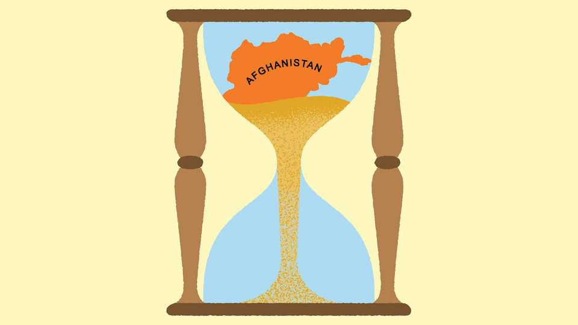

Asia | Banyan
The world is learning to live with the Taliban
Four years after the fall of Kabul, governments are quietly recognising the  
insurgents

August 21st 2025
  

  
As insurgents, the Taliban spent 20 years wearing down the world’s most  
powerful army. As diplomats they needed just four to break out of their  
international isolation. Since seizing power in August 2021, most countries  
have refused to recognise the Taliban as Afghanistan’s government,  
acknowledging them only as “de facto authorities”. That changed in July this  
year, when Russia officially recognised the group. The Taliban flag was  
raised at the Embassy of the Islamic Emirate of Afghanistan in Moscow.  
Unofficially, other governments are following suit. On August 20th the  
Taliban hosted a trilateral meeting with China and Pakistan.
The Taliban were supposed to remain in the diplomatic doghouse until they  
abandoned their abhorrent treatment of women and broadened their all-male  
Pashtun cabinet. Neither has happened. Girls are banned from secondary  
school, women from working for NGOs and going to parks. Vice-and-virtue  
police patrol Kabul, the capital, with increasing zeal to check that women  
are covered up and accompanied by a male relative, according to one of the  
city’s few remaining female corporate executives.

The front against the Taliban has nonetheless steadily cracked. At least 15  
mostly regional countries have ambassadors in Kabul, including China,  
Russia, Iran and several Gulf states. Many more operate at a lower level of  
diplomatic representation. The thaw is accelerating: the United Arab  
Emirates accepted a Taliban ambassador in August 2024. China followed in  
January. Both China and Russia eye Afghan minerals while fretting about  
Islamic State spillover. Business is picking up, too. Chinese, Turkish and  
Iranian firms are cutting deals. As a Kabul-based diplomat notes, when the  
Taliban must choose between an Uzbekistan energy contract and “another  
Western lecture on girls’ education”, the choice is obvious.

Western states are performing diplomatic contortions to engage with the  
Taliban on multiple issues without conceding recognition, a process an  
American diplomat calls a “charade”. Britain is among the few to have  
acceded to Taliban demands that countries must withdraw recognition from  
the former regime’s diplomats. It has a special envoy who has met Taliban  
officials at least once since being appointed in June. The EU has an office in  
Kabul. Norway received a Taliban diplomat in January. In March  
Switzerland reopened its humanitarian office.

Migration is a factor. Germany accepted two Taliban diplomats in Berlin and  
Bonn in July to co-ordinate the deportation of convicted Afghan criminals.  
More than 100 have been flown to Kabul since August 2024, despite UN  
warnings that Afghanistan is unsafe. But, even so, the Taliban won’t agree to  
solve the West’s illegal refugee problem “for free”, notes one foreign  
diplomat.

Similarly, America has between 12,000 and 15,000 illegal Afghan migrants  
it would like to return, according to an American diplomat. In January, the  
Biden administration traded prisoners with the Taliban. America has also
lifted $10m bounties on three top Talibs, including Sirajuddin Haqqani, the  
interior minister, who orchestrated suicide-bombings against Western forces.  
Mr Haqqani remains on the terrorist list, but this barely matters: in 2022  
sanctions were diluted to the point that businesses are free to deal with his  
ministry.

Until recently, Taliban officials met weekly with American diplomats in  
Qatar. Topics included human rights, drugs and counter-terrorism. The  
meetings ended when Mary Bischoping, an official hostile to engagement  
while the Taliban held American hostages, took charge. Her recent  
reassignment has been quietly celebrated by State Department pragmatists.

The Taliban’s trump card is the strength of their regime. In 2021 observers  
expected their support would crash along with the economy. Instead, they  
have cut corruption, halted poppy cultivation, ended 40 years of war and  
helped hammer the local Islamic State franchise (ISKP). Crucially, there is  
no credible opposition, in both Afghanistan and in exile. The Taliban feel so  
secure that they are slashing their bloated security apparatus to save money.

Things could still be destabilised by the cuts by Donald Trump’s  
administration to humanitarian aid, the pushback of refugees by Iran and  
drought. But the Taliban have endured worse. “You have the clocks, we have  
the time,” they told the occupying foreign powers. Now they have both.■

Subscribers to The Economist can sign up to our Opinion newsletter, which  
brings together the best of our leaders, columns, guest essays and reader  
correspondence.

This article was downloaded by zlibrary from [https://www.economist.com//asia/2025/08/21/the-world-is-learning-to-live-with-the-](https://www.economist.com//asia/2025/08/21/the-world-is-learning-to-live-with-the-)
taliban
China
 
Hong Kong’s courtroom dramas  
China’s mid-year economic wobble