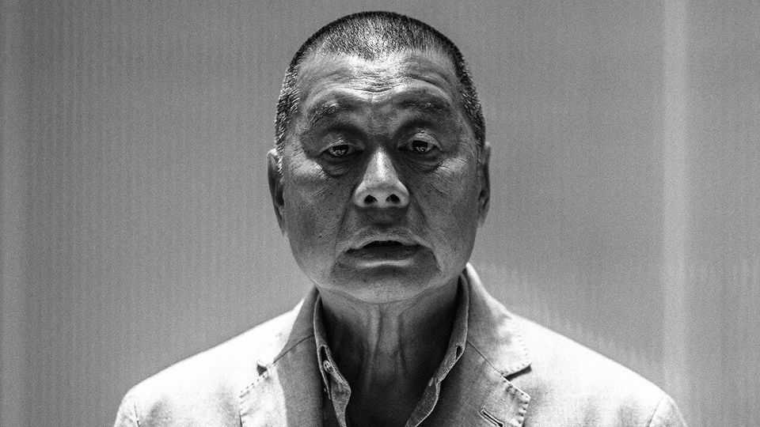
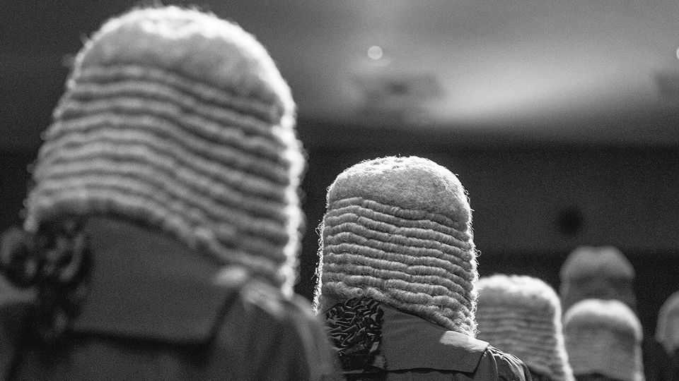

China | Judicial independence
Hong Kong’s courtroom dramas
Jimmy Lai’s trial raises questions about how justice now works
August 21st 2025

CLOSING ARGUMENTS are under way in the trial of Hong Kong’s most famous media mogul. Jimmy Lai’s publications cheered the millions who marched against the territory’s government in 2019. The charismatic billionaire could have fled. But Mr Lai stayed, and now stands accused of sedition and collusion with foreign forces. The verdict is expected to be delivered in a few weeks or months; few observers doubt that the 77-year- old will be found guilty. Already serving another jail term, he could face a sentence of life in prison. In the wake of the unrest, which turned violent, China’s ruling Communist Party engineered sweeping changes in Hong Kong’s laws to prevent further

upheaval. These are being used to crush even peaceful activism that is deemed a threat to the party or the government in Hong Kong.

This wasn’t how it was supposed to be after Britain passed Hong Kong back to China in 1997. China promised to preserve freedoms. It allowed Hong Kong to keep a common-law legal system, which set the bar high for putting dissenters in jail. But two new laws have transformed the legal landscape. The first was the National Security Law (NSL), promulgated by the legislature in Beijing in 2020. It created sweeping, fuzzy categories of crime that Hong Kong had not known before, such as secession, subversion and the collusion of which Mr Lai stands accused. The other was last year’s “Article 23 legislation”. It imposed tougher sentences for offences related to national security and ditched a requirement that the crime of sedition (which existed before the NSL) should be linked to violence.

Business people still seem bullish—increasingly so, even. The American Chamber of Commerce in Hong Kong regularly surveys its members about how they feel. In January 83% said they were confident in the territory’s legal order. In 2022 only about a quarter felt that way. Their assumption seems to be that the authorities will target activists and leave business alone. But the new laws feel oppressive to many Hong Kongers. Large, peaceful protests, once common, no longer happen. Government critics fear speaking out.

The legislation also weighs heavily on the courts. Judges lack precedent they can draw on for determining how to understand new legal parameters. Almost all the 78 concluded cases under the NSL have resulted in guilty verdicts, but appeals abound. It may take years for these to work through the system. That process will help provide more clarity about where exactly the law’s red lines are.

Legal blows against dissent raise questions about Hong Kong’s judicial independence. The territory still ranks highly on global rule-of-law indices. In 2019 it was placed 16th by the World Justice Project, an American NGO. America was 20th on its list of 126 countries and territories. Since the imposition of the NSL Hong Kong has fallen only slightly to 23rd (out of 142), keeping its lead over America, which trails at 26th. (Mainland China has fallen from 88th in 2020 to 95th, just above Tanzania.)

But Hong Kong’s overall score masks a sharp deterioration in one category: fundamental rights. In this area it has fallen from 33rd—six places behind America—to 62nd (25 behind). It is still far ahead of mainland China (close to bottom at 139th). Clearly, however, it has changed, with its courts now regularly jailing people for dissident activities that once would have been allowed. Critics wonder if judges are taking cues from Chinese officials, and to what degree the system is becoming more like that of the mainland. There the Communist Party, not the judiciary, determines the outcome of cases that involve matters relating to its interests.

Officials counter that the territory’s judicial system is as robust as ever. A senior adviser to Hong Kong’s government, Ronny Tong—himself a lawyer —dismisses suggestions that the judiciary is pliant. He calls allegations of political pressure on judges a “very unjustified myth”. Leaders in Beijing are adamant that they want to protect the territory’s common-law system.

In cases not involving dissent, this system indeed remains intact. And even in trials of political activists, Hong Kong’s courts still operate very differently from those of the mainland, where such events are often pro- forma, usually wrapped up in days and without media access. In Hong Kong they can last months, with evidence and witness testimony argued over in detail. Journalists can watch and report. There is no sign that the Communist Party intervenes directly in trials as it does on the mainland, where outcomes in politically sensitive cases are determined by its shadowy “political-legal” committees.

Yet the party has other ways of influencing outcomes. The NSL and Article 23 legislation allow related trials to be held without a jury—they now always are. Verdicts in these sorts of case are reached by three judges chosen from a special pool. Its members have renewable year-long terms, but the NSL says that if a judge “makes any statement or behaves in any manner endangering national security” while doing the job, they can be dismissed from the pool. China’s rubber-stamp parliament has the final say in the NSL’s interpretation. The Communist Party sees criticism of its rule as a national-security threat.

Disquiet is mounting. The territory’s Court of Final Appeal (CFA) has invited both local and overseas judges onto its bench since the handover.

The latter came from other common-law jurisdictions such as Australia and Britain and took up temporary seats. Five foreigners have quit the CFA since 2022; some have cited concerns about the political environment. (There is little chance a visiting overseas judge would be chosen to adjudicate an NSL case in the CFA, though foreign judges who are resident in Hong Kong have done so.)

One trigger was a case involving 47 people who were accused of subversion for their roles in organising an unofficial primary election to maximise the chances of opposition politicians taking control of the legislature, and using that majority to force Hong Kong’s leader to step down (its constitution allows that). Two were acquitted; the remainder were sentenced to between four and ten years in prison last year.

Citing their treatment, Lord Sumption, formerly of Britain’s Supreme Court, left the CFA after four and a half years in service. “It seemed to me that in cases, particularly criminal cases about which the Chinese government was known to feel strongly, the courts were not prepared to operate independently of the wishes of China,” he says. Hong Kong’s government rejects his views. In a statement of nearly 3,000 words in June 2024, it declared that any suggestion that judicial independence has been compromised “would be utterly wrong, totally baseless, and must be righteously refuted”.

For judges, these are difficult times in ill-charted territory. Lord Sumption recalls a “very senior” one telling him that the West offers only second passports and moral lectures. “We have nowhere else to go, unlike you,” he quotes the judge as saying. “What are we to do? We are not able to conduct a guerrilla war against China. And if we tried, we’d probably get something worse. We have to face realities.”

Many of the judges may not be liberals, anyway. China insists that they must be “patriotic”, which in its view involves accepting the party’s monopoly of power. A law professor says a few have not studied human-rights law. The NSL requires Hong Kong to adhere to the UN’s International Covenant on Civil and Political Rights. But judges know that any attempt to apply these principles in a way that prevents the party getting its way could end in frustration. The party makes clear its views using its local mouthpieces, especially two newspapers Ta Kung Pao and Wen Wei Po. These portray even peaceful protesters as guilty of heinous crimes against the state.

Many appeals are likely to end up eventually in the CFA; some may be upheld. In March it quashed the convictions of three former members of a now-disbanded pro-democracy group, the Hong Kong Alliance. It was a rare exoneration of activists by the territory’s highest court. But it was on a technicality. One of them, along with fellow former leaders of the group, is

expected to be put on trial in November on more serious charges. And when the party’s interests could be affected, the Hong Kong government occasionally invites China’s parliament to step in. In 2022 the national legislature allowed the territory to sidestep a CFA ruling that Mr Lai’s defence team could use an overseas barrister.

Over time, the judiciary’s strength may erode as the best lawyers in Hong Kong avoid taking on the job. “A lot of the gloss of a judicial appointment disappeared with the feeling that the judges are no longer as independent as they used to be,” believes Lord Sumption. The law professor says new law students barely remember the unrest six years ago. They “do not associate 2019 with anything positive”, he says. Neither does the Communist Party. ■

Subscribers can sign up to Drum Tower, our new weekly newsletter, to understand what the world makes of China—and what China makes of the world.

This article was downloaded by zlibrary from [https://www.economist.com//china/2025/08/21/hong-kongs-courtroom-dramas](https://www.economist.com//china/2025/08/21/hong-kongs-courtroom-dramas)