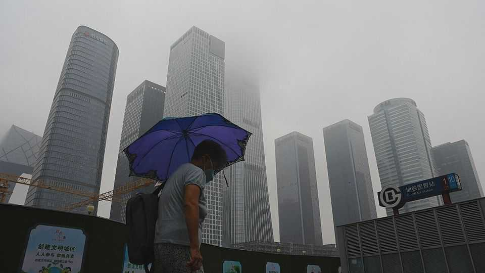
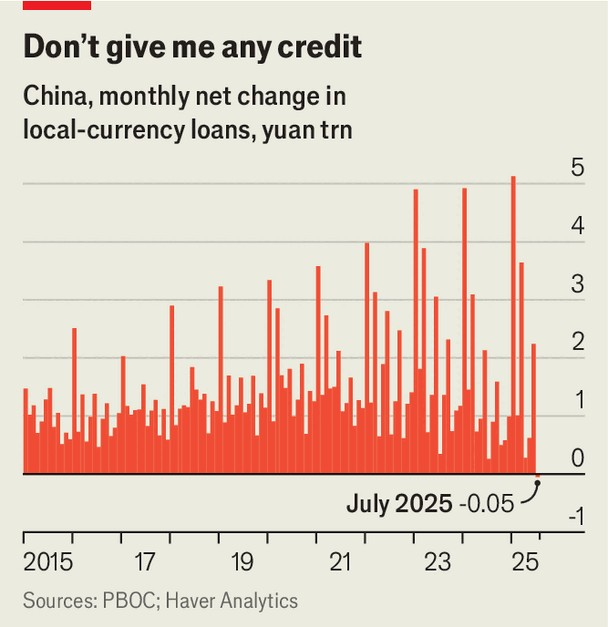

China | The second act
China’s mid-year economic wobble
The government experiments with small handouts to households

August 21st 2025
  

  
IN RECENT years China’s economy has obeyed a three-act dramatic  
structure, recognisable to any playwright. Growth starts the year brightly,  
suffers troubling setbacks as spring turns to summer, then prevails in the  
end, after a hurried government stimulus helps it meet the official GDP  
target, with precious little to spare.

This year’s difficult second act has now begun. After reporting brisk year-  
on-year growth of 5.3% in the first half of 2025, China’s statisticians have  
just released disappointing figures. Retail sales grew by only 3.7% in July  
compared with a year earlier, before adjusting for inflation. The volume of  
home sales fell by 8% over the same period. Households were so reluctant to
take out mortgages, or any other kind of credit, that the yuan loan books of  
China’s banks shrank in July for the first time in two decades (see chart).

The job market also looks wobbly. Urban unemployment, which does not  
count people who retreat to the countryside when they cannot find work in  
the cities, edged up from 5% to 5.2%. And things may get worse. China’s  
highest court has recently ruled that employers cannot waive pension  
contributions (and other social-insurance payments), even if workers want  
them to. The ruling could raise the cost of labour by about 1% of GDP if  
enforced, according to Société Générale, a bank.

Contributing to the slowdown, China’s policymakers seem to be keeping  
tighter tabs on its flagship stimulus policy—a scheme that encourages  
households to trade in old cars, phones and appliances for new ones. The  
central government did not rush to replenish funds when several local  
authorities recently exhausted the latest instalment of money that was set  
aside for the scheme.

The purse-strings have also tightened for officials themselves. In May the  
government revised regulations on “promoting frugality” and “opposing  
extravagance” among government and Communist Party workers. “Working  
meals must not include high-end dishes, cigarettes or alcohol,” it decreed.

That may have damaged China’s once booming schmoozing sector. On  
August 8th a commentary published by Xinhua, an official news agency,  
acknowledged worries that the revised rules were harming motivation and  
curbing consumption. Such concerns, it said, must be viewed “dialectically”.  
The word is a nod to Marx and Hegel. Alas “The Phenomenology of Spirit”  
is a poor substitute for the phenomenology of spirits.

If China’s economy is to triumph again in its third act, hitting the  
government’s growth target of 5% for this year, it will need more stimulus.  
The government has recently announced a variety of measures to help.  
Families will now get 3,600 yuan (about $500) a year as a childbirth  
subsidy, for each sprog under the age of three. From the start of this autumn  
term, they can also enrol their children in the final year of a state pre-school  
free, or collect an equivalent subsidy for a private one. The elderly with  
moderate to severe disabilities can get a monthly voucher worth up to 800  
yuan to pay for care. Employers who hire unemployed young people will  
also get a government payout of up to 1,500 yuan.

To boost banks’ loan books, the central government will subsidise consumer  
credit for the first time. The new policy, released on August 12th, will shave  
one percentage point off the interest rate for small personal loans and also  
subsidise bigger loans for cars, elderly care, education and training,  
childbirth expenses, culture and tourism, home furnishings, electronics and  
health care.

Unlike China’s traditional efforts to lift demand, these measures encourage  
consumption, not investment, and emphasise the purchase of services, rather  
than things. “These new programmes show the government becoming more  
comfortable with income transfers to households,” Ernan Cui of Gavekal  
Dragonomics, a consultancy, has pointed out. And the handouts are not  
confined to the poor.

But though they are novel, these transfers are small. The childbirth payouts  
and consumer-loan subsidy will each add less than 0.1% to GDP this year,  
according to Goldman Sachs, another bank. If that is not enough to get  
China’s economy through its mid-year wobble, the government will need to  
offer additional stimulus. China-watchers expect increased infrastructure-  
investment growth. One example is a controversial new 2,000km railway
between Xinjiang and Tibet. A state-owned firm to oversee the project was  
formally registered on August 8th.

In the three-act drama that is China’s economy, the government’s new  
consumer subsidies offer a novel twist. But it may be a stock character—  
infrastructure investment by state-owned enterprises—that ultimately saves  
the day. ■

Subscribers can sign up to Drum Tower, our new weekly newsletter, to  
understand what the world makes of China—and what China makes of the  
world.

This article was downloaded by zlibrary from [https://www.economist.com//china/2025/08/21/chinas-mid-year-economic-wobble](https://www.economist.com//china/2025/08/21/chinas-mid-year-economic-wobble)
Middle East & Africa
 
A new twist in Syria: a political opposition  
What’s in a name in the Middle East?  
Gaza’s Gen-Z influencers  
Are east African governments colluding to stifle dissent?  
How Sierra Leone beat back mpox