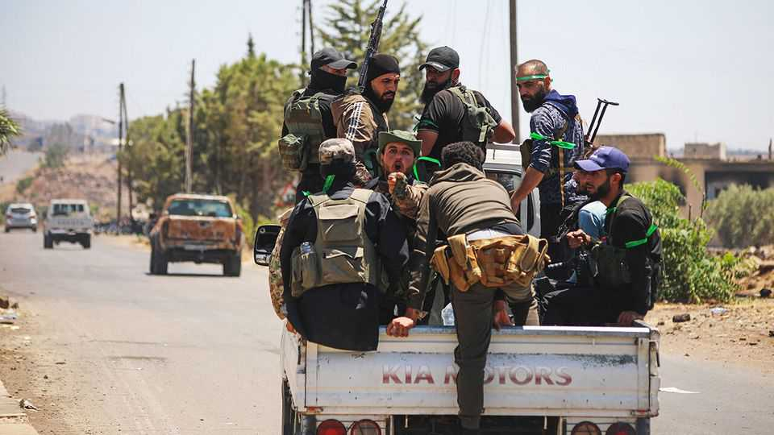

Middle East & Africa | After Assad
A new twist in Syria: a political opposition
The “transitional” regime is losing the confidence of minority groups
August 21st 2025

The overthrow in December last year of Bashar al-Assad, Syria’s dictator, brought a fleeting sense of unity to a country fractured by over a decade of war. Despite unease over his Islamist past, most Syrians rallied behind Ahmed al-Sharaa, their new leader. Over the summer, however, the mood has soured. A growing number of Syrians, especially from minority groups, are voicing frustration with his government. And the first shoots of an organised opposition are popping up. The immediate cause is sectarian bloodshed—and the state’s feeble response to it. In July hundreds were killed when government-backed Sunni militias ran amok in Suwayda, a Druze-majority province. It was the second bout of mass killing since Mr Assad’s fall. In March Sunni fighters descended on

coastal areas and massacred more than 1,400 people, many of them Alawites, the small sect many Sunnis blame for propping up the old regime.

In neither case did the government’s response inspire confidence. In March it was slow to halt the killing; in July its own troops were accused of carrying out atrocities. A committee set up to investigate the coastal massacres produced a report that disappointed many. An inquiry into Suwayda is expected to be similarly puny. In Damascus critics say the regime has absolved Syria’s military command of any real responsibility for their troops’ role in the coastal massacres, preferring to pin the blame on rogue perpetrators. To minorities the lesson is clear: Syria’s new rulers do not speak for them, will not listen to them and cannot—or will not—protect them.

That unimpressive response has encouraged others to organise. In July, amid the carnage in Suwayda, a coalition of activists launched the Syrian Centenary Initiative. It looks like the beginnings of an organised political opposition to Mr Sharaa’s government. Its first act was to demand an immediate ceasefire. It also called upon the government to rewrite the constitutional declaration that Mr Sharaa signed in March, so that it would allow for the formation of political parties and provide more protection for civil-society groups.

Among its founders are activists who spent decades in the Assads’ prisons. George Sabra, a Christian politician who once led a coalition of exiled opposition groups, and Ayman Asfari, a Syrian-British billionaire who was once touted to be Mr Sharaa’s prime minister, have joined. It also includes Alawite activists and businessmen from Aleppo. The group’s name refers to an uprising led by the Druze against the French mandate in Syria a century ago. Its members say it is responding to urgent threats to Syria’s unity.

The government has reacted badly. Officials have ignored the movement’s demands and attacked its members. “Instead of addressing the initiative on its merits, we faced organised smear campaigns,” says Hazem Dakhil, a journalist-turned-activist from Idlib, the province once run by Mr Sharaa and his rebels, who has joined the movement. “They accuse us of plotting to replace Sharaa with a military council or minority rule—claims that appear nowhere in our statements.”

Such defensiveness is becoming a regime hallmark. Civil-society activists say criticism is treated as treason. “There is no dialogue,” laments Mr Dakhil. Reports of Alawite women disappearing from coastal areas— documented by human-rights groups—have been met with Orwellian denials from the government. Journalists who investigate crimes by state security forces are harassed online by pro-regime trolls. Some have been arrested without charge, released only after a public outcry.

Rather than broadening his coalition, Mr Sharaa is narrowing it. Since the Suwayda killings, Druze leaders have rejected government pleas to join the security forces. The March massacres left the Alawites deeply mistrustful. Efforts to weld militias into a national army have stalled; negotiations with the Kurds in the north-east are going nowhere. Integrating minorities into the army and police is key to rebuilding the Syrian state. On this front, Mr Sharaa has made no headway.

Decision-making is limited to a small circle of officials, from Mr Sharaa’s former rebel group, who often bypass the very state institutions they need to rebuild. Many positions are awarded on the basis of loyalty, or tribal and family links. “They are militiamen…They can only see problems in the way militiamen see problems. They are no longer holed up in Idlib fighting Assad and Iran. They need to use politics rather than warfare to solve problems,” says Robin Yassin-Kassab, a British-Syrian writer.

Mr Sharaa still deserves credit. Most notably, he persuaded Donald Trump to lift the crushing American sanctions imposed under Mr Assad. Gulf states and Turkey continue to pledge investment. But the Suwayda violence rattled Mr Sharaa’s foreign allies. Their patience will not last indefinitely if he governs only for Sunnis.

Ordinary Syrians, meanwhile, have yet to enjoy much benefit. Day-to-day violence has decreased but nine in ten still live in poverty. Minorities feel as excluded as ever. Many Alawites have lost their jobs. Some Druze militias now openly fly the Israeli flag; some are calling for secession. “The more he alienates the minorities, the more he is reliant on a sectarian base,” warns one international mediator.

Even so, his critics insist they want to work with him—if he will listen. But their patience is not limitless. As one activist in Aleppo puts it: “We did not throw out Assad to be ignored once again.” ■

Sign up to the Middle East Dispatch, a weekly newsletter that keeps you in the loop on a fascinating, complex and consequential part of the world.

This article was downloaded by zlibrary from https://www.economist.com//middle-east-and-africa/2025/08/21/a-new-twist-in-syria- a-political-opposition