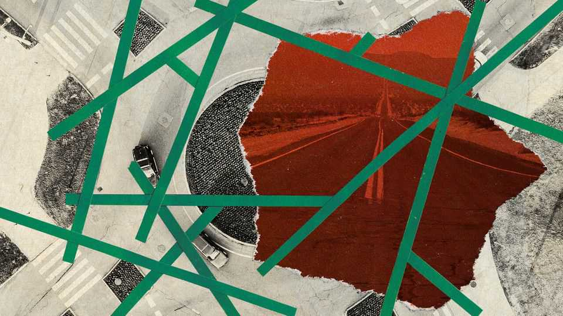

Middle East & Africa | Another kind of conflict
What’s in a name in the Middle East?
Controversies about names are more about politics than history
August 21st 2025

The first road you take after arriving in Lebanon was long named after a foreigner who killed thousands of Lebanese. For decades the airport motorway was known as Hafez al-Assad avenue, after the late Syrian dictator. It struck some visitors as an odd choice, since the Assad regime had been an unwelcome occupier in Lebanon for three decades—a bit like naming the airport road in modern-day Warsaw after Josef Stalin. It became odder still in December, when Syrian rebels overthrew Bashar al- Assad, the dictator’s son. Even as they tore down symbols of the family’s rule, Assad père clung to a stretch of tarmac in southern Beirut. But no longer. On August 5th the Lebanese cabinet announced that it would rename the street after Ziad Rahbani, a beloved artist who died a week earlier.

Naming controversies are a fixture of modern life. The Biden administration ordered America’s army to rechristen army bases named after Confederate officers (though Donald Trump has restored many of the original monikers). British councils have done the same with slave traders. Times change, and sensibilities change with them. But in the Middle East, where the past is not always past, such controversies are often less about reassessments of history than contemporary politics.

In the early 1980s Tehran named a street after Khalid al-Istambouli, the Egyptian officer who gunned down Anwar Sadat, his country’s third president. The logic was crass but clear. Sadat harboured the Shah of Iran after he was deposed in 1979. He also made peace with Israel. Naming a street after his assassin was a crude way for the nascent Islamic republic to demonstrate its revolutionary bona fides. Egyptians were unimpressed: the name was a source of diplomatic tension for decades.

Last month, though, the city took down Istambouli’s name and replaced it with that of Hassan Nasrallah, the slain leader of Hizbullah, a Lebanese Shia militia. The regime has not reassessed its jaundiced view of Sadat. But it is feeling isolated after its disastrous war with Israel this summer. Iran needs friends in the region; antagonising Egypt no longer serves a purpose.

At other times, names are changed to help people forget. When Bahrainis took to the streets in January 2011 to protest against the monarchy, they built an encampment at Pearl Roundabout, a traffic circle in the capital dominated by a sculpture of the gem (a nod to Bahrain’s formerly pearl-based economy).

One month later the government bulldozed the monument. Officials stopped referring to the circle by its popular name and insisted on using the official (but little-known) title: Gulf Co-operation Council Roundabout.

A few years later they did away with the roundabout altogether. That stretch of highway is now a junction named after Omar ibn al-Khattab, a seventh- century caliph revered by Sunnis but reviled by Shias, who see him as a usurper. The sectarian overtones were probably no coincidence: many of the protesters in 2011 were Shias.

Egypt has thrown plenty of names down the memory hole since the army overthrew Muhammad Morsi, the popularly elected president, in a coup in 2013. His supporters staged a two-month sit-in to protest against the putsch at a plaza in eastern Cairo. Hundreds of them were killed by soldiers and police in August of that year, the bloodiest day in Egypt’s modern history. The name of the square, Rabaa al-Adawiya, became a metonym for massacre. So the government tried to stop people from speaking it. In 2015 it renamed the square after a prosecutor assassinated in a car bombing.

History is written by the victors, but victories in the Middle East can often be tenuous. Though the Syrian army left Lebanon in 2005, the Assad regime retained deep influence in the country for many years. It took Bashar’s exile to Moscow to sweep away a trivial vestige of Syrian rule in Lebanon. It may take longer still to rename the other street leading to the airport—named not after a famous Lebanese but after Ayatollah Ruhollah Khomeini, the architect of the Iranian revolution. ■

Sign up to the Middle East Dispatch, a weekly newsletter that keeps you in the loop on a fascinating, complex and consequential part of the world.

This article was downloaded by zlibrary from https://www.economist.com//middle-east-and-africa/2025/08/21/whats-in-a-name-in- the-middle-east