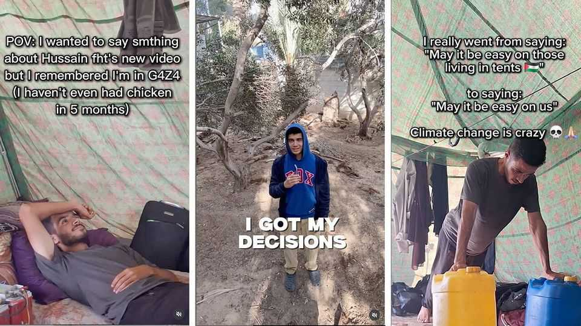

Middle East & Africa | Voices from the strip
Gaza’s Gen-Z influencers
They include a bodybuilder, a would-be American-college student and skateboarders
August 21st 2025

An amateur bodybuilder. A teenager admitted to Dartmouth College in America. A gang of skateboarders. They are not obvious chroniclers of bombs and famine. But they are among Gaza’s most dogged witnesses—the Generation-Z Palestinians who have posted online over 22 months of war. Audiences can be vast: a handful have millions of followers, many of them count hundreds of thousands of followers from around the world. Their role matters all the more because Israel bars foreign journalists from working freely in Gaza, and because hundreds of Palestinian reporters have been killed. For those looking for Palestinians’ own stories about life in Gaza, TikTok and Instagram, not cable television, offer the most unfiltered version.

On Instagram Mohammed Hatem, an amateur bodybuilder who goes by the name “Gym Rat in Gaza”, documents his muscles wasting away for lack of protein. He has almost 400,000 followers and has appeared on some fitness podcasts in America.

In a recent interview, he described how he was getting just 1,200 calories, on average per day, barely half the 2,400 he calculates he needs to stay fit, he says. “As much as I try to optimise training and nutrition to still make results, my main focus in it was for my mental side. I would like to stay committed to this little bit of my daily routine,” he told one podcaster.

Some of Mr Hatem’s videos feature witty clips about the lack of chicken in Gaza. Others show him giving fitness consultations to clients outside Gaza or gathering his belongings for yet another evacuation.

Omar Shareed, who won a place at Dartmouth College in America, posts about the bureaucratic struggle to leave Gaza and take up his studies. He pleads with his followers to help him with this.

Ceasefire or not, Gaza’s influencers continue to document birthdays, weddings and the daily struggle to stay alive and get enough food. Life goes on—except when it does not. Earlier this year Yaqeen Hammad, an 11-year- old known as “Gaza’s youngest influencer”, was killed in an Israeli airstrike.■

Sign up to the Middle East Dispatch, a weekly newsletter that keeps you in the loop on a fascinating, complex and consequential part of the world.

This article was downloaded by zlibrary from https://www.economist.com//middle-east-and-africa/2025/08/21/gazas-gen-z- influencers