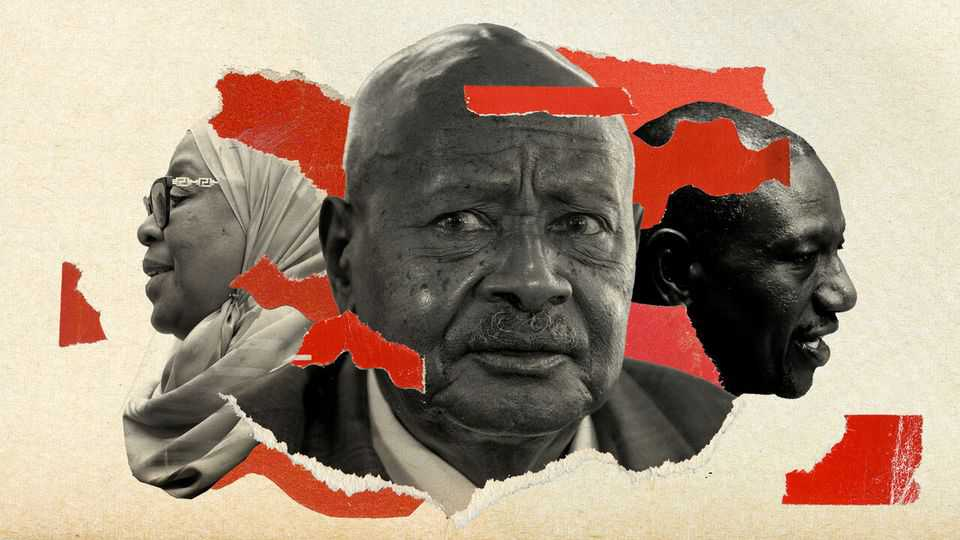

Middle East & Africa | Autocrats without borders
Are east African governments colluding to stifle
dissent?

A raft of recent cases raises a disturbing suspicion

August 21st 2025
  

  
When Agather Atuhaire, a Ugandan lawyer and journalist, was arrested in  
Tanzania in May, she says she was held incommunicado, tortured and raped.  
Three days later she was dumped at the border between the two countries.  
Her supposed crime? Attending the trial of Tundu Lissu, a Tanzanian  
opposition leader charged with treason. A Kenyan activist who went with  
her was also abducted and tortured. Ms Atuhaire says their tormentors  
warned them never to return and “interfere” in Tanzanian politics again.  
Tanzania’s police denied mistreating them. After the incident William Ruto,  
Kenya’s president, apologised to Tanzania for “anything that Kenyans have  
done that is not right”.
Repression is not uncommon in Tanzania, which has been run by the same  
party since independence in 1961. With elections due in October, the regime  
headed by Samia Suluhu Hassan is in no rush to allow her jailed opponent,  
whose party has been barred from competing, more publicity. (On August  
18th a judge banned live coverage of Mr Lissu’s latest court appearance.)  
Yet the alleged brutal treatment of Ms Atuhaire and her colleague and the  
Kenyan government’s response raises the disturbing suspicion that security  
forces in Kenya, Tanzania and Uganda may be colluding to crush dissent.

It is just one of several recent cases. The most prominent example is Kizza  
Besigye, a Ugandan opposition leader who was kidnapped on a visit to  
Kenya in November and now stands accused of plotting to overthrow  
Uganda’s government by force. Because Mr Besigye was unlawfully  
rendered to a military jail in Uganda, “there has to have been a high level of  
co-ordination” between the two countries’ security agencies, says Roland  
Ebole of Amnesty International, a rights group. Kenya’s government has  
since admitted that it co-operated with the Ugandan authorities, saying Mr  
Besigye’s treatment may have been “different” had he claimed asylum.

Other cases suggest collusion at a lower level. Mwabili Mwagodi, a Kenyan  
critic of Mr Ruto, whose rule is increasingly authoritarian, was seized in July  
by unknown assailants while working at a hotel in Tanzania. He was handed  
over to the Kenyan authorities, battered and bruised, several days later, and  
admitted to hospital.

In January Maria Sarungi Tsehai, a Tanzanian democracy activist, was  
kidnapped by masked men on the streets of Nairobi, Kenya’s capital, which  
until recently was a relatively safe haven for dissidents. She is sure at least  
one of her abductors was Tanzanian. “Either Ruto doesn’t control the  
security services, or he is assenting to it,” says a former American official.  
“Neither scenario is remotely reassuring.” Mr Ruto and the Kenyan  
government have not commented on the allegations.

Even where there is no evidence of collusion, leaders scratch each others’  
backs. Ms Atuhaire notes that although the Ugandan authorities may not  
have asked Tanzania to arrest her and her Kenyan colleague, none objected  
to their treatment.
Jeffrey Smith, founder of Vanguard Africa, a pro-democracy outfit in  
Washington, sees a “convergence of authoritarian tactics across east Africa”.  
Mr Ruto is said to have a personal bond with Yoweri Museveni, Uganda’s  
president since 1986. The Kenyan leader’s harsh response to recent anti-  
government protests feels familiar to Ugandans. Mr Museveni is “an  
example and encouragement” to his regional peers, says David Lewis  
Rubongoya of the National Unity Platform, a Ugandan opposition party. The  
Ugandan president in turn may have been influenced by the ruling party in  
Tanzania when he lived there, first as a student and later as a rebel leader,  
argues Erick Kabendera, an exiled Tanzanian journalist.

Why might these governments be tempted to team up against their  
opponents? For one, they share a common predicament. Though only Kenya  
has recently had mass protests, leaders in Uganda and Tanzania are also  
unpopular with their young and increasingly restive voters. Mrs Samia, who  
took office after the death of her predecessor in 2021, will face them for the  
first time in October. Mr Museveni, who is 80, is planning to run again in  
January. But his authority is beginning to slip. Some observers reckon that  
fear of an uprising is what prompted the regime to go so hard after Mr  
Besigye.

Meanwhile the international order has grown more permissive. Last month  
Marco Rubio, secretary of state in the Trump administration, told American  
officials to avoid opining on the credibility of elections overseas. Diplomats  
who might once have spoken out when regimes threaten or even kill  
opponents are increasingly staying mum. “A single statement from  
Washington can make people here very fearful,” says Godwin Toko, a  
lawyer in Uganda. “But now you don’t have any.”

Britain’s foreign office wants its diplomats to spend less time lecturing  
African governments about democracy and human rights. A European  
ambassador in Nairobi says that “three generations after independence, I  
think we’re done telling them what to do.” Donors are slashing funds for  
election monitors and civil-society groups. Chapter Four, a human-rights  
group in Uganda, says its budget has halved since the Trump administration  
closed USAID.
Western efforts to boost democracy in Africa were never consistent or  
faultless. Still, Western diplomats sometimes used to push for tweaks to  
draconian laws or help endangered dissidents get to safety. “The West was  
actually a strong restraining hand on the government here,” acknowledges  
Andrew Mwenda, a Ugandan journalist with ties to the government.

Now, though, authoritarians across the continent are discovering just how  
much they can get away with. “I fear it is going to get worse,” says Marion  
Kirabo, a lawyer who plans to stand for local government in Uganda next  
year. “We are basically on our own now.” ■

Sign up to the Analysing Africa, a weekly newsletter that keeps you in the  
loop about the world’s youngest—and least understood—continent.

This article was downloaded by zlibrary from [https://www.economist.com//middle-east-and-africa/2025/08/21/are-east-african-](https://www.economist.com//middle-east-and-africa/2025/08/21/are-east-african-)
governments-colluding-to-stifle-dissent