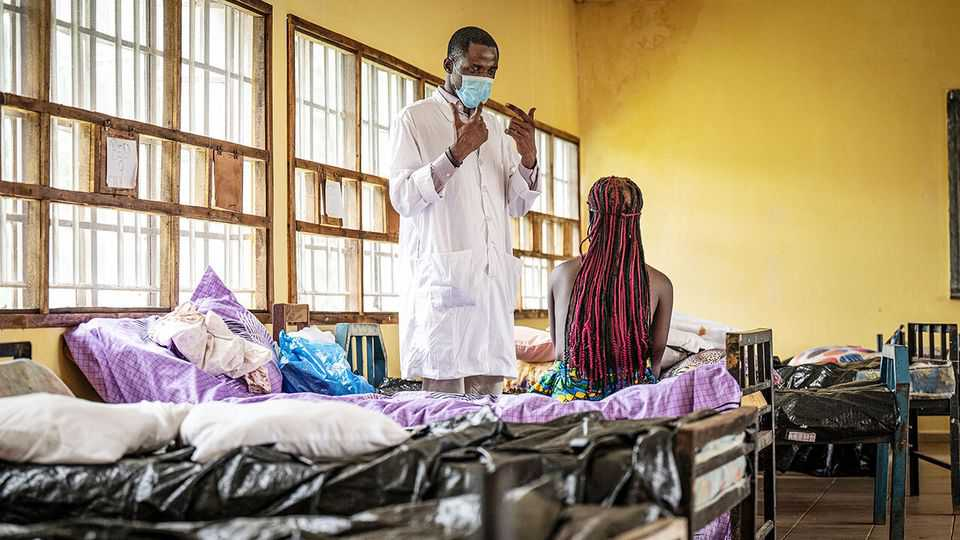
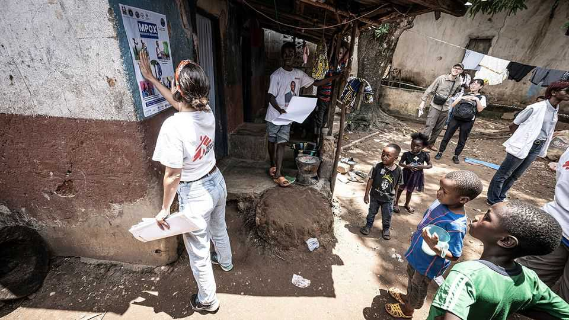

Middle East & Africa | Going viral
How Sierra Leone beat back mpox
The country’s effective public-health messaging is a model for the rest of Africa
August 21st 2025

Pictures of sore, blistered genitals have gone viral in Sierra Leone in recent months. The gruesome photos showing symptoms of mpox have helped persuade Sierra Leoneans that the virus, which spreads mainly through close physical contact and causes fever, chills and skin blisters, is a real public- health threat. That has made them more willing to follow government advice on how to avoid it. “When we had Ebola, I was one of the people saying I don’t believe it is real,” says Moses Lavalie, a 32-year-old in Freetown, the capital. “But mpox? Mpox is very real.” Ever since the UN’s World Health Organisation (WHO) declared mpox a “public-health emergency of international concern” a year ago, African

countries have been worst affected. The continent has suffered a surge in the spread of two mpox strains, with the newer one, known as clade Ib, believed to be more lethal. The rollout of vaccines has been slow. More than 2,000 people are confirmed to have died from mpox since the beginning of 2024, many of them children. The Democratic Republic of Congo, Uganda and Sierra Leone between them account for almost 80% of cases and deaths.

Yet among the three countries, Sierra Leone stands out for its management of the disease. Congo’s mpox burden is likely to be much higher than reported, with many cases from last year only now being confirmed. Uganda has recorded a large number of deaths among people living with HIV. Meanwhile, following a spike earlier this year, Sierra Leone’s caseload has been falling rapidly.

Sierra Leonean authorities have done some key things well since the country recorded its first case in January. Messaging has been widespread and effective. The government has used radio jingles, posters and daily texts to tell people where to go for testing and how to avoid close bodily contact. That has improved understanding of how the disease spreads and what its risks are (and possibly encouraged people to be open about their symptoms on social media, generating the viral images). The public-health agency has sent workers to poorly connected areas to identify suspected cases and offer treatment, paid for by the government.

Despite limited resources, the country treats mpox as seriously as outbreaks of Ebola and covid-19. As you get off the plane in Sierra Leone, staff offer hand sanitiser. Office buildings conduct temperature checks, as an early symptom of mpox is a fever. Military and police hospitals have been converted into isolation centres. Mild cases, where blisters are restricted to intimate areas, are allowed to be treated at home, freeing beds for more serious cases, such as in people living with HIV.

Things are not perfect. Hospitals are still crowded, with long wait times for tests and treatment. Enforced isolation at home is hard to police in crammed urban areas like Freetown. Mr Lavalie had to wait three days for an answer from an emergency line when he began to show symptoms. Cuts to foreign aid, which has historically helped Sierra Leone pay for lab equipment, contact-tracing and genomic sequencing for epidemiological research, could weaken defences against future outbreaks.

A year into the most recent epidemic, too little is still known about the virus. The strain that accounted for most of Sierra Leone’s cases beginning in May is thought to be the older one, known as clade IIb. But it spread faster than expected and has infected both sexes equally, rather than mainly men. That makes it more like the newer clade Ib strain, puzzling scientists.

Thankfully data from the African Centres for Disease Control and Prevention, based in Ethiopia, show that the number of cases across the continent is shrinking. Yet progress is hampered by rises in infections in countries that are responding less effectively than Sierra Leone. Not all lessons from Freetown are transferable. Sierra Leone is a small country dealing with its first outbreak. Congo is massive and embroiled in conflict across much of its east. Nigeria has battled mpox for at least three years, which has made it harder to treat the latest outbreak as a more urgent emergency. The fight is far from over. ■

Sign up to the Analysing Africa, a weekly newsletter that keeps you in the loop about the world’s youngest—and least understood—continent.

This article was downloaded by zlibrary from https://www.economist.com//middle-east-and-africa/2025/08/21/how-sierra-leone-beat- back-mpox

Europe

Putin’s hunger to destroy Western unity rages on Security “guarantees” for Ukraine are dangerously hazy Friedrich Merz cuts a good figure abroad but is struggling at home Europe is ablaze Why Turkey’s football clubs can pay more cash for talent Trump wants a Nobel prize. Europe can exploit that to help Ukraine