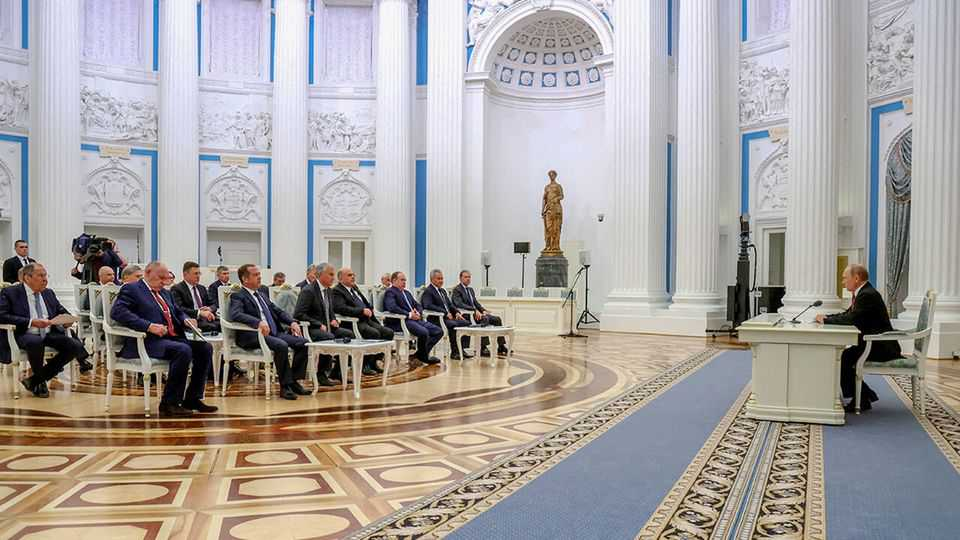

Europe | The view from Moscow
Putin’s hunger to destroy Western unity rages on
He bets on a military breakthrough or a Trump-brokered stitch-up
August 21st 2025

On august 16th, a day after his summit with Donald Trump, Vladimir Putin summoned Russia’s grandees to the Kremlin’s Hall of the Order of St Catherine. Built in tsarist times to show off the glory of the Russian empire, the hall was the setting for Mr Putin’s account of his achievements during the visit to Alaska, a former Russian imperial possession. He praised Mr Trump’s “sincerity” and efforts to end the war. “It moves us closer to making necessary decisions,” he said. In the same hall, three and half years ago, Mr Putin had gathered his terrified courtiers and ordered them, one after another, to make the case for recognising the separatist-held territories in eastern Ukraine. That bizarre televised spectacle signalled the start of the invasion of Ukraine. His post-

Alaska gathering, however, indicated that the war might now end—on Russia’s terms, of course. The message reflects both Russia’s exhaustion from war and Mr Putin’s confidence of winning it, through fighting or by favourable negotiation. His peace initiatives and military actions align to the same goal: more power.

Mr Putin’s tone was emollient: “We respect the US administration’s position, which wants the hostilities to stop as soon as possible. So do we.” One person who seems to take Mr Putin’s words at face value is Mr Trump, who, over the months, has displayed an almost clinical dependence on the Kremlin’s strongman, and has recoiled every time Ukraine and its European allies have urged him to apply pressure on Russia’s leader.

During the follow-up summit in Washington with Volodymyr Zelensky and seven European leaders, a hot mic caught Mr Trump whispering to Emmanuel Macron, the French president: “I think he [Mr Putin] wants to make a deal for me, you understand that? As crazy as it sounds.” Despite earlier promises, Mr Trump has not imposed sanctions and no longer demands a ceasefire as a precondition for talks.

Mr Putin is unlikely to be bothered by the smiles, shoulder-slapping and assurances of support for Ukraine at the White House. As far as he is concerned, the meeting produced little more than general talk of security guarantees that will apply only if Mr Putin agrees to peace. Mr Trump’s call to Mr Putin, in the middle of his meeting with European leaders, offered him reassurance: Mr Trump will do nothing about Ukraine without consulting Russia.

Mr Putin’s own summit with Mr Trump, on the other hand, was much more of a success. Branded a murderous criminal by Mr Trump’s predecessor, he got a red-carpet reception and applause from Mr Trump, who ended Mr Putin’s diplomatic isolation and restored his position as a power player in Europe.

“I congratulate all of us on a perfect summit. It was grand. To win everything and lose nothing—only Alexander III could do that,” enthused Alexander Dugin, an ultra-imperialist philosopher and proponent of war,

nodding to one of Mr Putin’s favourite tsars. It is still unclear what the two summiteers agreed: Mr Putin went to Alaska not to negotiate, but to preen.

Recent polls suggest that 70% of Russians think their country is prevailing on the battlefield, yet 60% favour peace talks. Fear of defeat is long gone, but there is not much appetite for more war. One well-informed businessman sums up the elite’s attitude: “Nobody gives a fuck how it’s going to end, as long as it does. Putin can sell anything as a victory.” At a minimum, though, he wants this to include the recognition, by America at least, of Russia’s occupation of Crimea and the corridor, seized in war, that connects it to Russia; Ukraine’s permanent exclusion from NATO; and presidential elections in Ukraine. “No deal is likely while Zelensky is in power,” says a Russian insider.

Mr Putin’s new enthusiasm for diplomacy reflects his constraints. Russia’s economy is heading into recession. In the first seven months of this year its budget deficit has overshot the target for the whole of 2025— unsurprising, considering a 20% increase in public expenditure in those seven months. At least 5% of all government spending now goes to maintaining a contract army that is mostly fighting in Ukraine, according to Re:Russia, a Vienna-based think-tank.

This does not make Mr Putin’s position critical: he can always impose yet more pain on the economy. But “this will increase risks and internal tension, which will radically change Russians’ perceptions of the costs of war,” says Kirill Rogov of Re:Russia. Moreover, for the third summer in a row, Russia has failed to break Ukraine’s front line. It still controls only a percentage point of Ukrainian territory beyond what it held at the start of 2023.

Mr Putin does not want to risk mass mobilisation, or to carry on the war for another year. The vast human and economic cost would highlight his army’s failure to defeat Ukraine’s. “Everybody understands that [carrying on] the war is senseless and it’s time to end it,” says a Russian magnate.  But this does not mean Mr Putin is about to stop. As Mr Rogov says, he still craves a breakthrough in the next two months: Ukraine is short of manpower; desertion is common. “He is opening the diplomatic door as a contingency, in case his offensive does not yield the desired effect.”

For Mr Putin endless negotiations are simply another part of his war plans. They keep Mr Trump on his side and further the broader aim of sowing dissent in the West and in Ukraine. As a Russian blogger puts it: “The main thing to understand is that the war has not stopped. Our president will consider the [diplomatic] options, and in the meantime the military keeps working to liberate our territories.” Mr Putin’s demand that Ukraine hand over territory in the western Donbas that he has not won on the battlefield is meant to trigger a political crisis in Ukraine. He knows Mr Zelensky has pledged not to cede an inch of land, and that Mr Trump may dump him if he does not cave in.

To achieve his goal of dismantling the post-cold-war security order, Mr Putin wants to unravel Ukraine politically, drive America out of Europe and undermine Europe’s support for Ukraine. He is yet to achieve any of this. But even if the war’s active phase winds down, his struggle to destroy Western unity will persist. ■

To stay on top of the biggest European stories, sign up to Café Europa, our weekly subscriber-only newsletter.

This article was downloaded by zlibrary from https://www.economist.com//europe/2025/08/19/putins-hunger-to-destroy-western- unity-rages-on