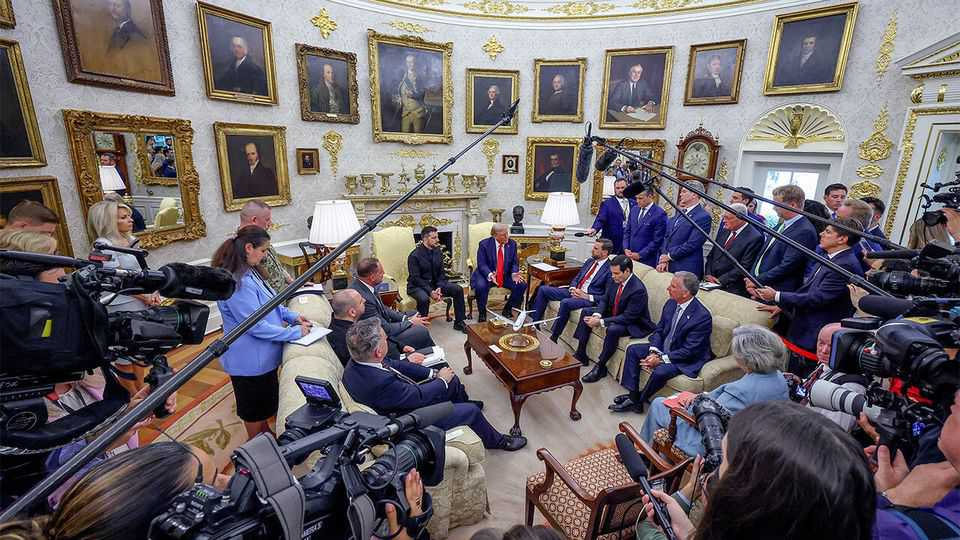
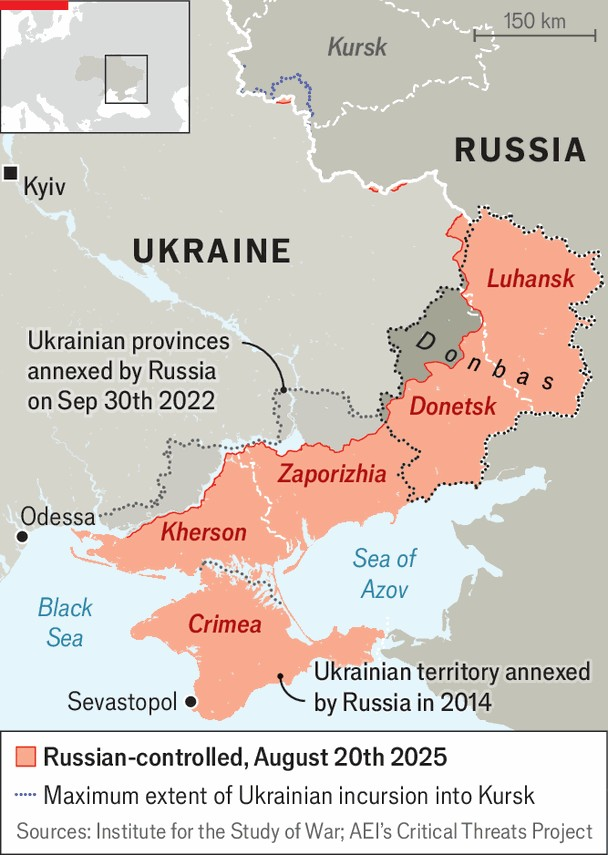

Europe | After a deal
Security “guarantees” for Ukraine are dangerously hazy
The devil is in the detail on proposals from Trump, Putin and Europe
August 21st 2025

ONE OF THE most important unresolved questions surrounding any peace deal for Ukraine is about security guarantees—how to ensure that Russia will not break its word and invade again. A nightmare scenario for Ukraine is that Russia will use peace and the lifting of sanctions to rebuild and retrain its army, and re-emerge as a more formidable force to attack Ukraine again and finish the job. On August 18th Mr Trump said that Russia had agreed to accept security guarantees, repeating a claim made days earlier by Steve Witkoff, his envoy to Russia, that “Article 5-like protection” was on the table. What would that mean in practice?

Article 5, the clause enshrining nato’s mutual defence, specifies that an attack on one member is seen as an attack on all, and that each ally will help with “such action as it deems necessary”. On August 19th Mr Trump explicitly ruled out nato membership for Ukraine, describing Ukraine’s bid as “very insulting” to Russia. Mr Trump, like Barack Obama and Joe Biden before him, is unlikely to commit to go to war against Russia to protect Ukraine.

Nor is it clear what, precisely, Mr Putin and his team told the Americans when they met in Alaska on August 15th. The details are important. In 2022, during talks with Ukraine, Russia did indeed agree that Ukraine’s partners could provide guarantees as part of a peace deal. But the Kremlin later inserted a poison-pill clause that would have allowed it to veto any activation of those guarantees. On August 20th Sergei Lavrov, Russia’s foreign minister, said that any new deal would need to be based on those proposals, with China included among the guarantors.

There are also mechanisms that fall well short of Article 5. One would be security “assurances”, rather than guarantees, like the Budapest memorandum of 1994, in which America, Britain and Russia promised to respect Ukraine’s integrity and, feebly, to “consult” if it was violated. Plainly, those did not work. In the middle, says Samuel Charap of the rand

Corporation, a think-tank, would be something like the pact America signed with Israel in 1975: a promise to take remedial action if Egypt violated a ceasefire, such as a snapback of sanctions, for example.

All of this is also tied up with the question of a “coalition of the willing”, spearheaded by Britain and France, that could deploy troops to Ukraine and planes to its skies. The coalition, which could include non-European countries like Australia, has been engaged in detailed military planning for months, with some countries considering where in Ukraine they would place their forces. One sticking-point has been whether Mr Trump would enable such a force, for instance with logistics and intelligence, and “backstop” it by promising to step in if it were to be attacked.

In recent days Mr Trump appeared to suggest that he would. On August 18th he said that Europeans would be the “first line of defence”, but America would “help them out with it”, though he gave few clues as to what that might mean. The next day he reiterated that he was willing to help, possibly with air power, “because there’s nobody [with] the kind of stuff we have…I don’t think it’s going to be a problem.” Marco Rubio, America’s secretary of state, is leading a working group to examine this, along with broader guarantees. Russia has reaffirmed that it is opposed to the idea.

At the heart of the Trumpian vision of a peace deal is a contradiction: Russia, the aggressor, would have to consent to any security guarantees given to Ukraine, a state whose legitimacy it denies. The unknowable factor is Mr Putin. If he has indeed come to the opinion that it is time to make strategic decisions to stop, he may bend. If not, the impossible issue of squaring serious security guarantees with a Russian veto will be a convenient stumbling-block.

What is also not clear is what precisely a European force would do. One aim is for it to train and develop Ukraine’s own armed forces. Another is to offer reassurance by the mere presence of foreign troops, who left in a rush in 2022. But if the force were attacked, or if Russia were to break a peace agreement and reinvade, how would the coalition respond? A formal pledge to fight Russia would amount to Article 5 by other means. A vague mandate with woolly rules of engagement could tempt Russia to test European resolve. One worry of the Biden administration was that if a European force

were embarrassed inside Ukraine, it could undercut the credibility of Article 5 on nato soil.

In practice, Ukraine, scarred by experience, will put only limited faith in outside pledges and foreign troops. Speaking in the White House, Emmanuel Macron, France’s president, acknowledged that the ultimate guarantee was Ukraine’s own armed forces. That made it all the more important, he noted, that a peace deal should include no limits on the size and capability of those forces, as Russia has also sought. Mr Zelensky cannot sign a deal that would leave his country defenceless. Mr Putin still seeks to turn Ukraine into an enfeebled vassal state cut off from its allies. ■

To stay on top of the biggest European stories, sign up to Café Europa, our weekly subscriber-only newsletter.

This article was downloaded by zlibrary from https://www.economist.com//europe/2025/08/20/security-guarantees-for-ukraine-are- dangerously-hazy