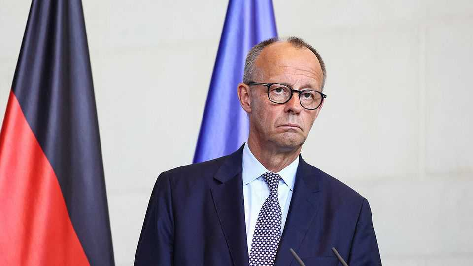
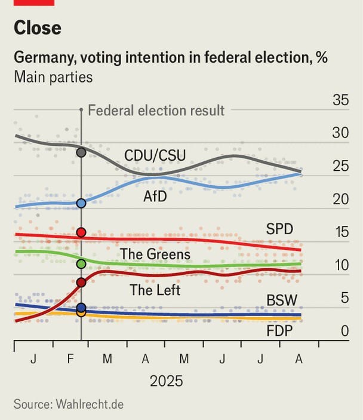

Europe | The Aussenkanzler
Friedrich Merz cuts a good figure abroad but is struggling at home
The chancellor may be Germany’s last chance to avoid a hard-right government
August 21st 2025

Friedrich Merz never enjoyed the honeymoon customary for a new head of government. When he stood for election to the chancellorship in the Bundestag on May 6th, he fell short of the required absolute majority on the first round. He got there on the second attempt, but it was a sign of things to come. His majority is wafer-thin. Worse, he cannot count on the loyalty of all the deputies in his coalition, made up of his centre-right Christian Democrats (CDU), their Bavarian sister party the Christian Social Union (CSU), and the Social Democratic Party (SPD).

Immediately after taking the oath of office Mr Merz embarked on a series of trips, first across Europe (Paris, Warsaw, Brussels and Kyiv) and then to America. His enthusiasm for travel quickly earned him the tag Aussenkanzler (foreign chancellor). He has succeeded in his ambition of establishing Germany as a leading voice in international politics, playing a prominent role in this week’s Ukraine peace talks, and seems to get on well with Donald Trump. But at home he is stumbling. After 100 days in office Mr Merz was less popular than Olaf Scholz, his unloved predecessor, had been at that point, according to a poll by ARD, a German public broadcaster. Only 32% were satisfied with Mr Merz, compared with 56% for Mr Scholz and 74% for Angela Merkel, Mr Scholz’s predecessor.

Recently, and even more worryingly, some polling suggests the hard-right Alternative for Germany (AfD) may be ahead of the CDU (see chart). And according to a survey by Insa, 68% of Germans expect that next year’s regional elections will for the first time return a state premier from the AfD. The states holding elections next year are Baden-Württemberg, Rhineland- Palatinate, Saxony-Anhalt, Berlin and Mecklenburg-Western Pomerania. It is a sign of the times that mainstream parties will consider it good news if the AfD comes first but fails to win an absolute majority in Saxony-Anhalt, and becomes the biggest party in just one or two of the five states.

What went wrong? “Merz is not an experienced politician, he acts more like a CEO,” says Holger Schmieding, chief economist of Berenberg, a bank. In foreign policy his top-down leadership works well, but at home his management style ruffles feathers. Many parliamentarians from his own party were angered after he rammed through a loosening of Germany’s balanced-budget rules before even taking office. Since then, his peremptory style has led to a number of domestic storms that have clouded his debut.

In July his troubles centred on nominations to the country’s powerful consitutional court. Mr Merz had to cancel a vote in parliament on three appointments after some of his own party’s deputies rebelled against the nomination of Frauke Brosius-Gersdorf, a law professor. Several Christian Democrats took offence at her liberal views on abortion. Mr Merz said their attacks against her amounted to a campaign of personal defamation. Ms Brosius-Gersdorf has since withdrawn her candidacy.

Then on August 8th Mr Merz decided to halt German exports to Israel of weapons that could be used in Gaza, without consulting anyone but his closest advisers. This upset both CDU and CSU lawmakers, as well as some state premiers. Markus Söder, the leader of the CSU and second-term premier of Bavaria, was particularly miffed not to have been sounded out.

To some extent Mr Merz gets a bad rap. His government has done reasonably well at implementing the four big changes he promised for his first months in office: cutting red tape, more frequent border checkpoints, a reform of Bürgergeld (Germany’s minimum income) and corporate-tax cuts. Construction permits have sped up, minimum-income reform is in the works, and companies can write off more capital investment; a lower corporate-tax rate will take effect in 2028. But the media have focused on a jump in corporate insolvencies, a rise in unemployment (though the rate is just 3.6%, low by international standards) and on a broken promise to lower electricity prices for consumers.

The stakes for Mr Merz’s chancellorship are high. He has described it as Germany’s last chance to stave off a government run by the AfD. It is early days, but so far the Aussenkanzler has not managed to seize the opportunity. ■

To stay on top of the biggest European stories, sign up to Café Europa, our weekly subscriber-only newsletter.

This article was downloaded by zlibrary from https://www.economist.com//europe/2025/08/21/friedrich-merz-cuts-a-good-figure- abroad-but-is-struggling-at-home