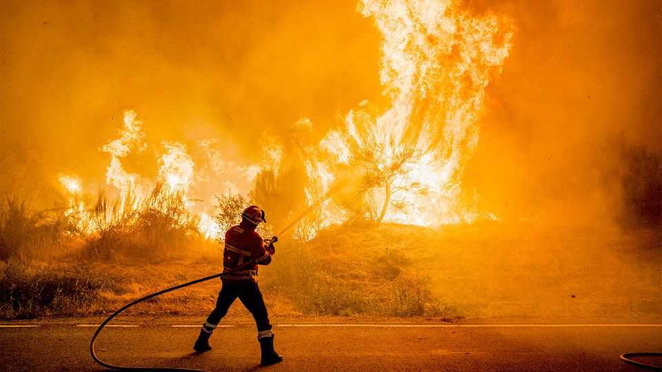

Europe | Wildfires
Europe is ablaze
New records are being set for devastation
August 21st 2025

Meteorologically, Europe is a middling sort of place. Hurricanes, monsoons and sandstorms pass it by. But in one increasingly alarming way, Europe stands out. It is warming faster than other continents. Since the mid-1990s its average temperatures have risen by 0.53°C per decade, which is more than double the global land average of 0.26°C. This summer the effects have been dramatically apparent. Heatwaves roasted northern Europe in June, and the south in August. According to the European Forest Fire Information System, wildfires in the European Union had burnt almost 10,000 square kilometres by August 19th. That compares with an average over the same period since 2006 of 2,440 sq km. Blazes have swept across swathes of the Balkans, Cyprus, France,

Greece, Portugal and Spain. Some of them have come scarily close to big cities including Madrid, Porto, Podgorica and Patras, Greece’s third-largest. At least eight people have died, probably many more. Countries that are struggling to cope have sought help a record 17 times through the EU’s civil-protection mechanism, a system for co-ordinating disaster response.

Relative to its size, Portugal has been hardest hit. Fire has consumed 2.9% of the country’s entire territory: 2,600 sq km, more than was burnt in the whole of the EU in the same period last year. Another 4,000 sq km have been ravaged in neighbouring Spain. Around 30,000 Spaniards have been forced to leave their homes. Some of the wildfires are of explosive intensity, a new trend. “There are areas where there’s no way the fires can be controlled by human means,” said Margarita Robles, Spain’s defence minister. “Only the weather will allow us to have that control.”

With temperatures dropping and rain forecast, the corner may have been turned. But plenty of questions remain as to whether central and regional governments need to do more. In Spain, total public investment in fire prevention fell by more than half between 2009 and 2022, according to a lobby group of forestry companies.

Global warming turns large parts of Europe’s countryside into kindling. But it does not apply the match. Ignition comes from either natural events, usually lightning strikes, or human intervention. The most recent study of the causes of wildfires in Europe used data from 2016. Of the blazes with known causes (more than half the total), a mere 4% were found to have started naturally. Accidents and negligence explained 39%. But the main reason, accounting for 57% of outbreaks, was that the fires were lit deliberately.

Why? In the early 2000s, Italy’s forestry police, the Corpo Forestale dello Stato (CPS), a body that has since been absorbed by the semi-militarised Carabinieri, carried out a detailed study based on data from 2001. The proportion of fires attributable to arson was 60%, almost identical to the figures in the later, EU-wide survey. The CPS found only about one in ten of the fires had been lit by pyromaniacs or others who were mentally disturbed. The most common reason was that an attempt to clear land for pasture had

got out of hand. Other wildfires were deviously lit so that the area burnt could subsequently be reclassified for construction.

Clearly there is a case for stiffening the penalties for starting fires and ensuring that land devastated by blazes cannot subsequently be used for grazing or building. It might also be worth thinking hard before ending the autonomy of specialised forces like the CPS. ■

To stay on top of the biggest European stories, sign up to Café Europa, our weekly subscriber-only newsletter.

This article was downloaded by zlibrary from [https://www.economist.com//europe/2025/08/21/europe-is-ablaze](https://www.economist.com//europe/2025/08/21/europe-is-ablaze)