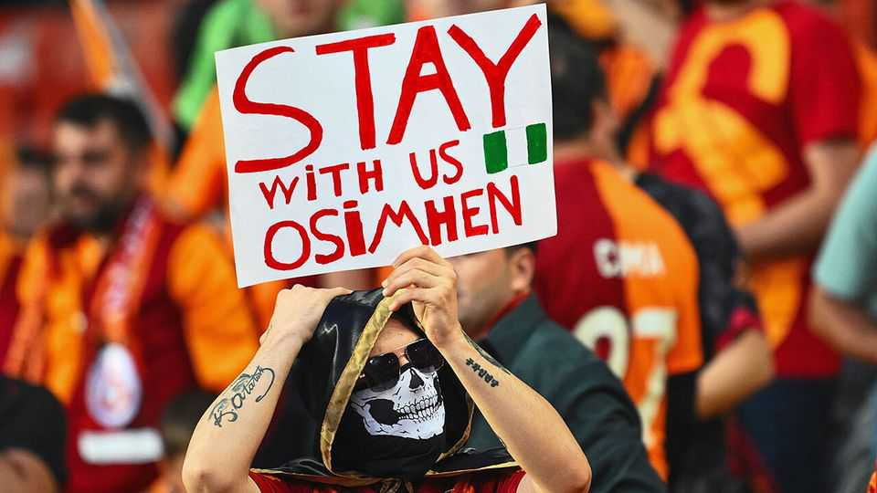

Europe | Sublime sport
Why Turkey’s football clubs can pay more cash for
talent

Paradoxically, it may have to do with the country’s troubled economy

August 21st 2025
  

  
FOUR OF THE five priciest transfers in European football this summer  
involved England’s cash-soaked Premier League. The fifth was more  
unusual. Victor Osimhen, a Nigerian striker, left Napoli, the Italian  
champions, for Galatasaray in Turkey’s Super Lig. The €75m ($87m)  
transfer fee was the biggest in Turkish history, more than triple the old  
record. Mr Osimhen will earn €15m a year after taxes, comparable to top  
players in England and Spain. Nor was it a one-off. Galatasaray and their  
crosstown rivals, Fenerbahce and Besiktas, have signed loan deals for high-  
profile players from Europe and even Saudi Arabia. Continental clubs are  
tightening belts. What is happening in Istanbul?
The Super Lig has long been popular among European players near the end  
of their careers. Turkey’s football-mad president, Recep Tayyip Erdogan, has  
lured them with a tax exemption: they pay a flat 20% rather than the normal  
progressive rates. But the average age of those signed this summer by  
Galatasaray, Fenerbahce and Besiktas is just 26.

Paradoxically, one reason the clubs can afford prime players may be linked  
to Turkey’s economic troubles. Mr Erdogan long kept interest rates low  
despite spiralling inflation, which peaked at 85%. The lira fell from ten to  
the euro in 2021 to almost 40 in 2024. But Turkey’s biggest teams bring in  
lots of euros. Analysts estimate Galatasaray earned €32m from the  
Champions League in the 2023-24 season, and that the three Istanbul sides  
collectively made €45m from Europa League matches last season. Bayern  
Munich paid Galatasaray €30m for Sacha Boey, a French defender.

The weak lira helped teams inflate away domestic debt and costs. In euro  
terms, Turkish clubs’ debts fell by 19% between 2019-23; those of European  
teams rose by 40% on average. Economic policy has since improved, and  
the clubs were left with euros to invest. Signing elite players on year-long  
loans, even on high wages paid in euros, is smart. It should help the clubs  
progress further in European competitions, which earns more euros, without  
adding long-term liabilities. If the lira falls again, they can unload expensive  
players.

But not Mr Osimhen. Galatasaray have signed him for four years. To be  
sure, they tried before they bought. They took Mr Osimhen on loan in the  
2024-25 season. He scored 26 goals in 30 matches, and Galatasaray won the  
Super Lig. ■

To stay on top of the biggest European stories, sign up to Café Europa, our  
weekly subscriber-only newsletter.

This article was downloaded by zlibrary from [https://www.economist.com//europe/2025/08/21/why-turkeys-football-clubs-can-pay-](https://www.economist.com//europe/2025/08/21/why-turkeys-football-clubs-can-pay-)
more-cash-for-talent