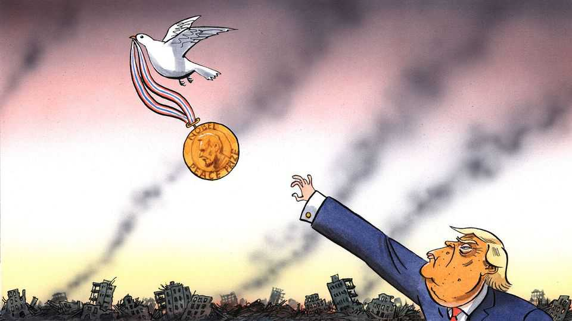

Europe | Charlemagne
Trump wants a Nobel prize. Europe can exploit
that to help Ukraine

But beware the pitfalls of photo-op peacemaking

August 21st 2025
  

  
Foreign dignitaries invited to the White House know a thoughtful gift can  
help lubricate the wheels of diplomacy. Volodymyr Zelensky, Ukraine’s  
president, went the safe route as he arrived in Washington this week,  
offering a golf club to his golf-mad host, Donald Trump. Past gifts from  
abroad have included a presidential private jet from Qatar, a posh set of  
Mont Blanc fountain pens from Angela Merkel (no match for the  
presidential Sharpie) and a portrait of one Donald J. Trump made with  
gemstones, courtesy of Vietnam. As a parade of European leaders set out for  
Washington to support Mr Zelensky, what memorable trinket from their  
home continent could they possibly bestow upon the president who has  
everything? Mr Trump, as it happens, no doubt had something in mind. For
there is one bauble from Europe he has alluded to repeatedly of late: the  
medal awarded to recipients of the Nobel peace prize. His pining for the  
acclaim granted every year by a committee appointed by the Norwegian  
parliament is turbocharging American diplomacy in a way that might both  
encourage Europe and cause it to panic.

An obvious plot offers itself to the deft diplomat: could Europe, the  
continental home of the Nobel prizes, dangle the prospect of a shiny medal  
and an Oslo banquet as a sort of carrot to lure Mr Trump onto their side  
when it comes to Ukraine? Alas, the committee that decides on the prize,  
comprised of five obscure Norwegian grandees drawn from politics and civil  
society, seems above such antics. Repeated assurances from Mr Trump that  
he is not campaigning for the gong, nor thinks he will ever get it, are taken  
as sure signs he desperately wants it. (A recent phone call to the Norwegian  
finance minister, in which the matter of the Nobel reportedly came up  
alongside threats of tariffs, is another clue.) Mr Trump wants his dealmaking  
skills to be recognised in endeavours beyond the building of gaudy  
skyscrapers, and there is no greater arena than diplomacy. The global elites  
sneer at mere moneymaking. But recognition from Oslo is worth much more  
than the medal’s weight in gold (about 200 grams, or $20,000).

The prospect of joining Teddy Roosevelt, Mother Teresa and Martin Luther  
King as a Nobel laureate (best not to mention Barack Obama) has sent Mr  
Trump into “peacemaker-in-chief” mode. In recent months he has boasted of  
spreading harmony faster than the world’s baddies can spark strife.  
Somewhat improbably he has claimed credit for ending six (or sometimes  
seven) wars in as many months. Where does the fellow find the time? At  
least in his own mind, amity now prevails between the Democratic Republic  
of Congo and Rwanda; there is nothing but fraternal love between India and  
Pakistan; the guns will forever be silent in the conflicts between Azerbaijan  
and Armenia, Iran and Israel, Thailand and Cambodia. The repentant  
warmongers, among them Binyamin Netanyahu of Israel (not so repentant  
when it comes to Gaza), have backed Mr Trump for the Nobel.

Yet to secure the gong Mr Trump knows he will have to tackle the thorniest  
war of all: Russia’s full-scale invasion of Ukraine. The president  
campaigned on a promise that peace could be brokered in just 24 hours.  
Even Hillary Clinton, once Mr Trump’s arch-nemesis, says delivering a deal
that doesn’t involve Ukraine making fresh land concessions would be  
worthy of the prize.

This presents an opportunity for Europe. The American president has at  
times seemed bored by the war in Ukraine. After a quick deal proved  
elusive, he appeared ready to dismiss the conflict as “Biden’s war” and  
move on. If the shimmering mirage of the Nobel can repurpose his  
messianic vanity towards greater engagement, so much the better. Europeans  
hope a newly invested Mr Trump will come to realise that Russia is in fact  
the obstacle to a realistic deal—and thus to Mr Trump’s white-tailed trip to  
Oslo.

There are downsides to Mr Trump’s Nobel lust. His get-peace-quick  
schemes might come at the expense of the tiresome legwork needed to stop  
the fighting for good. Mr Trump, never a man for details, will instinctively  
seek the headline of an ended war, leaving Vladimir Putin in charge of the  
fine print. But a mere photo-op in the Rose Garden won’t do for Mr  
Zelensky. Above all he needs security guarantees America would have to at  
least support, but the offer of which remains infuriatingly vague. If talks  
drag on, as no doubt they will, Mr Trump may find it easier to push Ukraine  
to accept a shoddy peace than to force Russia into a durable one.

Beyond his pining for a gold medal, Mr Trump seems to genuinely loathe  
wars (and has joked that ending them may be his way into heaven). If  
nothing else, Trump-as-peacemaker is more pleasant to deal with. European  
leaders visiting the White House received obsequious praise from the  
president, in contrast to past encounters. Will that endure after October 10th,  
once the peace prize is bestowed, inevitably to someone else? For  
Charlemagne will happily wager there are no sane Norwegians who would  
plump for Mr Trump to receive any prize, let alone one for peace. The man  
has, after all, threatened to invade countries, slashed American foreign aid  
and deployed troops in his own capital.

If it is not in European leaders’ gift to get Mr Trump the Nobel, they should  
do the next best thing: loudly proclaim they are backing Mr Trump for the  
prize, with letters of endorsement to boot, and drop hints of “Oslo having  
been spoken to”. Such nominations have zero value; well over 100,000  
worthies, including history professors at fourth-tier universities, can put
forward whomever they choose for consideration. Several hundred make the  
cut each year; even Adolf Hitler, of all people, was nominated once. But the  
gesture will go down well in Mar-a-Lago. If Europe can find a way to  
channel Mr Trump’s prize-winning delusions to its advantage, a little Nobel  
tomfoolery may be worth it. ■

Subscribers to The Economist can sign up to our Opinion newsletter, which  
brings together the best of our leaders, columns, guest essays and reader  
correspondence.

This article was downloaded by zlibrary from [https://www.economist.com//europe/2025/08/21/trump-wants-a-nobel-prize-europe-can-](https://www.economist.com//europe/2025/08/21/trump-wants-a-nobel-prize-europe-can-)
exploit-that-to-help-ukraine
Britain
 
The new geography of stolen goods  
How thieves could break into your car  
A court ruling threatens to disrupt Britain’s asylum policy  
England’s white working class falls further behind at exams  
The moral of “The Salt Path”, an embellished bestseller   
What it means when Britain talks about “Bosh”