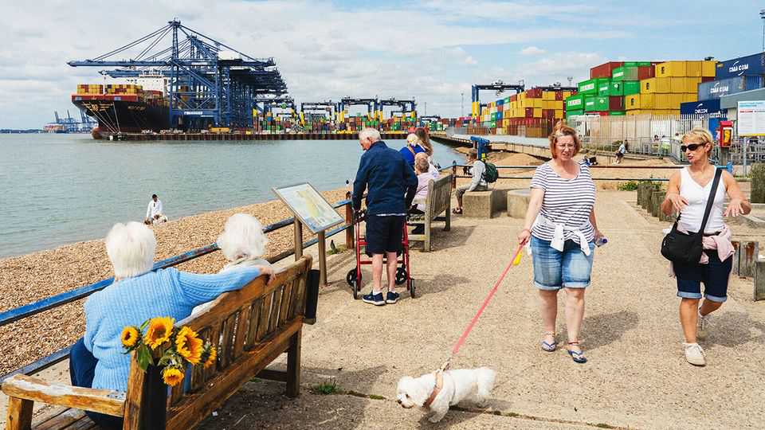

Britain | Grand Theft Global Inc
The new geography of stolen goods
Cars, phones, tractors: how high-end products are increasingly stolen to serve distant markets
August 21st 2025

THE MSC RUBY is almost ready to leave Felixstowe. Seven remote- controlled gantry cranes are still at work, stacking containers in the ship’s bays. Some 11,000 containers pass through this port each day, making it Britain’s primary conduit to the arteries of global trade. The Ruby’s next call is Gran Canaria—then, the long run down the coast of Africa. Watching the scene Adam Gibson, the lone police officer at the port, whose job is finding stolen cars, sounds rueful: “There’s no way in hell I can search even a small fraction of them. We could be standing here now and there could be three or four boxes of stolen cars just there in those stacks. They could be manifested as teddy bears.”

Without many people noticing, Britain has become a leading exporter of stolen goods. In the past decade the number of vehicles stolen in the country has risen by 75%. Most end up on container ships; the top destination is west Africa. More recently London has become known as the “phone-snatching capital of Europe”. If the victims manage to track their devices, the goods are most likely to turn up in China. British farmers are plagued by raiding gangs. Their tractors and GPS kits usually head east, to Russia or eastern Europe.

For centuries criminals have nicked valuable products and smuggled them across borders, beyond the reach of the law. Britain today shows how this model has evolved in new and alarming ways. Encrypted communications have enabled criminal gangs to operate and co-operate more freely than ever before, and establish global supply chains. As countries in Africa and Asia have become richer, demand for the products common on the streets of the rich world is growing. This combination has spawned a flourishing criminal enterprise. Call it Grand Theft Global Inc.

Britain is a “perfect place” for this business, says Elijah Glantz of RUSI, a think-tank, because of its saturated consumer market and weak export controls. There are lots of expensive cars and phones to steal, and it is easy to get them away. There is also almost no deterrent: Britain’s police solve only 5% of crimes (and 2% of vehicle thefts). In continental Europe and America such criminal enterprise is growing, too, though America has stronger scrutiny of exports because it fears fraud and tax evasion. Canada has been hit by a rash of vanishing vehicles. But for now, Britain has the dubious title of world leader.

Cars show how the model has evolved. Like other rich countries, Britain experienced a sharp drop in vehicle crime in the 1990s, thanks to immobilisers and other technology. In 2013 Britain had only 2.7 thefts for every 1,000 privately owned cars, according to RUSI. Now it is 4.4. Thefts have risen from 90,000 in 2020 to 130,000 last year. That has fed into a 45% real-terms rise in the cost of car insurance (in the EU it has risen only in line with inflation). Vehicle crime is “my number-one issue”, says Dan Tomlinson, the Labour MP for Chipping Barnet, a leafy north London suburb.

The method is typically as follows. To defeat sophisticated security systems, thieves use specialised equipment. Once in, they mask the car with fake number plates and use jammers to override GPS tracking. Then they move it, usually across county lines (collaboration between police forces is often poor), where it will be sold to a group that handles logistics. Sometimes the car is hidden in a shipment of other goods, under a false manifest. More often, the gang employs a third group to give the car a “new identity”—not only paperwork but markers including the vehicle identification number, a unique code stamped on the chassis.

This whole process—from theft to container—often takes less than a day. That is partly because Grand Theft Global is not one outfit but a sophisticated supply chain. It is also lucrative. Consider a Toyota Hilux, which when new costs around £40,000 ($54,000). The group that steals one might be paid £1,500 for a night’s work. If another gets it to west Africa, where Hiluxes are sought after, they can sell it for more than it fetches in Britain.

In his large inspection tent at Felixstowe, Mr Gibson provides a guided tour. The cars are all shiny SUVs, though most have been dented by ratchet straps (the thieves don’t mind, because that can be fixed cheaply at the other end). Shelves are piled with engines, batteries and sundry parts from cars taken to a “chop shop”, a freelance operator who will break them up without asking questions. Some are literally sawn into thirds. Gangs have also begun to target rental companies using fake documents. On the day your correspondent visits, Mr Gibson opens a container, following a tip-off. Inside is a Porsche 911 Carrera S that was rented in Germany two weeks ago: somehow it has found its way into a box in Britain, bound for Africa.

Between 2021 and 2024 almost four in ten stolen cars intercepted at Britain’s ports were heading for the Democratic Republic of Congo, according to the National Vehicle Crime Intelligence Service (NaVCIS). The DRC seems to be acting as an entry point to a wider African market. One in five was heading for the United Arab Emirates. From there gangs reach customers across the Gulf. Most thefts in Canada follow the same two routes. Buyers largely want SUVs that can handle poor roads. The elite also want sports cars, which often stick out on the streets of Kinshasa (not least,

because many are right-hand-drive). Sometimes, says Mr Gibson, thieves seem to work to an “order”.

Grand Theft Global works in a similar way for phones. Some 70,000 phones were stolen in London last year, a rise of more than a third on the year before. Britain accounts for 40% of the stolen phones in Europe. As with cars, low-level thieves sell them on to a fence (a thief might get £100-200 for one that is unlocked, or £30-60 for one that isn’t). Again, third-party services have popped up, such as shops that specialise in overcoming security features. Large batches of phones are then wrapped in tinfoil to prevent tracking, and exported, often via container ships.

Investigations have found that most end up in one place: Huaqiangbei market in Shenzhen. Demand in China for second-hand phones is huge; those that cannot be unlocked are broken apart and rebuilt. And there is no better place to do that than Huaqiangbei, the world’s largest electronics market. Because Shenzhen is where many of the phones were made in the first place, there is a ready supply of skilled workers. According to a study by Zituo Wang of the University of Southern California, the primary source of stolen phones identified in China is Britain.

British farms have been targeted since Russia’s invasion of Ukraine led to sanctions on legal trade. In 2023 the value of claims for stolen GPS kits rose by 137%.

It may be that Grand Theft Global is thriving in Britain because the country has particular vulnerabilities. Or perhaps criminals there have just been quicker to pick up on them. London is, after all, often a city where innovative methods in criminality first emerge. There is little reason to think this one will not be exported, too.

To see why, consider four factors. First is the way containerised shipping works. Around the world, border agencies overwhelmingly focus on imports, hunting for people and drugs. In many countries, exports are hardly checked at all. Anyone can book a container. The way ships are filled—tiers of “freight forwarders” buy batches of containers and sell them on—makes auditing hard. Only a tiny proportion of containers will ever be opened up, let alone X-rayed; typically only when authorities receive a tip-off. For each container Mr Gibson holds up and searches, the police must pay the port a fee of £200.

Second, the ability to covertly communicate, sell goods and transfer money online has favoured criminal groups. Until recently, even highly professional outfits found it hard to do this (case files abound with drug kingpins struggling to make themselves understood on clunky satellite phones). Now someone who wants a Porsche in Kinshasa can be linked seamlessly, via intermediaries, with someone prepared to steal one in Kent. “These groups are just doing business in a very modern way,“ says Ruggero Scaturro of the Global Initiative against Transnational Organised Crime, a think-tank. In Britain Grand Theft Global is seen as so low-risk that many drug gangs are shifting into it.

That links to the third factor: supply and demand. As cars and phones have become more sophisticated, they have become more expensive in relation to incomes. That alone has made stealing them more attractive. And most middle-class consumers in China cannot afford a new iPhone. Many Africans want better vehicles, but the used-car market remains dominant, legal dealerships scarce, and premium cars have not yet reached the economies of scale that bring costs down. These gaps will continue. As the

market for stolen goods becomes more efficient, prices will fall. Once a particular model is sold, there will be demand for parts.

Fourth, police forces largely remain in the dust. NaVCIS has enjoyed some success, intercepting 550 cars in the past year. But that is a small fraction of those getting through. Mr Gibson is one of three officers at ports in the south of the country. Britain’s police have yet to catch any high-ups in the business. European forces do not even have dedicated investigation teams. Across the rich world, resources tend to be directed towards “higher harm” offences.

In some ways the success of Grand Theft Global is a story of globalisation. It uses the infrastructure of global commerce, designed for frictionless trade. Identifying stolen goods amid so many containers is like finding “needles in haystacks”, says Tim Morris of the Association of British Ports. Globalisation created the supply chain that allows each iPhone—with nearly 3,000 components—to reach the hands of a consumer. The same forces inverted see that phone yanked out of them, re-exported and broken apart again.

Yet Grand Theft Global can also thrive in a world that is increasingly fragmented. Tariffs just make stolen goods more competitive. Sanctions, like those on Russia, boost demand for criminal activity. When countries are less co-operative, it is easier to ship goods to places where they are unlikely to be recovered.

Indeed, while Grand Theft Global hurts the rich world’s consumers, the countries benefiting from the trade have little incentive to curb it. Unlike those in Europe, authorities in China do not make it hard to sell stolen phones. The country is not part of the Central Equipment Identity Register, a global database that networks use to block stolen devices. “China really doesn’t care about this problem,” says Mr Wang. Even if African countries wanted to clamp down, says Mr Glantz, they would struggle. “Enforcement capability in Cameroon or the Congo is almost none.”

In theory sending goods halfway round the world is an added cost. But a container is paid for only when it reaches its destination. If it is intercepted, the cost is borne by the freight forwarder. Extra distance can also reduce the

willingness of insurers to pursue recovery. One officer says French police have shown her videos of stacks of stolen cars in Senegal that cannot be repatriated. Once the MSC Ruby leaves port, its contents are as good as gone. ■

For more expert analysis of the biggest stories in Britain, sign up to Blighty, our weekly subscriber-only newsletter.

This article was downloaded by zlibrary from https://www.economist.com//interactive/britain/2025/08/17/the-new-geography-of- stolen-goods