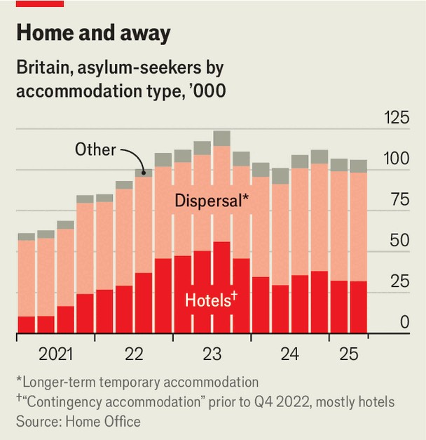

Britain | For whom the Bell tolls
A court ruling threatens to disrupt Britain’s asylum policy
What the Bell Hotel in Epping means for migrants
August 21st 2025

THE BELL HOTEL in Epping is a drab 80-bedroom coaching inn 20 miles as the crow files from Westminster. Since April it has housed up to 138 male asylum-seekers on behalf of the Home Office. Epping Forest District Council, which is controlled by the Conservative Party, contends that doing so constitutes a “material change of use” and the hotel’s owner should seek planning permission to convert it to a hostel. The owners of the hotel, on the advice of the Home Office, disagree. As there is a fine line between a hotel and a hostel it is for a court to decide, in the legalese, the “balance of convenience”.

On August 19th a High Court judge, Mr Justice Eyre, sided with Epping council. He granted an interim injunction against the hotel, which means that all asylum-seekers will have to leave by September 12th. The injunction will be in place until a final judgment, which will consider the merits of the case more thoroughly, is heard in the autumn. The decision in Epping, a sleepy town of 12,000, will have ripple effects on law, government policy and politics.

The case is not the first of its kind to be heard. The Home Office’s use of hotels for asylum-seekers over the past three years has irked plenty of local planning authorities. In May 2023 the High Court granted an injunction to Great Yarmouth Borough Council in Norfolk against a seafront hotel. Requests for other injunctions in Fenland, Stoke-on-Trent and Ipswich—all in 2022—were dismissed. Although Mr Eyre said that there is “simply no general rule” to apply to these cases, the Epping case will give like-minded councils hope.

Andrew Fraser-Urquhart, a barrister at Francis Taylor Building, says the judge cited several factors that are “pretty readily transferable to other situations”. First, that owners were forewarned by the council in 2020 that housing asylum-seekers constituted, in their view, a change of use. Second, that the judge said the owner’s decision not to seek planning permission “side-stepped the public scrutiny and explanation which would otherwise have taken place”. Finally, the judge thought the underlying merits of the case were strong.

The hotel could now seek planning permission, yet the council’s position is abundantly clear: Chris Whitbread, its leader, has called the hotel’s usage for asylum-seekers “totally unsuitable”. That is, in part, because on July 8th a 41-year-old Ethiopian resident of the hotel was arrested after he allegedly tried to kiss a 14-year-old girl on the high street (he denies this). Protesters —some of whom were violent—amassed outside the hotel for a number of weeks. The council’s strand of argument that housing asylum-seekers “poses a clear risk of further escalating community tensions” was dismissed by the judge.

Nevertheless, the case has given encouragement to Nigel Farage, the leader of Reform UK, who has championed the protesters’ cause. Writing in the

Telegraph, Mr Farage said that “Epping has shown the way to win.” Reform says it will now seek similar legal action against hotels across the ten councils that it controls. Chris Philp, the Conservative shadow home secretary, has said he would welcome other councils doing the same.

For its part, the Labour government has pledged to end the use of hotels for asylum-seekers, but only by 2029. Of the 107,000 asylum-seekers being housed by the government at the end of March, 32,000 were staying in hotels. As well as being political dynamite, there is a robust fiscal case for ending their use: hotels housed 35% of asylum-seekers but accounted for 76% of accommodation costs. In July there were 210 hotels in use, just three fewer than a year ago.

While the government tries to work out where to house the stock of asylum- seekers already in the country, it also has a problem with the flow. Small- boat migrants, the most visible source of new claimants, have increased by 50% over the past year to 45,000 and are soon likely to reach an all-time annual high. Labour has spent much of its first year promising to fix the “broken planning system”; now the planning system, via the courts, has bitten back where the government least expected. ■

This article was downloaded by zlibrary from https://www.economist.com//britain/2025/08/20/a-court-ruling-threatens-to-disrupt- britains-asylum-policy

