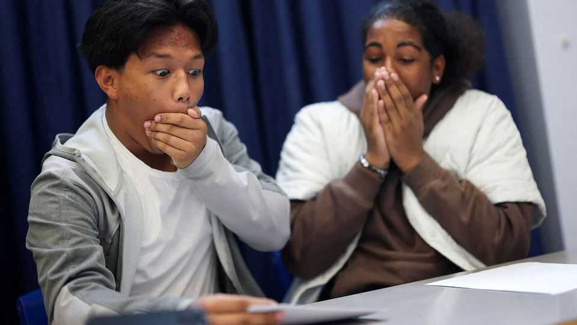
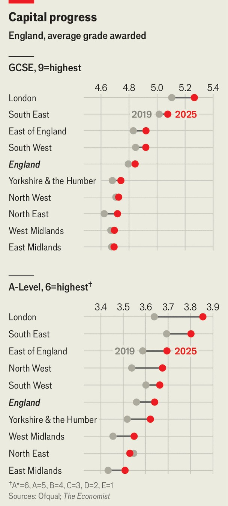

Britain | Flunking it
England’s white working class falls further behind
at exams

Blame rising absenteeism

August 21st 2025
  

  
For teenagers, August is make-or break time. On August 21st, 700,000 16-  
year-olds in England received their GCSE exam marks, joining the 300,000  
18-year-olds who got their A-level grades a week earlier. The results show  
that the gap in attainment between pupils in London and the rest of the  
country continued to widen. In 2019 the average GCSE grade in the capital  
was 6% above the English average. It has now stretched to 10% (see chart).  
The same trend is true for A-levels.
Bridget Phillipson, the education secretary, frets about the “lack of progress  
for children from white working-class backgrounds”. Detailed data for this  
year have still to come, but the attainment gap at 16 between white children  
in England on free school meals (ie, from low-income families) and all  
others rose by four percentage points in the five years from 2018-19.

The government wants to narrow that gap. Other poor children on free  
school meals have not fallen behind in recent years. At 16 ethnic Chinese  
children who are also disadvantaged are 39 months ahead of their white  
British peers in England.

Turning up for class would help. Fully 23% of white British children were  
persistently absent last year, compared with 4% for ethnic Chinese. The  
Education Policy Institute, a think-tank, finds that the rising attainment gap  
since 2019 among disadvantaged children can be entirely explained by  
increased absenteeism. ■

For more expert analysis of the biggest stories in Britain, sign up to Blighty,  
our weekly subscriber-only newsletter.

This article was downloaded by zlibrary from [https://www.economist.com//britain/2025/08/21/englands-white-working-class-falls-](https://www.economist.com//britain/2025/08/21/englands-white-working-class-falls-)
further-behind-at-exams

