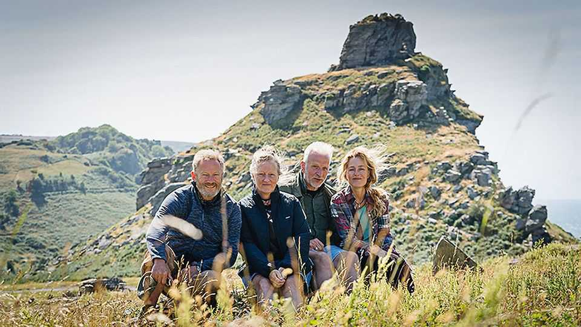

Britain | The poor me’s lament
The moral of “The Salt Path”, an embellished
bestseller 

The truth will catch up with you, but will readers want to hear it?

August 21st 2025
  

  
IF LIFE is a spin on fortune’s wheel, Raynor Winn always seems to lose. In  
her bestselling 2018 memoir “The Salt Path”, Ms Winn recounts a journey  
she and her husband, Moth—recently homeless and reeling from his  
diagnosis with a terminal illness—made around Britain’s rugged south-west  
coastline. In May her “unflinchingly honest, inspiring and life-affirming true  
story” became a box-office hit, starring Gillian Anderson and Jason Isaacs.  
And then some pesky journalists pointed out that many details, big and  
small, seem to have been invented or exaggerated. Alas, poor Ms Winn has  
since had “vitriol poured on me from all quarters”.
What explains the book’s success? And what is the moral of its unravelling?  
To explore, your correspondent set off, copy in hand, to retrace the first  
30km of the walk, from Minehead to Lynmouth.

The journey begins with a climb out of Minehead. It is “excruciatingly  
steep”, says Ms Winn, leaving her with a “huge blister two inches across”,  
which soon halts progress. There are many grassy spots but, inexplicably,  
the duo decide to pitch their tent on heather (like “lying in the fork drawer”).  
Ms Winn’s thin sleeping bag is “bone-aching cold”. Moth’s pills mean he  
doesn’t want to have sex. He snores.

The adjective most often applied to “The Salt Path” is “uplifting”. Yet what  
strikes the reader most is constant grumbling, which surely accounts for part  
of the book’s success. In “The Wild Places”, Robert Macfarlane, perhaps  
Britain’s finest nature writer, happily nestles down in his bivouac with some  
cheese and rye bread for dinner; a few sonnets are enough to keep him  
warm. The book sold around 100,000 copies. Ms Winn’s moan-fest sold 2m  
and was translated into 25 languages. Its message: you too could be  
redeemed by nature, even if you find it annoying.

Ms Winn finds everything annoying. After making it down to Bossington—a  
pretty descent that Ms Winn spends mulling whether she dislikes uphills or  
downhills more—the couple stop for a cream tea they can’t afford. Here they  
admit to a family that they are homeless, whereupon “the man reached out  
and pulled his child towards him and the wife winced and looked away”. Ms  
Winn finds such pathos in this scene that she repeats it twice later, almost  
word for word. Elsewhere, complete strangers call the couple “disgusting”.

Really? The Observer alleges that Ms Winn lied about the cause of her and  
Moth’s financial woes (she actually stole £64,000 from a former employer),  
their homelessness (the couple own a house in France) and the severity of  
Moth’s illness (he has none of the usual symptoms of corticobasal  
degeneration, or CBS). Ms Winn has rebutted these claims, unconvincingly.  
And more fabrications have emerged.

A few miles on, in Porlock, locals have mixed views. “It’s all a load of old  
nonsense isn’t it,” says Lesley Thompson, buying her morning paper in  
SPAR. Her main gripe is that a scene in the film featuring a local beach has
led to streams of confused tourists looking for a path that does not exist.  
Paul McGee, the owner of the Lorna Doone Hotel, is more chipper, crediting  
Ms Winn with a slight uptick in business. Next year he expects a surge,  
when Ms Anderson’s fans stream over from America.

One question raised by the scandal is whether publishers should be more  
sceptical. On the hill out of Porlock, the Winns encounter a blind man  
practising yoga, who catches them up at a picturesque church. “We’re just  
walking the path,” they tell him. “You are, and you’ll travel many miles,” he  
replies. “You’ll see many things, amazing things, and suffer many setbacks,”  
he continues, before laying his hand on Moth’s. “But you will overcome  
them, you’ll survive, and it will make you strong.”

Perhaps one far-fetched scene could be overlooked (“I’ve been in that  
church many times and I’ve never been spoken to by any blind man,” says  
Tony Richards, the churchwarden). But most of the reported speech in the  
book sounds like a Hollywood script rather than real life. Industry figures  
have noted that many publishers have no fact-checkers. A book billed as a  
“true story” is subject to far less scrutiny than this article.

In 2003 James Frey published “A Million Little Pieces”, a memoir about his  
life as an addict caught up in crime. When it was exposed as a fake, readers  
successfully sued the publisher for compensation. But the book remained in  
print, marketed as a novel, with an apologetic note from Mr Frey, claiming  
his mistake was “to write about the person I created in my mind”.

Ms Winn insists her book is true and says she “can’t allow any more doubt  
to be cast on the validity of those memories”. But it will be, in part because  
the scandal itself is such a good story. “The Salt Path” is a morality play in  
which the protagonists—homeless, dying, poor—endure a callous world,  
indifferent to their suffering. Not only does that tale now appear fabricated,  
it has caused suffering of its own, including to CBS patients who took false  
hope from Moth’s recovery.

What, then, is the moral of this story? It could be, as Ms Winn would put it,  
the power of keeping going. The journey has brought her riches, though it  
seems unlikely she will be counting her good fortune. Perhaps it is that the  
truth will always catch up with you. Yet Ms Winn’s book will remain in
print; while some readers are angry, others seem not to mind. “I’ve heard all  
that stuff and I don’t care,” says a woman inspired to walk the trail, a few  
miles before Lynmouth. “It’s about the theory.” ■

For more on the latest books, films, TV shows, albums and  
controversies, sign up to Plot Twist, our weekly subscriber-only newsletter

This article was downloaded by zlibrary from [https://www.economist.com//britain/2025/08/16/the-moral-of-the-salt-path-an-](https://www.economist.com//britain/2025/08/16/the-moral-of-the-salt-path-an-)
embellished-bestseller