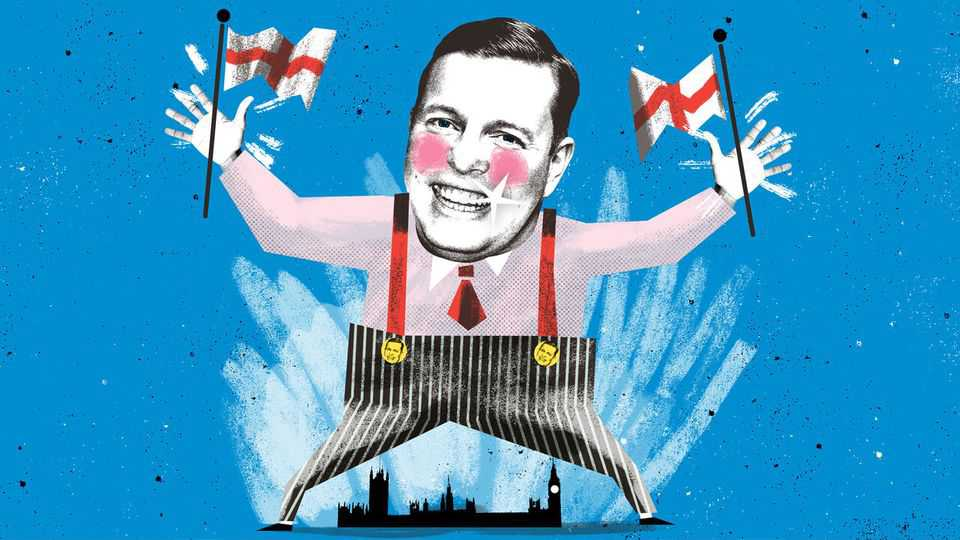

Britain | Bagehot
What it means when Britain talks about “Bosh”
A desperate political class is out of ideas 

August 21st 2025
  

  
Tom Skinner is a typical reality-television star. The market trader from  
Romford found fame in the British version of “The Apprentice”, ending  
every other sentence with the word “bosh”. From there, Mr Skinner  
cemented a niche celebrity by posting motivational messages on Instagram  
while eating odd breakfasts (such as lasagne and baked beans) and through  
appearances on daytime television, where he would cheerily debate any  
topic (“Pub Bosses Fear They May Have To Hire ‘Banter Bouncers’”). This  
month he reached the pinnacle of any self-made celebrity: a slot on “Strictly  
Come Dancing”.

Mr Skinner has carved a less likely role in politics. Right-wing thinkers  
invited him to a seminar, “Now and England”, at the Roger Scruton Legacy
Foundation where Boshman declared: “England is the absolute guv’nor”. He  
admitted he was thinking of “giving it a go in politics”. Dominic Cummings,  
the brains behind the Brexit campaign and Boris Johnson’s 2019 general-  
election victory, offered to help him run for mayor of London. When J.D.  
Vance, America’s vice-president, visited Britain this summer, doyens of the  
British right recommended that Mr Skinner should be on his itinerary.  
“When the vice-president of the USA invites ya for a BBQ an’ beers, you  
say yes,” said Mr Skinner. “Bosh.”

How does a mattress salesman from Romford bag a meeting with the man  
who is a choked Big Mac away from being the most powerful on Earth? To  
his fans, Mr Skinner is an amusing presence in their smartphone; to  
Westminster, he is a guide to a country politicians struggle to understand.  
Partly it is what he symbolises. Mr Skinner makes class less complicated. He  
is a wheeler-dealer. When not on telly or on TikTok eating an entire  
Christmas dinner for breakfast, he buys things at one price and then sells  
them for slightly more. It is a simple, tangible living. What can politicians  
offer downwardly mobile workers, whose precarious job prospects are being  
annihilated by artificial intelligence? Good question. And one that  
politicians can avoid if Mr Skinner acts as a cipher for the entire working  
class.

If class confuses Westminster, so does gender. Politicians cannot decide  
whether young men are incorrigibly woke or dangerous, porn-addicted  
misogynists. Pollsters, in general, have no idea what they think. Only the  
crudest caricatures survive, which Mr Skinner happily plays up to. What do  
men like? Football? Saying bosh? Saying bosh at the football? Reform UK  
has launched a football shirt for £39.99 ($54). Mr Skinner, a West Ham fan,  
was an early guest on “Talking Pints”, Nigel Farage’s show on GB News,  
which helped keep the Reform leader front of mind while ostensibly taking a  
break from politics. “Talk to us about the word ‘Bosh’,” suggested Mr  
Farage.

Perhaps the time of the celebrity politician has arrived. After all, politics is  
an attention game, and those in Westminster are losing it. Mr Farage is the  
biggest British politician on TikTok, with 1.3m followers. That is just over  
half as many as The Famileigh, a suburban family who do silly dances. It is  
easier to teach an internet poster about politics than it is for a politician to
become a successful poster. Cannier politicians know that traditional media  
have already sunk. In their desperation they cling to whatever digital flotsam  
they can grab, even if it is a white-van man who eats spicy Korean noodles  
for breakfast on Instagram.

So far, no one in British politics has come close to harnessing the full power  
of social media, three decades after their invention. Marshall McLuhan, the  
media theorist who said “the medium is the message”, argued that people  
cannot comprehend their current media environment, even though it shapes  
everything about them. Instead people “look at the present through a rear-  
view mirror”, meaning they “march backwards into the future”. Nowhere is  
this more true than Westminster. In July Sir Keir Starmer hired a former  
editor of the Sun, a once-mighty tabloid, to gee up the government’s comms.  
By contrast, Mr Skinner is a prophet for the present. Dyslexic, he happily  
admits he uses ChatGPT to turn garbled Essex prose into synthetic poetry, in  
order to convert internet fame into political power. McLuhan would have  
loved it.

There is, in general, a dearth of charisma in British politics. Kemi Badenoch,  
the Conservative Party leader, is not charismatic but she is captivating, like a  
motorway pile-up. Sir Keir has never pretended to be exciting. Promise  
made, promise delivered. And so the politicians turn to Mr Skinner, in the  
same way pilgrims head to Rome to rub St Peter’s foot. Downing Street  
sought Mr Skinner’s views on apprenticeships. Robert Jenrick, the shadow  
justice secretary, filmed a short video with Mr Skinner calling for a  
crackdown on tool theft. “Bosh?” squeaked Mr Jenrick. “AHHH, BOSH,”  
roared Mr Skinner in reply, blessing the wannabe Tory leader with the spirit  
of Bosh.

Mr Skinner is the latest beneficiary of Westminster’s habit of monomania. It  
can focus on only one type of voter at a time. At the moment, Mr Skinner is  
treated as Albion incarnate, as if he is John Bull with an Insta. Yet he is not  
even the only man from Romford famous online for saying “Bosh”. Big  
John, a cheese wholesaler, has found a similar level of fame by ordering  
large Chinese meals, signing off with “bosh”. While Mr Skinner rails against  
the “woke brigade” and says “London has fallen”, Big John offers a more  
optimistic message. Bosh Britain contains multitudes.
Westminster knows something new is needed, although it does not know  
quite what. Every party’s polling is only a small swing from catastrophe.  
Everyone is looking for someone or something to save them. Mr Skinner’s  
rise in Westminster is a symptom of desperation more than anything else. If  
Bosh is the answer, what exactly was the question?■

For more expert analysis of the biggest stories in Britain, sign up to Blighty,  
our weekly subscriber-only newsletter.

Correction (August 21st): An earlier version of this article described Robert  
Jenrick as the shadow home secretary.

This article was downloaded by zlibrary from [https://www.economist.com//britain/2025/08/20/what-it-means-when-britain-talks-](https://www.economist.com//britain/2025/08/20/what-it-means-when-britain-talks-)
about-bosh
International
 
A burning threat to pregnant women  
Was globalisation ever a meritocracy?