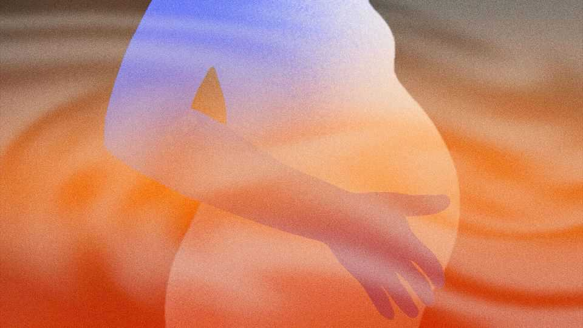
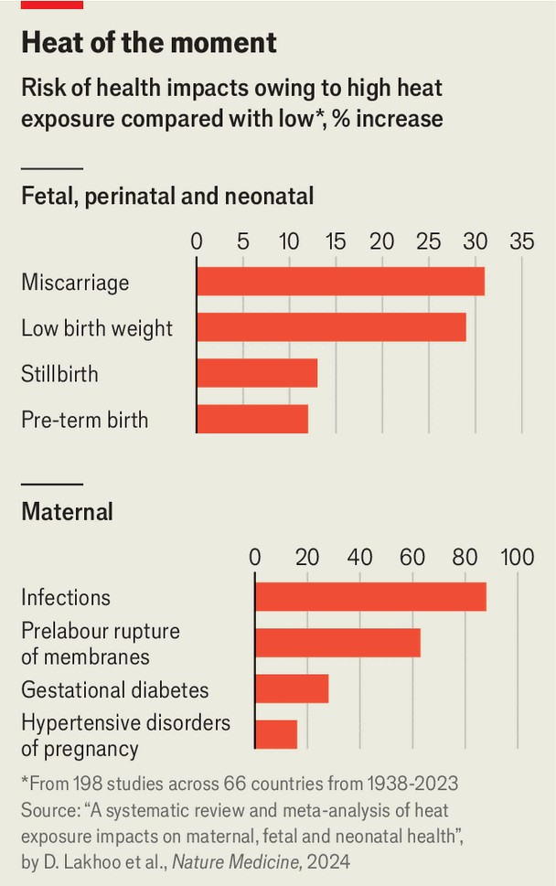

International | What to expect when you’re expecting
A burning threat to pregnant women
Alarming new research on the link between heat and dangerous  
pregnancies

August 21st 2025
  

  
FROM THE examination table, Sagobai chats as her doctor moves the  
ultrasound wand across the dome of her belly. Aged 20, she is pregnant for  
the third time. She feels fine now, she says, but in recent months—during a  
prolonged heatwave in Pakistan’s Sindh with temperatures reaching 49°C  
(120°F)—she had often felt dizzy and dehydrated. The heat is more intense  
than it used to be, and she worries that it might be bad for both her and the  
baby.

A research team, led by Dr Jai Das at the Aga Khan University in Karachi, is  
investigating that question, too. Each year more than 4.5m women and  
babies around the world die during pregnancy, childbirth or in the weeks
following—about one death every seven seconds. Hundreds of thousands of  
these, and increasingly more, are affected by heat. Sagobai is one of 400  
women taking part in the world’s largest study trying to understand why.  
Nearly 6,000 other pregnant women will join her.

The task is formidable. Each woman is recruited before her 13th week of  
pregnancy (well before many would normally disclose it). They must submit  
to repeated tests, lengthy ultrasounds and wear a device logging temperature  
and humidity 24/7. Some will have a sample of placenta collected within 30  
minutes of giving birth. All this is taking place in remote Pakistan, often  
without phones or reliable internet.

Yet the researchers believe their painstaking effort is worthwhile. Their  
findings will help explain why a warmer climate is having a devastating  
impact on some pregnant women and their babies—a trend that is now  
apparent in every country in the world, and is projected to get worse in all of  
them. The world had been reducing the numbers of mothers dying in  
childbirth, deaths of newborns and stillbirths, but progress has slowed in the  
past decade. There is “no doubt” that higher temperatures are now cancelling  
out some of the improvements that should have been made in maternal  
health, says Dr Ana Bonell of the London School of Hygiene and Tropical  
Medicine (LSHTM).

It has long been clear that climate change—which is pushing up  
temperatures and making extreme-weather events more frequent and severe  
—is bad for health. Humans must maintain a stable temperature to function  
properly. The hotter it gets, the harder the body must work to cool itself  
down, which puts undue strain on even healthy individuals and can fatally  
exacerbate chronic conditions.

Pregnancy comes with physiological changes that can make a woman and  
her unborn baby especially vulnerable to rising temperatures. A pregnant  
woman’s metabolism speeds up to support a growing fetus, producing  
excess heat for her body to dissipate. Blood volume increases by up to 50%,  
adding to the heart’s workload. Dehydration and malnutrition set in more  
easily and pose greater risks to both mother and child. And a woman’s  
immune system is altered, making her more susceptible to some infections.
Likewise, newborn babies struggle to regulate their body temperature and  
fight off disease.

Despite these obvious problems, the connection between global warming  
and dangerous pregnancies was established only fairly recently. The first  
large-scale study, published in 2010, analysed almost 60,000 summertime  
births in California over eight years, and found that the number of births  
before 37 weeks of pregnancy increased as temperatures rose. Complications  
arising from such “pre-term” births are thought to cause 40% of all deaths in  
babies less than a month old.

The relationship between heat and pre-term births has since been backed up  
by data from all around the world. A 2024 meta-analysis of 198 studies  
across 66 countries found that the odds of pre-term birth increase by about  
4% for every 1°C rise in the average temperature that women are exposed to  
in the month before giving birth, and more over longer periods. Heatwaves,  
defined as two or more days of unusually high temperatures for that  
particular location, increase the likelihood of pre-term birth by more than a  
quarter. Because a disproportionate number of these studies were done in  
rich, temperate countries, the true impact could be much larger.

Strong links have also been found between hotter weather and stillbirths, as  
well as with gestational diabetes and hypertensive disorders in expectant  
mothers (both of which can be life-threatening if untreated). Low birth  
weight and certain birth defects seem to rise also, though the evidence is less  
certain.

All this exacerbates existing inequalities. The study in California, for  
instance, found that the risk of pre-term birth increased more than twice as  
much among black mothers than white ones for the same rise in temperature.  
In countries such as The Gambia, where health-care services are patchy and  
women can do less to avoid high temperatures, the risks are greater still.  
Women there make up at least half of the agricultural workforce. Research  
on pregnant women working in the fields, conducted by Dr Bonell, found  
that they were exposed to dangerous heat on most days, and that in a third of  
tests their fetuses showed signs of distress.
Rising temperatures are already having catastrophic consequences for some  
expectant mothers in many countries. In Africa, climate change is estimated  
to have doubled the number of deaths in children under five by 2009  
(compared with the level that would be expected without global warming). It  
is projected to double the number again by 2049. Similarly large effects are  
being observed elsewhere. In 2022 scientists estimated that heatwaves  
caused an average of 13,262 pre-term births each year in China between  
2010 and 2020. About a quarter were attributable to climate change. Other  
researchers reckon that in the two decades after 2001, about 47,000 heat-  
related neonatal deaths in India, and 31,700 in Nigeria, were caused by the  
changing climate.

These effects are likely to become more severe as temperatures rise. Recent  
modelling done by LSHTM projected changes to pre-term births and  
childhood mortality in South Africa and Kenya. On the world’s current  
emissions trajectory, child mortality would rise by 20% in South Africa  
between 2040 and 2060, and pre-term births would increase by more than  
half in both countries. Even if the world reached net zero by 2050, child  
mortality would fall less quickly than it should; pre-term births would rise  
by at least a fifth.

More pre-term births will be costly to both individuals and the wider  
economy. As well as drastically increasing the odds of neonatal death,  
babies born too early are far more likely to suffer from a whole host of  
problems throughout their lives, including cardiovascular disease,  
respiratory issues and developmental disorders. The UN’s World Health  
Organisation (WHO) lists pre-term birth as a leading cause of lost human  
capital worldwide at all ages. By one estimate, when medical fees are  
combined with productivity losses, each case in America has a lifetime cost  
to the economy of $64,815. Heat-related pre-term births in China cost the  
country more than $1bn a year, a figure almost certain to rise.

If the consequences of climate change on the health of new mothers and  
babies are now clear, the reasons for them are not. “We know the two  
extremes, the exposure and the outcome,” Dr Das explains. “The in-between  
pieces are all missing.” By closely monitoring the health of thousands of  
women and their fetuses, and the exact conditions they are exposed to  
throughout their pregnancies, his team is trying to make sense of it all. His  
study is supported by the Wellcome Trust, a British charity and one of the  
world’s largest funders of medical research. The trust has awarded £17m  
($23m) to nine projects around the world that investigate mothers’ and  
babies’ “biological vulnerability” to extreme heat.

The hope is that more research will reveal the physical processes whereby  
heat affects pregnancy outcomes, such as by altering blood flow to the  
placenta, triggering hormonal changes or disrupting how fetal cells express  
certain genes (all as-yet-unproven hypotheses). That, in turn, will give  
doctors a better idea of what to watch out for, and allow them to begin  
developing medical treatments. But all that will take years, points out  
Professor Debra Jackson, also of LSHTM. In the meantime, she argues,  
simply knowing that high temperatures heighten pregnancy risks is enough  
to start trying to mitigate them.

Mitigation is the goal of several current studies. One of them, also led by Dr  
Das, tests the impact of cheap interventions in Pakistani homes, like adding  
canvas-shading to roofs or painting walls a reflective colour. High Horizons,  
a research consortium backed by British and European public money, runs  
several projects. These include an app offering tailored advice to pregnant  
women that is being trialled in Sweden, South Africa and Zimbabwe. The
backers, Professor Jackson notes, know that the dangers now facing African  
and South Asian countries will soon become increasingly relevant to their  
own.

Such thinking has yet to really move beyond academic circles. Practically no  
countries mention maternal health in the climate-adaptation plans they  
submit to the UN. Only a fraction of the “heat-health action plans” that the  
WHO asks governments to put together do so. Fewer have systems to track  
the relevant data. In America, legislation to fund research into the effects of  
global warming on pregnancy was first proposed almost five years ago, but  
it has since gone nowhere.

That will change, says Professor Jackson. Some professional associations,  
like Britain’s Royal College of Obstetricians and Gynaecologists or the  
International Confederation of Midwives, have begun showing an interest in  
the ways that global warming may affect their work, and asking  
governments to do more. Several UN agencies will soon release official  
guidance on indicators governments need to monitor to design interventions.  
But to make real progress, the world will need a big push. ■

This article was downloaded by zlibrary from [https://www.economist.com//international/2025/08/21/a-burning-threat-to-pregnant-](https://www.economist.com//international/2025/08/21/a-burning-threat-to-pregnant-)
women