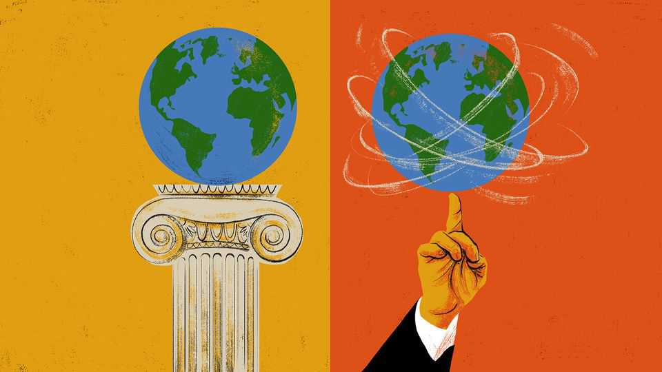

International | The Telegram
Was globalisation ever a meritocracy?
The Trumpian assault on globalism, as seen from Singapore

August 21st 2025
  

  
WHEN a schoolyard is taken over by bullies, what are model pupils to do?  
Something like that quandary is now playing out in the global economy.  
Since returning to power in January, President Donald Trump has treated  
trade partners with the swaggering cruelty of a sixth-form tyrant. This marks  
a change from his first presidency, when American officials acted as harsh  
disciplinarians. Back then, Trump aides called countries cheats for running  
trade surpluses with America. They demanded structural reforms from  
countries like China, accused of stealing American jobs and technologies by  
abusing world trade rules.

In the second age of Trump, rules are out and the boss’s whim is in. No  
country has been spared tariffs, even those that run trade balances in
America’s favour. This arm-twisting era is ghastly for many governments. It  
is painful in a special way for high-achieving countries that top league tables  
for competitiveness or ease of doing business. For such star pupils, late-  
20th-century globalisation felt like a form of meritocracy. Hard work and  
wise planning could give an ambitious nation a chance to find its niche in  
the global economy, transforming its fortunes. Now, over-achieving  
governments are realising that the old economic order has gone. In its place,  
they fear a fragmented and inefficient world economy, in which investments  
and supply chains are guided by politically motivated tariffs and geopolitical  
rivalries, or Trumpian caprice.

Some of the clearest thinking about this swot’s predicament can be heard in  
Singapore, a paternalist city-state that has risen from poverty to great wealth  
with the help of hard work, diligence and lots of rules about civilised  
behaviour—like a giant prep school with its own army and airport. The  
Telegram recently travelled there to meet government officials as they  
celebrated their republic’s 60th birthday in a very Singapore-ish way, with  
policy conferences and leaders’ speeches about the global order.

Singaporean elites sound anxious and disappointed. Their country set out to  
be the meritocrats’ meritocracy. Over six decades Singapore drained swamps  
and cleared slums to create a squeaky-clean, multicultural showcase of  
skyscrapers and social-housing towers, container ports and high-tech  
industrial parks, governed by graduates from the finest universities on earth.  
When older industries declined, Singapore “upskilled”, investing in such  
sectors as biomedicine and advanced gas-turbine maintenance. Those  
thrived alongside large financial and services firms.

During the first Trump presidency, Singapore’s elites feared historical forces  
beyond their control as tensions between their two most important partners,  
America and China, threatened to divide the world into ideological and  
economic blocs. Today Singapore’s technocrats sense that, in Mr Trump’s  
second presidency, the risks of the world economy splitting in two are  
abating. Instead of grand geopolitical divisions they find themselves  
worrying about small, even squalid factors affecting business decisions.

America’s president seems bent on undermining merit as a driver of  
investments, and replacing it with cronyism. In his version of globalisation,
countries can buy favour with showy offers to spend billions on factories in  
Trump-voting states. Other governments have offered murky cryptocurrency  
deals to members of the president’s family and inner circle. In South-East  
Asia, Singapore’s backyard, countries that could co-operate to promote  
regional trade are instead vying to attract trade diverted from neighbours  
facing higher American tariffs.

Singapore’s prime minister, Lawrence Wong, warned citizens to brace for  
turbulence at a national-day rally on August 17th. “For decades, Singapore  
benefited from an American-led rules-based global order. It was not perfect.  
But it brought peace and stability to the world. And because the rules  
applied to all, even a small city-state like ours could compete fairly,” he  
declared. Today, America is pulling back and weakening multilateral  
systems, undermining old rules and norms and encouraging more countries  
to chase “narrow, immediate gains over shared progress”, he added.

In late July the deputy prime minister and trade minister, Gan Kim Yong,  
addressed a policy conference in Singapore straight after returning from a  
visit to Washington. American officials were “non-committal” when asked if  
Singapore’s baseline tariff of 10% might rise in the future, Mr Gan told the  
audience of business people, technocrats, scholars and students. He admitted  
to “significant uncertainty” about sector-specific tariffs that America is  
preparing to impose on semiconductors and pharmaceuticals, which are big  
business in Singapore. Nor could Mr Gan offer clarity about the investments  
that Japan, the European Union and others have offered to make in America,  
and whether those funds might be “diverted” from planned investments into  
Singapore.

Singapore is not ready to give up on globalisation. The law of comparative  
advantage is “extremely difficult to dislodge”, a former central bank chief,  
Ravi Menon, told the same conference. “Like water in nature, trade finds a  
way,” he said. Mr Menon blamed much of the current backlash against  
globalisation on other governments that had failed to retrain their workforces  
and to spread the benefits of prosperity widely across their societies. By  
contrast Singapore was called an example of good governance, along with  
such countries as Switzerland and Denmark. Some say Singapore is boring,  
said the prime minister, Mr Wong. “But at the same time we are stable, we
are predictable.” Being trusted is an asset “others would die to have”, he  
added.

Singapore does not want to alter its ways. Alas, the schoolyard offers a last  
lesson. If bullies are rarely loved, the same often holds for model pupils.  
Only a broad coalition of countries can save globalisation from Mr Trump.  
Elite over-achievers alone cannot. ■

Subscribers to The Economist can sign up to our Opinion newsletter, which  
brings together the best of our leaders, columns, guest essays and reader  
correspondence.

This article was downloaded by zlibrary from [https://www.economist.com//international/2025/08/19/was-globalisation-ever-a-](https://www.economist.com//international/2025/08/19/was-globalisation-ever-a-)
meritocracy
Business
 
To survive, Intel must break itself apart  
How AI-powered hackers are stealing billions  
China’s hottest new look: the facekini  
China is quietly upstaging America with its open models  
Big chocolate has a growing taste for lab-grown cocoa  
The last days of brainstorming  
American tech’s split personalities