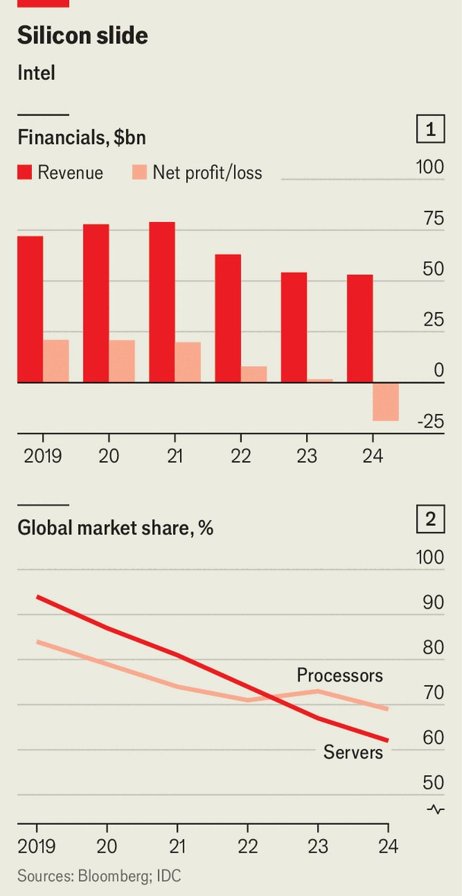

Business | Chipmaking in America
To survive, Intel must break itself apart
And it should do so before it is too late

August 21st 2025
Intel once set the pace of technological progress. Gordon Moore, one of its  
founders, predicted in 1965 that chips would get faster and cheaper with  
metronomic consistency. Over the decades Intel brought Moore’s Law to  
life, designing and building the processors that powered servers and, later,  
personal computers. Today it makes headlines for its turmoil more than its  
technology. On August 7th President Donald Trump demanded the  
resignation of Lip-Bu Tan, Intel’s boss, citing his links to China, only to  
praise Mr Tan four days later after meeting him. Reports soon surfaced that  
the government was pursuing a 10% stake in the company, which would  
make it Intel’s largest shareholder. On August 18th SoftBank, a Japanese  
tech conglomerate, announced that it would invest $2bn in the company.

The drama has refocused attention on Intel’s plight. The company has  
missed nearly every big shift in its industry over the past two decades. It  
failed to profit from the rise of smartphones, was slow to adopt advanced  
lithography tools and has largely sat out the boom in artificial intelligence  
(AI). Between 2021 and 2024 revenue dropped by a third, from nearly  
$80bn to just over $50bn; last year it made a net loss of almost $20bn (see  
chart 1). Over the past five years its market value has fallen by roughly half,  
to around $100bn. TSMC, which has stolen Intel’s crown as the world’s  
leading chip manufacturer, is worth ten times as much.
Yet Intel still matters, as Mr Trump’s interest shows. The most advanced  
chips, vital for smartphones and AI, are now made almost entirely by  
TSMC. America’s tech giants depend on it. Such reliance on a single  
supplier—particularly one based in Taiwan—is risky. Intel is one of the few  
firms that could rival TSMC. But it will need more than government  
subsidies to do so. If it is to recover its chipmaking prowess, Intel will need  
to break itself apart.

Throughout its history Intel has designed and built its own chips. That  
integration let it use its manufacturing prowess to deliver better products  
even when its designs lagged behind. From the mid-2010s, however,  
repeated missteps in its manufacturing saw it fall behind TSMC. Deprived of  
that advantage, Intel’s processors became uncompetitive with those from  
AMD, a long-term rival which gave up on manufacturing long ago. In 2021  
Intel, too, began outsourcing production of its most advanced chips to  
TSMC.

The erosion of Intel’s manufacturing leadership has coincided with fiercer  
competition in the market for designing processors. As recently as 2019 Intel  
controlled 84% of the global market for PC chips and 94% for servers. By  
2024 those figures had fallen to 69% and 62%, respectively (see chart 2).  
AMD, using the x86 architecture pioneered by Intel, has developed better

chips. Cloud giants such as Amazon, Google and Microsoft, which were  
once reliant on Intel, now design their own processors using outlines from  
Arm, a British company owned by SoftBank. In December Amazon said that  
half the server capacity it added in the preceding two years used its own  
silicon.

Pat Gelsinger, Intel’s boss from 2021 to 2024, tried to reverse the slide. He  
split design and manufacturing into two units, allowing the product arm to  
shop around for the best manufacturer while opening Intel’s chip factories,  
called “fabs”, to outsiders. To build a contract-chipmaking business, known  
as a “foundry”, Mr Gelsinger then set about splurging $90bn on new fabs in  
four American states. He tapped private equity and bagged nearly $8bn in  
subsidies under America’s CHIPS Act to fund his vision. But the plan was  
thrown into disarray by a combination of technical problems at the foundry,  
which deterred external customers, and falling sales at the design arm.

Mr Tan, who took over in March after Mr Gelsinger was sacked, seems to  
have different priorities. He has rightly identified that the company is  
bloated; at the end of 2024 it employed 109,000 people, nearly as many as  
Nvidia, the leading designer of AI chips, and TSMC combined. Mr Tan  
plans to cut Intel’s workforce by a quarter by the end of this year. When it  
comes to AI, he believes that the firm should focus not on designing chips  
for training models, an area that Nvidia dominates, but on inference, the task  
of running them. As for the foundry, last month Mr Tan scrapped projects in  
Germany and Poland, and pushed construction of Intel’s advanced fabs in  
Ohio back to the early 2030s. He also hinted that the company might retreat  
from leading-edge manufacturing if it cannot secure external customers.

All that may help buy Intel time. Yet it lacks the boldness needed to save the  
company from fading into irrelevance. Evercore, an investment bank,  
reckons Intel’s design arm might be worth more than $100bn on its own. But  
it faces a crowded field and its products are no longer distinctive.

Mr Tan could sell the division to another fabless chipmaker such as  
Broadcom while it still holds value and focus solely on the foundry, which is  
troubled but holds more long-term promise. Its newest “18A” process  
incorporates transistors that are ahead of TSMC’s, as well as a novel way of  
feeding power through the back of the chip to save space and
energy. SemiAnalysis, a consultancy, reckons Intel will need to invest a bit  
over $50bn between 2025 and 2027 to make it competitive in leading-edge  
manufacturing. A sale of the design division would more than cover that.

Parting with the design business would help in other ways, too. Foundries  
must serve many customers using the same process. To do so they provide  
“process design kits”—the blueprints chipmakers use to design their  
products. TSMC’s kits are broad and easy to use. Intel still tunes its kits for  
its own products first. One veteran designer who has used both says Intel  
“lacks the experience” of working with outsiders. Ian Cutress, a  
semiconductor analyst, notes that Intel sought to buy that expertise with its  
attempted acquisition of Tower Semiconductor, an Israeli foundry, but the  
deal collapsed after Chinese regulators withheld approval.

By making its foundry truly independent, Intel may be better able to  
persuade other chip designers to work with it. More customers would, in  
turn, make Intel a more compelling choice. Foundries live or die by yield—  
the share of chips that function as intended. New processes start buggy and  
improve only with volume. Foundries typically need yields above 70% to  
break even; the current rate for Intel’s 18A process is reportedly closer to  
10%.

America’s tech giants would certainly welcome another alternative to  
TSMC. Samsung, the only other contender in leading-edge chipmaking,  
recently secured a $16.5bn contract from Tesla, a car company, to make AI  
chips at a new fab in Texas. But the South Korean company has a reputation  
for being difficult with customers and has faced technical challenges of its  
own. Indeed, if Intel’s shareholders would rather pocket the proceeds of a  
sale of the design arm, it is possible that a consortium of would-be foundry  
customers could be persuaded to invest instead. SoftBank has also  
reportedly expressed interest in acquiring Intel’s manufacturing business.

Intel faces a difficult choice. A foundry-only business would certainly be a  
gamble. But the longer it dithers, the lower the chance of success. Intel’s  
greatness once lay in doing everything. Its contribution in future may come  
from doing one thing well: making chips. ■
To stay on top of the biggest stories in business and technology, sign up  
to the Bottom Line, our weekly subscriber-only newsletter.

This article was downloaded by zlibrary from [https://www.economist.com//business/2025/08/21/to-survive-intel-must-break-itself-](https://www.economist.com//business/2025/08/21/to-survive-intel-must-break-itself-)
apart