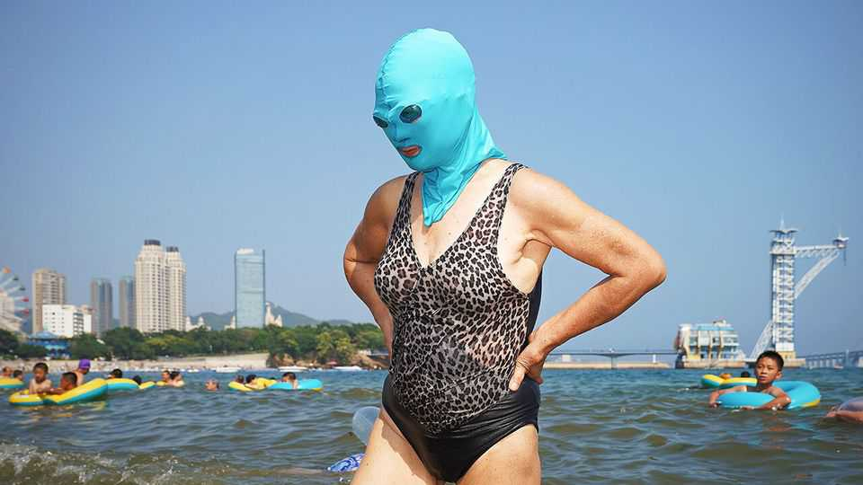
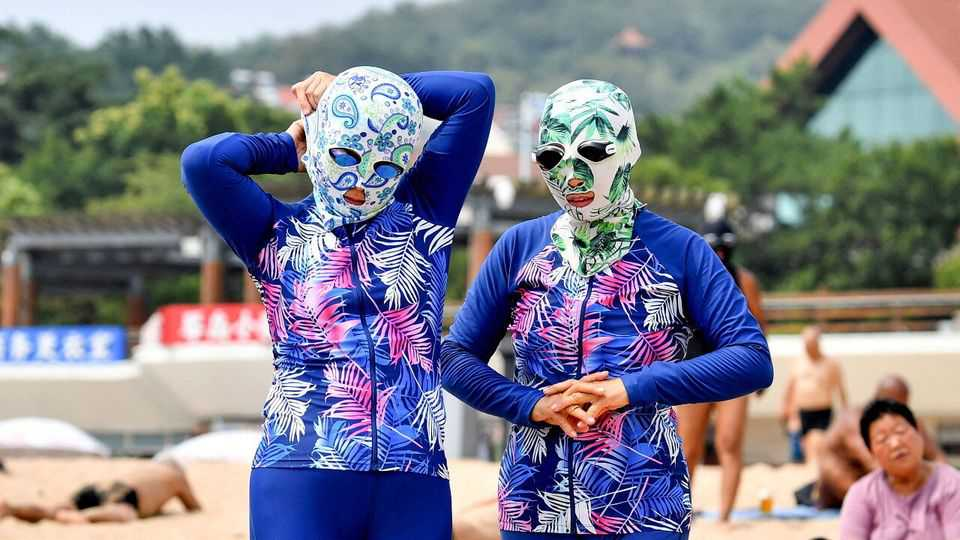

Business | Sun-safe fashion
China’s hottest new look: the facekini
Communist party officials disapprove of the trend

August 21st 2025
  

  
Fads come and go. Capes, codpieces and ruffs were all once standard garb in  
Europe, before falling out of favour. Occasionally new articles of clothing  
fall into favour, too—as in China today, where designer sun-protection face  
coverings known as “facekinis” are popularising a look previously favoured  
by bank robbers.

Facekinis form part of a thriving industry in China offering accessories to  
protect against ultraviolet (UV) rays. Unlike the surgical masks of the covid-  
19 pandemic, sun masks are made from a washable synthetic fabric. Some  
cover only the lower face; others extend to the forehead, neck and chest.  
They range in price from a few dollars to nearly $50.
All told, sales of UV-wear in China reached around 80bn yuan ($11bn) last  
year. Sales of facekinis, which are targeted at women, rose by around 50% in  
the year to July, according to Daxue Consulting, a research firm. Those of  
UV sleeves, more popular among men, doubled.

Until recently, facekinis were mainly reserved for beaches and often worn by  
older women seeking to avoid a tan while swimming. The pandemic, and the  
widespread mask use it prompted, helped broaden their popularity. In the  
years since, facekinis have gone from cheap, poorly designed products for  
old folk to fashionable goods mainly bought by younger consumers. Now  
people want masks that match their office attire or outdoor gear, says Lai  
Ming Yii of Daxue Consulting. Many women see them as part of a skincare  
routine aimed at helping them maintain a fair complexion, she adds.

Companies are cashing in. Perhaps the biggest beneficiary from the trend  
has been Beneunder, established a dozen years ago in Shenzhen, which  
offers a line of masks and other UV gear. But many other Chinese apparel  
companies are also starting to sell similar products, including sportswear  
labels such as Anta and Li-Ning.

The Chinese Communist Party, however, does not approve of the look.  
People’s Daily, a party mouthpiece, recently lamented the rise of “sun-

protection anxiety”, pointing to confusion over what is needed to protect  
one’s skin. Ruffs were clinging to necks for a century in Europe. China’s  
facekinis might not last as long.■

To stay on top of the biggest stories in business and technology, sign up  
to the Bottom Line, our weekly subscriber-only newsletter.

This article was downloaded by zlibrary from [https://www.economist.com//business/2025/08/21/chinas-hottest-new-look-the-facekini](https://www.economist.com//business/2025/08/21/chinas-hottest-new-look-the-facekini)