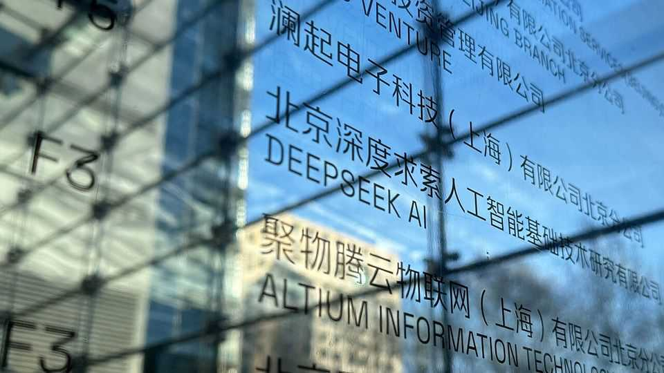

Business | DeepSeek aftershocks
China is quietly upstaging America with its open models
How worried should OpenAI and other labs be?
August 21st 2025

While American tech giants are spending megabucks to learn the secrets of their rivals’ proprietary artificial-intelligence (AI) models, in China a different battle is under way. It is what Andrew Ng, a Stanford University- based AI boffin, recently called the “Darwinian life-or-death struggle” among builders of China’s more open large language models (LLMs). Their competitive zeal should be a wake-up call for the West. In January DeepSeek, a Chinese startup, rocked global stockmarkets by making available free of charge an advanced AI model it had developed on a shoestring. Since then Chinese models from Alibaba, a tech giant, and others have quietly continued to gain traction abroad. When entrepreneurs walk

into the offices of Andreessen Horowitz (a16z), a big American venture- capital firm, the odds these days are that their startups are using AI models made in China. “I’d say 80% chance [they are] using a Chinese open-source model,” says Martin Casado, a partner at a16z.

Strictly speaking, China specialises in open-weight models. Unlike open- source software, for which the source code is shared publicly for anyone to modify, most non-proprietary LLMs provide only the numerical parameters (or “weights”) they have learned during training, and not the source code or underlying data. But call them what you will, on a variety of intelligence tests Chinese models released this year have outperformed their similarly open American peers, such as those from Meta, a social-media giant. Moreover, their capabilities are closing in on the best proprietary models.

OpenAI, maker of ChatGPT, illustrates the pressure this is creating. In the mid-2010s, it popularised the more open approach to AI (hence its name), but in order to make money and prevent misuse of increasingly powerful AI, it switched to selling only proprietary LLMs in 2020. Recently, though, it has seen an uptick in its customers’ use of open-weight models, including those from China, and wants to get in on the action. This month it released its first open-weight language model since 2019, called gpt-oss.

The use of the lower case is telling. The model is relatively small. In the same week OpenAI unveiled the long-awaited—and underwhelming—GPT- 5, its latest proprietary model. Such timing made OpenAI’s embrace of openness look half-hearted. That may prove true of other American companies’ efforts, too. Ali Farhadi of the Allen Institute for AI, a Seattle- based non-profit organisation, says that while Chinese firms go all-in, releasing their best models openly, American ones keep the “shiny new thing” proprietary. “As hard as it is for us all to swallow, I think we’re behind [on open weights] now,” he says.

Even Meta reinforces that idea. It was widely celebrated in the open-source world for making Llama open and widely available. But Mark Zuckerberg, its boss, is now focused on building so-called superintelligence. In the future, his company will be more cautious about what it chooses to make open, he has said.

From a business perspective, how much does this matter? After all, the revenues generated by American proprietary models are far greater than those produced by the Chinese open-weight ones. The valuations of the former—up to $500bn in the case of OpenAI—dwarf those of the latter; Alibaba’s entire market capitalisation is only $285bn. It is easier to make money from proprietary models, and the proceeds can be poured back into innovation.

Yet open source is not just for the also-rans. Percy Liang, co-founder of Together AI, a platform for open-weight LLMs, says the models spur different forms of adoption than proprietary technology. They can be more easily adapted by companies, governments and researchers to the “nooks and crannies” of individual use cases, and help users run their AI tools on premises rather than relying on the cloud. Money can still be made from ancillary services, including support with customisation.

In other words, while American labs are betting big on the fortunes to be made by pushing the frontiers of intelligence, their open-weight Chinese rivals are more focused on encouraging adoption of AI. If they succeed, the DeepSeek shock may be just the beginning. ■

To stay on top of the biggest stories in business and technology, sign up to the Bottom Line, our weekly subscriber-only newsletter.

This article was downloaded by zlibrary from https://www.economist.com//business/2025/08/21/china-is-quietly-upstaging-america- with-its-open-models