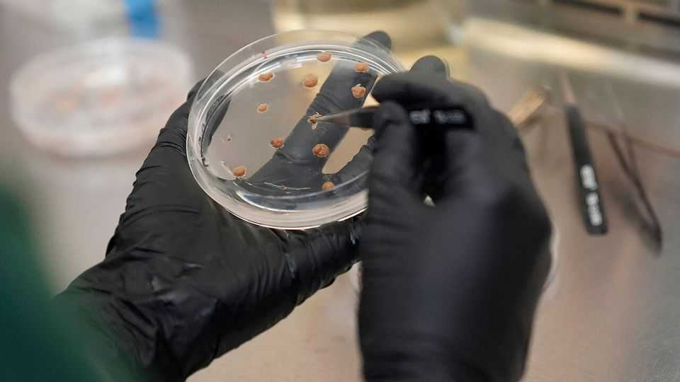
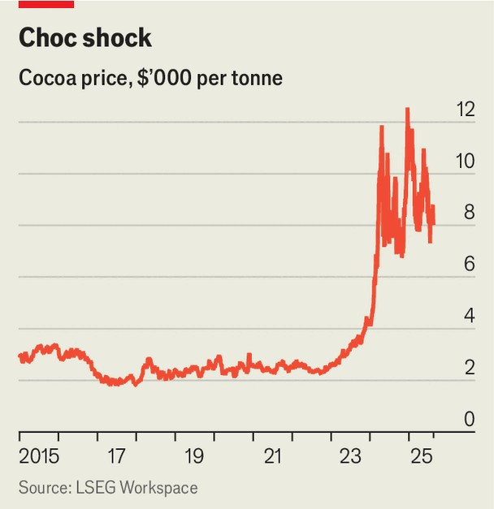

Business | From trees to test tubes
Big chocolate has a growing taste for lab-grown cocoa
Can science solve the problem of a shortage of beans?
August 21st 2025

The first half of the scientific name for the fiendishly fickle cocoa tree means “food of the gods”. By the time Theobrama cacao was christened by Carl Linnaeus, a Swedish naturalist, in 1753, wealthy Europeans, like the Mayans before them, were already worshipping its seeds. Three centuries on, demand for cocoa, the basic ingredient for chocolate, is still climbing heavenwards. Supply cannot keep pace. An unholy combination of disease, climate change and poor farming practices in Côte d’Ivoire and Ghana, where about 70% of the world’s cocoa is grown, has caused a severe shortage. Prices hit a record high of more than $12,000 in December. Although they have since eased, falling to $8,000 a

tonne this month, that is more than triple the price three years ago (see chart). To survive, sweet-makers have raised their prices and pushed chocolate-free treats, such as gummies. They are working on more innovative solutions, too.

Last year Lindt, a Swiss chocolatier, launched a limited-edition snack bar with Planet A Foods, a German startup which roasts and ferments sunflower seeds to mimic the taste of cocoa. Even more exciting, says Darren O’Brien of Mondelez, a snack giant, is real cocoa that is grown, or “cultured”, in a laboratory from plant cells. Last year his firm invested in Celleste Bio, an Israeli startup focused on extracting cocoa butter (the fatty bit of the bean that gives chocolate its pleasing texture) from lab-grown cocoa.

Others have also taken an interest. Last month Barry Callebaut, another Swiss chocolate-maker, entered into a partnership with the Zurich University of Applied Sciences to develop cell-culture technology for cocoa. Meiji, a Japanese confectioner, has backed California Cultured, an American startup that is developing lab-grown cocoa for use in chocolate sweets, beverages and ice cream. Alan Perlstein, the startup’s founder, proudly claims that it has “cracked” dark chocolate, which is trickier becuse it has fewer filler ingredients. It is now building a big demonstration facility and preparing to apply for regulatory approval.

Playing God comes with risks. In 2021 investors poured almost $1.4bn into lab-grown meat and seafood, swayed in part by environmental and ethical arguments. Yet the technology is still not ready for prime time. It has also been dragged into America’s culture wars, with some Republican states having pre-emptively banned it. Cultivated-meat firms raised just $139m in 2024, according to the Good Food Institute, an alternative-meat advocacy group.

Growing plant cells such as cocoa is cheaper and easier than growing animal tissue, reckons David Welch of Synthesis Capital, which invests in food tech. Because it is an ingredient rather than an end product, it might also face less political opposition. With big companies now backing the sector, the technology for other cultivated plant cells, such as coffee, could “accelerate as well”, says Mr Welch.

As yet, none of the cell-culture startups has regulatory approval. Most expect to become commercially viable in years, rather than months. And big chocolate companies think lab-grown cocoa will supplement, rather than replace, the tree-grown variety. Even so, the firms involved could help save the cell-culture industry—and perhaps the desperate chocoholics of the future, too. ■

Correction (August 21st): An earlier version of this article said that Lindt backed Planet A Foods. In fact, they partnered on a limited-edition snack bar. Sorry.

To stay on top of the biggest stories in business and technology, sign up to the Bottom Line, our weekly subscriber-only newsletter.

This article was downloaded by zlibrary from https://www.economist.com//business/2025/08/21/big-chocolate-has-a-growing-taste- for-lab-grown-cocoa