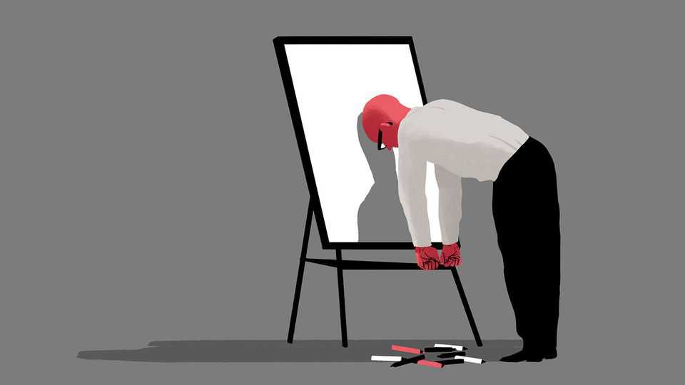

Business | Bartleby
The last days of brainstorming
Enjoy the peculiar melange of whiteboards and humans while you can

August 21st 2025
  

  
Alan: Let’s get going. We’ve all had a chance to think of some fresh names  
for our new value-added membership service. The last time we met we  
talked about calling it Gold or Platinum: if it works for the likes of American  
Express and Virgin Atlantic, it can work for us. But some of you felt that we  
could be more original. So let’s write our favourite ideas on the whiteboards,  
and then we’ll review them. We want a shortlist of three for Peter to choose  
from.

[Sound of breathing and writing.]

Alan: OK. Let’s take a look and see if any themes emerge. I can see a few  
metals and minerals here. Iridium. Osmium. What’s Californium?
Michaela: I put that down. It’s the most expensive metal.

Walter: It’s also highly radioactive.

Michaela: Oh.

Alan: This says Platinum again.

Sally: That was me.

Alan: Weren’t you listening at the start? And who are you?

Sally: I’m really sorry. I’m actually in the wrong meeting and was checking  
my phone for the right location when you were talking. And then I felt like it  
was too late to leave. I’ll go now. [Sound of chair scraping, footsteps, door  
closing.]

Alan: Let’s just take another one. Rolls-Royce. Who was that?

Rupert: That’s mine. I was thinking that we should use a brand that is  
synonymous with quality.

Violet: Oughtn’t that to be our own brand? Especially since we are also in  
the automotive industry.

Alan: What does this say? It’s almost completely illegible.

Shreya: Celine Dion.

Alan: Oh.

Shreya: I was thinking of people who sell out their shows, you know. So it’s  
hard to get into.

Jon: I get it. So people with residencies in Las Vegas. Like Adele. Or those  
magicians with the tiger.

Rupert: Calvin and Hobbes?

Jon: Yes, that’s them.
Violet: I’m not sure. Isn’t a bit weird to say “I’m in Celine Dion”?

Alan: What’s this one?

Michaela: Yttrium. It’s a rare earth.

Rupert: Metals again?

Michaela: Says the man who wants to use another brand name to signal  
quality.

Alan: I like the idea but it’s a bit unpronounceable. Let’s look at a couple  
more. Praseodymium. I assume that’s you again, Michaela. And Gucci is  
presumably you, Rupert? How about this one. Oxygen?

Jon: That was me, but I now see that it’s better for our basic service. Sorry.

Alan: And this one?

Kate: Jeroboam. I thought maybe we should use units associated with a very  
special occasion.

Walter: A Jeroboam is not that big. The biggest bottle is a Melchizedek.

Alan: Not sure that we want to be too closely associated with alcohol, given  
we’re in the business of car rentals. What’s this one? It looks like “Inspire”.

Violet: That was left over from the previous meeting.

Alan: Nice. Not many left. Everest?

Rupert: That implies huge effort, extreme cold and a high risk of death.

Michaela: You should go.

Kate: What about Alcove? I just love that word. Doesn’t it sound like a  
winter evening reading a book?

Alan: Which would be great if we were selling winter evenings. Is there a  
nice word that conjures up renting cars?
Kate: Freedom?

Jon: Wheels?

[Door opens]

Alan: You again? We’re not done.

Sally: I’m sorry. My other meeting is over and I just wanted to suggest  
another one. Elara.

Walter: The moon of Jupiter?

Sally: Yes. I saw you were still going, so I asked ChatGPT for ideas. It  
honed the list, worked up some taglines and did a trademark search. This  
one jumped out. I quite like Zenith and Regent, too.

Violet: I like Elara.

Rupert: As long as Michaela didn’t suggest it, I’m OK with that.

Michaela: If Rupert likes it, I’m against it.

Alan: We’re going to have to wrap up. I’ll take Elara and Inspire to Peter.  
But he’s a massive Celine Dion fan, so we may well have a winner.■

Subscribers to The Economist can sign up to our Opinion newsletter, which  
brings together the best of our leaders, columns, guest essays and reader  
correspondence.

This article was downloaded by zlibrary from [https://www.economist.com//business/2025/08/21/the-last-days-of-brainstorming](https://www.economist.com//business/2025/08/21/the-last-days-of-brainstorming)